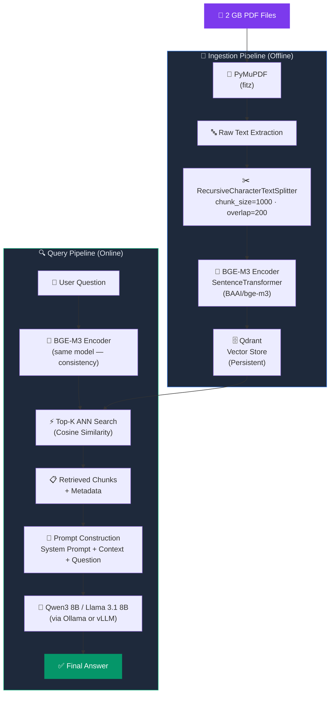

# PDF RAG System Design (2 GB Scale)

> [!info] Context
> Local development setup: **RTX 3090 (24 GB VRAM)**
> Knowledge base: **~2 GB of PDFs**
> Goal: Production-quality RAG system with fast retrieval, minimal hallucination, and scalable architecture.

---

## Quick Reference — Reasoned Stack

| Component      | Choice                           | Why                                          |
| -------------- | -------------------------------- | -------------------------------------------- |
| PDF Parsing    | `PyMuPDF (fitz)`                 | Fast, handles large PDFs, reliable text extraction |
| Chunking       | `RecursiveCharacterTextSplitter` | Preserves semantic context between chunks    |
| Embeddings     | `BGE-M3`                         | Multilingual, SOTA retrieval quality         |
| Vector Store   | `Qdrant`                         | Persistent, production-ready, metadata filters |
| LLM            | `Qwen3 8B` / `Llama 3.1 8B`     | Excellent local performance on 3090          |
| Framework      | `LlamaIndex` / `LangChain`       | Faster development, battle-tested abstractions |

---

## Complete Pipeline Diagram



---

## 1. PDF Parsing — `PyMuPDF`

```python
import fitz  # PyMuPDF

def extract_text(pdf_path: str) -> str:
    doc = fitz.open(pdf_path)
    return "\n".join(page.get_text() for page in doc)
```

**Why PyMuPDF over alternatives?**

| Parser         | Speed | Large PDF Handling | Accuracy |
| -------------- | ----- | ------------------ | -------- |
| PyMuPDF        | ✅ Fast | ✅ Excellent        | ✅ High   |
| pdfplumber     | ⚠️ Slow | ⚠️ Medium          | ✅ High   |
| PDFMiner       | ❌ Slow | ❌ Poor             | ⚠️ Medium |
| PyPDF2         | ✅ Fast | ⚠️ Medium          | ❌ Low    |

> [!tip] Key Insight
> PyMuPDF is a Python binding for **MuPDF** — a C library. That's why it's significantly faster than pure-Python parsers. For 2 GB of PDFs, this matters.

---

## 2. Chunking Strategy

**Pipeline order — do NOT tokenize first:**

```
PDF → Text Extraction → Chunking → Embeddings
```

> [!warning] Common Mistake
> Don't pass raw PDFs to the embedding model or tokenize before extracting text. Extract clean text first, *then* chunk.

### Parameters

```python
from langchain.text_splitter import RecursiveCharacterTextSplitter

splitter = RecursiveCharacterTextSplitter(
    chunk_size=1000,      # characters per chunk
    chunk_overlap=200,    # overlap to preserve cross-boundary context
    separators=["\n\n", "\n", ".", " ", ""]  # tries to split on paragraphs first
)

chunks = splitter.split_text(raw_text)
```

### Why `RecursiveCharacterTextSplitter`?

- Tries larger separators first (`\n\n` → `\n` → `.` → ` `), so it **respects natural document structure**
- `chunk_overlap=200` ensures no context is lost at chunk boundaries
- Unlike `TokenTextSplitter`, it doesn't require a tokenizer at this stage

> [!note] Why 1000/200?
> - 1000 chars ≈ 200–250 tokens → fits well within embedding model context windows
> - 200 overlap ≈ 20% — enough to catch cross-boundary references without excessive duplication

---

## 3. Embedding Model — `BGE-M3`

```python
from sentence_transformers import SentenceTransformer

model = SentenceTransformer("BAAI/bge-m3")

# Tokenization happens INTERNALLY — consistent with training
embeddings = model.encode(chunks, batch_size=64, show_progress_bar=True)
```

### Model Comparison

| Model              | Dims | Multilingual | Quality  | Speed    |
| ------------------ | ---- | ------------ | -------- | -------- |
| **BGE-M3**         | 1024 | ✅ Yes        | ✅ SOTA   | ✅ Fast   |
| bge-large-en-v1.5  | 1024 | ❌ English    | ✅ High   | ✅ Fast   |
| all-MiniLM-L6-v2   | 384  | ❌ English    | ⚠️ Medium | ✅ Fastest |
| text-embedding-ada | 1536 | ⚠️ Partial   | ✅ High   | 🌐 API   |

**Why BGE-M3 wins:**
- Top performer on BEIR benchmark
- Supports **dense + sparse + multi-vector** retrieval (ColBERT-style)
- Multilingual — useful when PDFs contain non-English content
- Open source, runs locally on 3090

### Tokenization Answer for Interviews

> [!important] Interview Answer
> *"I would use the tokenizer **bundled with the embedding model** to ensure consistency between training and inference. Using a mismatched tokenizer can cause subtle performance degradation."*

---

## 4. Vector Store — `Qdrant`

```python
from qdrant_client import QdrantClient
from qdrant_client.models import Distance, VectorParams, PointStruct

client = QdrantClient(path="./qdrant_storage")  # persistent local storage

# Create collection
client.create_collection(
    collection_name="pdf_rag",
    vectors_config=VectorParams(size=1024, distance=Distance.COSINE),
)

# Upsert chunks + embeddings
points = [
    PointStruct(
        id=i,
        vector=embeddings[i].tolist(),
        payload={"text": chunks[i], "source": pdf_name, "page": page_num}
    )
    for i in range(len(chunks))
]

client.upsert(collection_name="pdf_rag", points=points)
```

### Retrieval

```python
results = client.search(
    collection_name="pdf_rag",
    query_vector=query_embedding.tolist(),
    limit=5,  # Top-K chunks
    with_payload=True
)

context = "\n\n".join([r.payload["text"] for r in results])
```

### Why Qdrant over alternatives?

| Store      | Persistent | Filtering | Docker | Scale      |
| ---------- | ---------- | --------- | ------ | ---------- |
| **Qdrant** | ✅          | ✅ Rich    | ✅      | ✅ Millions |
| ChromaDB   | ✅          | ⚠️ Basic  | ✅      | ⚠️ Medium  |
| FAISS      | ❌ (manual) | ❌         | ❌      | ✅ Fast     |
| Pinecone   | ✅          | ✅          | 🌐 API | ✅ Massive  |
| Weaviate   | ✅          | ✅          | ✅      | ✅ High     |

> [!tip] Qdrant Docker (Production Setup)
> ```bash
> docker run -p 6333:6333 -v $(pwd)/qdrant_data:/qdrant/storage qdrant/qdrant
> ```
> Switch from `path=` to `url="http://localhost:6333"` in client.

---

## 5. LLM — Local Inference on RTX 3090

### Option A — Qwen3 8B ⭐ Recommended

```bash
ollama pull qwen3:8b
ollama run qwen3:8b
```

- ✅ Excellent reasoning and instruction following
- ✅ Strong context handling (up to 32K tokens)
- ✅ Fits comfortably in 3090's 24 GB VRAM at 4-bit quant

### Option B — Llama 3.1 8B

```bash
ollama pull llama3.1:8b
```

- ✅ Stable, widely benchmarked
- ✅ Large community and tooling support

### vLLM for Higher Throughput

```bash
vllm serve Qwen/Qwen3-8B --max-model-len 16384
```

Use vLLM when you need **concurrent requests** (e.g., serving multiple users).

### Prompt Construction

```python
def build_prompt(context: str, question: str) -> str:
    return f"""You are a helpful assistant. Answer the question using ONLY the provided context.
If the answer is not in the context, say "I don't know."

Context:
{context}

Question: {question}

Answer:"""
```

---

## 6. Complete End-to-End Code Skeleton

```python
# ── INGESTION ──────────────────────────────────────────────────────────────
import fitz
from langchain.text_splitter import RecursiveCharacterTextSplitter
from sentence_transformers import SentenceTransformer
from qdrant_client import QdrantClient
from qdrant_client.models import Distance, VectorParams, PointStruct
import glob

# 1. Init
model = SentenceTransformer("BAAI/bge-m3")
client = QdrantClient(path="./qdrant_storage")
client.recreate_collection("pdf_rag", vectors_config=VectorParams(size=1024, distance=Distance.COSINE))

splitter = RecursiveCharacterTextSplitter(chunk_size=1000, chunk_overlap=200)

# 2. Parse + Chunk + Embed + Store
points, idx = [], 0
for pdf_path in glob.glob("./pdfs/**/*.pdf", recursive=True):
    doc = fitz.open(pdf_path)
    for page_num, page in enumerate(doc):
        text = page.get_text()
        for chunk in splitter.split_text(text):
            vec = model.encode(chunk).tolist()
            points.append(PointStruct(id=idx, vector=vec,
                payload={"text": chunk, "source": pdf_path, "page": page_num}))
            idx += 1

client.upsert("pdf_rag", points=points)
print(f"✅ Indexed {idx} chunks")

# ── QUERY ──────────────────────────────────────────────────────────────────
import ollama

def rag_query(question: str, top_k: int = 5) -> str:
    # Retrieve
    q_vec = model.encode(question).tolist()
    hits = client.search("pdf_rag", query_vector=q_vec, limit=top_k, with_payload=True)
    context = "\n\n---\n\n".join(h.payload["text"] for h in hits)

    # Generate
    prompt = f"Context:\n{context}\n\nQuestion: {question}\nAnswer:"
    response = ollama.chat(model="qwen3:8b", messages=[{"role": "user", "content": prompt}])
    return response["message"]["content"]

# Usage
print(rag_query("What is the refund policy?"))
```

---

## Key Interview Questions & Answers

### ❓ "Why not just put the PDFs directly into the LLM?"

> **Answer:** "Even large-context models have hard token limits, and repeatedly loading gigabytes of documents is computationally expensive and slow. RAG retrieves only the **relevant chunks** (~5 out of thousands), drastically reducing latency, cost, and hallucination risk — while allowing the knowledge base to scale independently of the model's context window."

### ❓ "Which tokenizer would you use?"

> **Answer:** "The tokenizer **bundled with the embedding model** — in this case, the one shipped with BGE-M3. Using a mismatched tokenizer breaks the token-to-vector mapping the model was trained on."

### ❓ "How do you handle chunk boundary problems?"

> **Answer:** "With `chunk_overlap=200`. The 200-character overlap ensures that a sentence or concept split across two chunks still appears in at least one complete chunk that gets retrieved."

### ❓ "Why Qdrant over FAISS?"

> **Answer:** "FAISS is an in-memory index — you'd need to manually serialize/deserialize it and it has no metadata filtering. Qdrant gives you persistent storage, rich payload filtering (e.g. filter by document source, date, page), and a clean HTTP API ready for production deployment."

### ❓ "How do you evaluate RAG quality?"

> **Answer:** "Use **RAGAS** — it evaluates: (1) **Faithfulness** — is the answer grounded in context? (2) **Answer Relevancy** — does it answer the question? (3) **Context Recall** — were the right chunks retrieved?"

```python
from ragas import evaluate
from ragas.metrics import faithfulness, answer_relevancy, context_recall
```

---

## Related Notes

- [[Different frameworks]]
- [[Llamaindex]]
- [[Build a visual Search System]]

---

*Last updated: 2026-07-15 | For Juspay ML interview prep*
