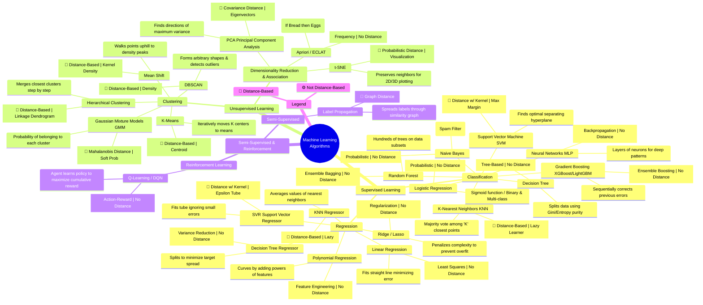

---

### Part 1: Supervised Learning (Labeled Data)

#### A. Classification (Predicting a Category)

| Algorithm                                 |     Distance-Based?      | Core Principle              | Brief Explanation                                                                                                                                                                          |
| :---------------------------------------- | :----------------------: | :-------------------------- | :----------------------------------------------------------------------------------------------------------------------------------------------------------------------------------------- |
| **Logistic Regression**                   |            No            | Probability (Sigmoid)       | Despite the name, it's for classification. It squeezes the output of a linear equation between 0 and 1 to give a probability of belonging to a class.                                      |
| **K-Nearest Neighbors (KNN)**             |        **📍 Yes**        | Distance (Lazy Learner)     | The "lazy" one. It does no training. When you ask for a prediction, it looks at the 'K' closest data points and takes a majority vote.                                                     |
| **Support Vector Machine (SVM)**          | **📍 Yes** (with Kernel) | Margin Maximization         | Draws a "street" (hyperplane) between classes. It tries to make the street as wide as possible. Can use the **Kernel Trick** to solve non-linear problems without calculating coordinates. |
| **Naive Bayes**                           |            No            | Probability (Bayes Theorem) | Assumes all features are independent (naive). Extremely fast and works surprisingly well for text classification (Spam Filters).                                                           |
| **Decision Tree**                         |            No            | Tree / Information Gain     | Asks a series of Yes/No questions (e.g., "Is Age > 30?"). Splits data to make groups as "pure" as possible using Gini Impurity or Entropy.                                                 |
| **Random Forest**                         |            No            | Ensemble (Bagging)          | Builds hundreds of Decision Trees on random subsets of data and features. Averages the results. Reduces overfitting.                                                                       |
| **Gradient Boosting (XGBoost, LightGBM)** |            No            | Ensemble (Boosting)         | Builds trees sequentially. Each new tree tries to fix the mistakes of the previous tree. **Often the winning algorithm in Kaggle competitions.**                                           |
| **Neural Networks (MLP)**                 |            No            | Backpropagation             | Layers of connected "neurons." Learns complex, non-linear relationships. The foundation of Deep Learning.                                                                                  |

#### B. Regression (Predicting a Continuous Number)

| Algorithm | Distance-Based? | Core Principle | Brief Explanation |
| :--- | :---: | :--- | :--- |
| **Linear Regression** | No | Least Squares | Fits a straight line (or hyperplane) through the data by minimizing the sum of the squared errors (the distances from points to the line). |
| **Polynomial Regression** | No | Feature Engineering | Same as Linear, but you square or cube your inputs first (e.g., turn `x` into `x, x², x³`). This allows the "line" to curve. |
| **Ridge / Lasso Regression** | No | Regularization | Linear Regression with a penalty for complexity. Prevents the model from memorizing noise. **Lasso can actually eliminate useless features entirely.** |
| **KNN Regressor** | **📍 Yes** | Distance | Same as KNN Classification, but instead of voting, it **averages** the target values of the nearest neighbors. |
| **SVR (Support Vector Regressor)** | **📍 Yes** (with Kernel) | Margin (Epsilon Tube) | Fits a "tube" around the data line. It doesn't care about errors as long as they are inside the tube. Very robust to outliers. |
| **Decision Tree Regressor** | No | Variance Reduction | Splits data at thresholds to minimize the variance (spread) of the target variable in each leaf node. |

---

### Part 2: Unsupervised Learning (Unlabeled Data)

#### C. Clustering (Finding Groups)

| Algorithm | Distance-Based? | Core Principle | Brief Explanation |
| :--- | :---: | :--- | :--- |
| **K-Means** | **📍 Yes** | Centroid / Voronoi | You choose 'K' (number of groups). It randomly places 'K' centers and iteratively moves them to the average (mean) of the closest points. **Fast, but assumes clusters are spherical.** |
| **Hierarchical Clustering** | **📍 Yes** | Linkage (Dendrogram) | Builds a tree of clusters. **Agglomerative:** Start with every point as its own cluster and merge the closest ones. Great for visualizing taxonomy (e.g., Animal Kingdom). |
| **DBSCAN** | **📍 Yes** | Density | My favorite. It finds clusters of **arbitrary shape** (spirals, blobs) by looking for areas of high density separated by areas of low density. **It automatically detects outliers as "Noise."** |
| **Gaussian Mixture Models (GMM)** | **📍 Yes** (Mahalanobis) | Probability / Expectation | Soft clustering. Instead of saying "Point A is in Cluster 1," it says "Point A is 70% likely to be in Cluster 1 and 30% in Cluster 2." Handles elliptical clusters better than K-Means. |
| **Mean Shift** | **📍 Yes** | Kernel Density | Walks points "uphill" towards the densest region of the data. It finds the **modes** (peaks) of the data distribution automatically without you specifying 'K'. |

#### D. Dimensionality Reduction & Association

| Algorithm | Distance-Based? | Core Principle | Brief Explanation |
| :--- | :---: | :--- | :--- |
| **PCA (Principal Component Analysis)** | **📍 Yes** (Covariance) | Variance / Eigenvectors | Rotates the data to find the "Principal Components"—the directions where the data spreads out the most. Used to compress data (reduce 50 columns to 5). |
| **t-SNE** | **📍 Yes** | Probability / Gradient | A visualization wizard. It maps high-dimensional data to 2D or 3D while trying to keep **neighbors close together**. **Not for prediction, only for plotting/exploration.** |
| **Apriori / ECLAT** | No | Frequency / Set Theory | **Market Basket Analysis.** Finds rules like: *{Bread, Milk} -> {Eggs}*. Measures Support (how often items appear together) and Confidence (likelihood of Eggs given Bread). |

---

### Part 3: Semi-Supervised & Reinforcement (The Other Two)

| Category | Example Algorithm | Brief Explanation |
| :--- | :--- | :--- |
| **Semi-Supervised** | **Label Propagation** | **📍 Yes** (Graph Distance). You have a little bit of labeled data and a mountain of unlabeled data. The labels "spread" through the graph based on similarity. |
| **Reinforcement Learning** | **Q-Learning / DQN** | **Not Distance-Based.** An agent learns to take **actions** in an **environment** to maximize a **reward** (e.g., playing Chess, self-driving cars adjusting steering). |

### Summary: Quick Reference for "Distance-Based"

If you are looking specifically for algorithms affected by the **Scale** of your data (requiring Standardization/Normalization), these are the key ones:

| ✅ **Strongly Distance Dependent** | ❌ **Not Distance Dependent** |
| :--- | :--- |
| KNN | Decision Trees / Random Forest |
| K-Means | Naive Bayes |
| SVM (RBF Kernel) | Gradient Boosting (XGBoost) |
| DBSCAN | Logistic Regression (weights scale, but not distance) |
| Hierarchical Clustering | |
| PCA / t-SNE | |

Would you like me to dive deeper into the mathematical intuition behind any specific one of these (e.g., *"How does SVM find the margin?"* or *"Why does DBSCAN not need to know K?"*)?

Let's dive into the world of neural networks. Think of each architecture as a specialized tool, each with its own unique "brain structure" designed to excel at a specific type of task.

### 🧠 The Neural Network Zoo: A High-Level Map

It's helpful to group networks by what they're best at. This isn't a strict taxonomy, but a practical way to understand the landscape:

*   **Foundational Networks**: The simplest, classic building blocks.
*   **Vision & Spatial Networks**: Specialized for images and video.
*   **Sequence & Time Networks**: For language, audio, and time-series data.
*   **Generative & Creative Networks**: Networks that create new content.
*   **Graph & 3D Networks**: For non-Euclidean data structures.

The following table breaks down the most important architectures:

| Type                                                | Category              | Core Idea                                                                                                                 | Key Features                                                                                                                  | Common Applications                                                                                       |
| :-------------------------------------------------- | :-------------------- | :------------------------------------------------------------------------------------------------------------------------ | :---------------------------------------------------------------------------------------------------------------------------- | :-------------------------------------------------------------------------------------------------------- |
| **Perceptron**                                      | Foundational          | A single neuron making a binary decision.                                                                                 | The simplest building block; only solves linearly separable problems.                                                         | Simple binary classification.                                                                             |
| **Feedforward (FNN) / Multilayer Perceptron (MLP)** | Foundational          | Information flows in one direction, from input to output, through multiple layers.                                        | The most basic "deep" network; good for general-purpose tasks on structured (tabular) data.                                   | Classification, regression, function approximation.                                                       |
| **Radial Basis Function (RBFN)**                    | Foundational          | Uses distance from a center point to activate neurons, unlike standard networks.                                          | Fast to train; uses a radial basis function (like a Gaussian) as its activation.                                              | Function approximation, time series prediction, classification.                                           |
| **Convolutional (CNN)**                             | Vision & Spatial      | Uses **filters (kernels)** that slide over input data to detect patterns like edges, corners, and textures.               | **Translation invariant** (can recognize an object anywhere in an image); parameter-efficient.                                | Image & video recognition, object detection, medical image analysis.                                      |
| **Recurrent (RNN)**                                 | Sequence & Time       | Has **loops** that allow information to persist. The output from a previous step is fed back as input.                    | Has "memory" to process sequences of data. Suffers from short-term memory (vanishing gradient).                               | Time series prediction, language modeling, speech recognition.                                            |
| **Long Short-Term Memory (LSTM)**                   | Sequence & Time       | A special RNN with a complex "gate" structure that can control information flow, solving RNN's short-term memory problem. | Can learn **long-term dependencies** in sequences. More powerful but more computationally expensive than standard RNNs.       | Machine translation, text generation, complex time series forecasting.                                    |
| **Gated Recurrent Unit (GRU)**                      | Sequence & Time       | A streamlined version of the LSTM with fewer gates, making it computationally more efficient.                             | Often performs comparably to LSTM while being faster to train.                                                                | Similar to LSTM, especially where computational efficiency is key.                                        |
| **Autoencoder (AE)**                                | Generative & Creative | Learns to compress (encode) input into a smaller representation and then reconstruct (decode) it back.                    | **Unsupervised** learning. The "bottleneck" layer captures the essence of the data. Good for learning efficient data codings. | Dimensionality reduction, feature learning, anomaly detection, data denoising.                            |
| **Variational Autoencoder (VAE)**                   | Generative & Creative | A probabilistic twist on the autoencoder that learns a smooth, continuous latent space.                                   | Can **generate new data samples** (like images) by sampling from the learned latent space.                                    | Image generation, creating new molecular structures, data augmentation.                                   |
| **Generative Adversarial Network (GAN)**            | Generative & Creative | A creative duel between a **Generator** (creates fakes) and a **Discriminator** (tries to spot them).                     | Both networks improve through competition, leading to the generation of incredibly realistic new content.                     | Generating photorealistic images, style transfer, creating deepfakes.                                     |
| **Transformer**                                     | Sequence & Time       | Relies entirely on an **attention mechanism** to weigh the importance of different parts of the input.                    | **Parallelized processing** makes it much faster to train than RNNs/LSTMs. Excels at capturing long-range dependencies.       | The foundation of modern NLP (BERT, GPT), state-of-the-art in machine translation and text summarization. |
| **Graph Neural Network (GNN)**                      | Graph & 3D            | Designed to operate on data structured as graphs (nodes and edges).                                                       | Can learn relationships and dependencies in non-Euclidean spaces.                                                             | Social network analysis, drug discovery, recommendation systems, traffic prediction.                      |

If any of these architectures pique your interest, feel free to ask, and we can explore it in more detail.