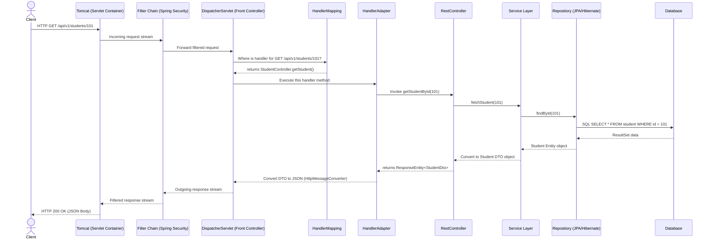

# ☕ Spring Boot REST API Flow & Implementation Guide

This guide details how REST APIs are architected and executed in **Spring Boot (Spring MVC)**. It covers the end-to-end request-response lifecycle (architectural flow), core REST annotations, layered design, global exception handling, and a full hands-on code example.

---

## 📂 Table of Contents
1. [The Spring Boot REST Request Lifecycle (The Flow)](#1-the-spring-boot-rest-request-lifecycle-the-flow)
2. [Core REST Annotations Explained](#2-core-rest-annotations-explained)
3. [The Layered Architecture Pattern](#3-the-layered-architecture-pattern)
4. [Global Exception Handling Mechanism](#4-global-exception-handling-mechanism)
5. [Complete Code Illustration: Student REST API](#5-complete-code-illustration-student-rest-api)

---

## 🔄 1. The Spring Boot REST Request Lifecycle (The Flow)

When a client (e.g., a browser or mobile app) sends an HTTP Request to a Spring Boot server, it passes through several architectural layers before returning a response.

### Architectural Flow Diagram



### Step-by-Step Breakdown of the Flow:

1. **Tomcat (Servlet Container)**: 
   Spring Boot runs on an embedded servlet container (typically Apache Tomcat). Tomcat listens on a port (e.g., `8080`), accepts the incoming TCP connection, parses the raw HTTP text stream into a `HttpServletRequest` object, and spawns a worker thread.
2. **Filter Chain (Servlet Filters)**:
   The request passes through a chain of filters (e.g., CORS Filters, Spring Security OAuth2/JWT verification filters). Filters intercept the request *before* it reaches the core application. They can reject requests (e.g., return `401 Unauthorized`) or modify headers.
3. **DispatcherServlet (The Heart)**:
   The request is handed over to the `DispatcherServlet`. This is the central controller (implementing the **Front Controller Design Pattern**) that orchestrates all incoming web traffic.
4. **HandlerMapping**:
   The `DispatcherServlet` queries `HandlerMapping`. `HandlerMapping` acts as an index lookup. It inspects the request URL (`/api/v1/students/101`) and HTTP Method (`GET`) and finds the matching controller class and method mapping.
5. **HandlerAdapter**:
   Once `DispatcherServlet` knows *which* method to run, it calls the `HandlerAdapter`. The controller method may have diverse inputs (e.g., path variables, request bodies). The `HandlerAdapter` binds the HTTP parameters to the Java method arguments.
6. **Controller Layer (`@RestController`)**:
   The controller method is invoked. It handles incoming user requests:
   - Validates input (e.g., using JSR-380 `@Valid` annotations).
   - Maps inputs to Data Transfer Objects (DTOs).
   - Invokes the appropriate Service Layer method.
7. **Service Layer (`@Service`)**:
   Contains the core business logic. It handles calculations, checks authorizations, enforces rules, and orchestrates transaction boundaries (using `@Transactional` for database rollbacks).
8. **Repository Layer (`@Repository` / JPA)**:
   Performs Database operations. If using Spring Data JPA, this is an interface. Spring generates the SQL queries dynamically. JPA (implemented by Hibernate) converts the SQL database rows into Java objects called **Entities**.
9. **Message Converter (`HttpMessageConverter`)**:
   When the controller returns a Java object (or a `ResponseEntity<T>`), the request flows back. Since we are building a REST API, the client expects JSON/XML. `DispatcherServlet` uses `HttpMessageConverter` (by default, utilizing the **Jackson Library's `ObjectMapper`**) to serialize the Java DTO object into a raw JSON string.
10. **Response Flow**:
    The JSON payload passes back through the Filter chain and Tomcat writes the HTTP status code, headers, and body onto the socket back to the client.

---

## 🏷️ 2. Core REST Annotations Explained

Spring Boot makes building REST APIs highly declarative using annotations. Here is the reference chart for key annotations:

* **`@RestController`**:
  A convenience annotation that combines `@Controller` and `@ResponseBody`. 
  - `@Controller`: Registers the class as a Spring Bean component in the web layer.
  - `@ResponseBody`: Directs Spring that the return values of *all* handler methods inside the class should be bound directly to the HTTP response body (automatically serialized into JSON/XML) instead of rendering an HTML view template.
* **`@RequestMapping(path = "/api/v1")`**:
  Maps HTTP requests to handler classes or methods. Used at the class level to establish a base URL prefix for all endpoints in the controller.
* **Endpoint HTTP Methods**:
  Spring provides shorthand annotations mapped to specific HTTP verbs:
  - `@GetMapping`: Read resource (`GET`).
  - `@PostMapping`: Create resource (`POST`).
  - `@PutMapping`: Update/replace resource (`PUT`).
  - `@PatchMapping`: Partially update resource (`PATCH`).
  - `@DeleteMapping`: Delete resource (`DELETE`).
* **Parameters Binding**:
  To extract data from the HTTP Request, use these binding annotations:
  
  | Annotation | Source | Example URL / Request | Use Case |
  | :--- | :--- | :--- | :--- |
  | **`@PathVariable`** | URI Path | `/api/students/{id}` $\rightarrow$ `/api/students/101` | Identifies a specific resource. |
  | **`@RequestParam`** | Query Parameter | `/api/students?dept=CS&page=1` | Filtering, sorting, and pagination. |
  | **`@RequestBody`** | HTTP Request Body | JSON payload in the request body | Capturing complex objects (e.g., on POST/PUT). |
  | **`@RequestHeader`**| HTTP Header | Headers (e.g., `Authorization`) | Reading metadata, tokens, or agent types. |

---

## 🏛️ 3. The Layered Architecture Pattern

Spring applications are structured using **Separation of Concerns** via three distinct logical layers:

```
[ Client ]
   |  HTTP Request / Response (JSON)
   v
=========================================
 🌐 WEB / CONTROLLER LAYER
 - Intercepts requests, validates inputs.
 - Converts raw HTTP requests to Java DTOs.
 - Sends DTOs to Service Layer.
=========================================
   |  DTOs / Values
   v
=========================================
 ⚙️ SERVICE / BUSINESS LAYER
 - Executes business rules & computations.
 - Orchestrates database transactions.
 - Isolates controllers from database structures.
=========================================
   |  Entities
   v
=========================================
 🗄️ REPOSITORY / DATA LAYER
 - Executes database operations (CRUD).
 - Speaks SQL/JPA to the DB.
=========================================
   |  SQL Queries
   v
[ Database ]
```

### Why separate DTOs (Data Transfer Objects) from Entities?
- **Security**: Preventing clients from modifying internal database table structures directly (e.g. preventing mass assignment vulnerabilities).
- **Performance**: An Entity might contain circular relationship references (e.g., a student has a department, and the department has a list of 500 students). Serializing this directly leads to stack overflow exceptions or excessive database queries. DTOs are flat and tailored exactly to what the client needs to see.

---

## 🛡️ 4. Global Exception Handling Mechanism

In production, you should never let exceptions escape directly to Tomcat (which renders ugly default stack traces with a `500 Internal Server Error`). Spring Boot handles exceptions globally using a central Interceptor framework:

1. **`@RestControllerAdvice`**: 
   A specialized interceptor class declared globally. It acts as an aspect-oriented interceptor that catches any exception thrown by *any* controller method in the entire application.
2. **`@ExceptionHandler(ExceptionClass.class)`**:
   Methods inside the `@RestControllerAdvice` class are marked with this annotation to define *how* to handle a specific Java exception.
3. **Flow**:
   If the Service layer throws a `StudentNotFoundException`, the Controller passes it up. The `@RestControllerAdvice` catches it, intercepts the error, wraps the message in a standardized `ErrorResponse` DTO, assigns a correct HTTP status (e.g., `404 Not Found`), and returns it to the client as clean JSON.

---

## 💻 5. Complete Code Illustration: Student REST API

Below is a complete, production-grade implementation of a Student REST API demonstrating all the layers, annotations, validation, and global exception handling.

### 1. The Entity Class (`Student.java`)
Represents the database table schema.
```java
package com.example.demo.entity;

import jakarta.persistence.*;
import lombok.*;

@Entity
@Table(name = "students")
@Getter
@Setter
@NoArgsConstructor
@AllArgsConstructor
@Builder
public class Student {
    
    @Id
    @GeneratedValue(strategy = GenerationType.IDENTITY)
    private Long id;
    
    @Column(nullable = false)
    private String name;
    
    @Column(nullable = false, unique = true)
    private String email;
    
    @Column(nullable = false)
    private Integer age;
    
    @Column(nullable = false)
    private String department;
}
```

### 2. The DTO Classes (`StudentRequestDto.java` & `StudentResponseDto.java`)
Defines the structure for incoming payloads and outgoing JSON.
```java
package com.example.demo.dto;

import jakarta.validation.constraints.*;
import lombok.*;

// Request DTO (includes JSR validation annotations)
@Data
public class StudentRequestDto {
    
    @NotBlank(message = "Name cannot be empty")
    @Size(min = 2, max = 50, message = "Name must be between 2 and 50 characters")
    private String name;
    
    @Email(message = "Please enter a valid email address")
    @NotBlank(message = "Email cannot be empty")
    private String email;
    
    @Min(value = 18, message = "Student must be at least 18 years old")
    @Max(value = 120, message = "Age limit exceeded")
    private Integer age;
    
    @NotBlank(message = "Department cannot be empty")
    private String department;
}

// Response DTO (clean output representation)
@Data
@Builder
public class StudentResponseDto {
    private Long id;
    private String name;
    private String email;
    private Integer age;
    private String department;
}
```

### 3. The Repository Layer (`StudentRepository.java`)
```java
package com.example.demo.repository;

import com.example.demo.entity.Student;
import org.springframework.data.jpa.repository.JpaRepository;
import org.springframework.stereotype.Repository;

import java.util.Optional;

@Repository
public interface StudentRepository extends JpaRepository<Student, Long> {
    Optional<Student> findByEmail(String email);
    boolean existsByEmail(String email);
}
```

### 4. Custom Exception Class (`ResourceNotFoundException.java`)
```java
package com.example.demo.exception;

public class ResourceNotFoundException extends RuntimeException {
    public ResourceNotFoundException(String message) {
        super(message);
    }
}
```

### 5. The Service Layer (`StudentService.java` & `StudentServiceImpl.java`)
```java
package com.example.demo.service;

import com.example.demo.dto.StudentRequestDto;
import com.example.demo.dto.StudentResponseDto;

import java.util.List;

public interface StudentService {
    StudentResponseDto createStudent(StudentRequestDto request);
    StudentResponseDto getStudentById(Long id);
    List<StudentResponseDto> getAllStudents();
    void deleteStudent(Long id);
}
```

```java
package com.example.demo.service.impl;

import com.example.demo.dto.StudentRequestDto;
import com.example.demo.dto.StudentResponseDto;
import com.example.demo.entity.Student;
import com.example.demo.exception.ResourceNotFoundException;
import com.example.demo.repository.StudentRepository;
import com.example.demo.service.StudentService;
import lombok.RequiredArgsConstructor;
import org.springframework.stereotype.Service;
import org.springframework.transaction.annotation.Transactional;

import java.util.List;
import java.util.stream.Collectors;

@Service
@RequiredArgsConstructor // Automatically generates constructor for dependency injection of repository
public class StudentServiceImpl implements StudentService {
    
    private final StudentRepository studentRepository;
    
    @Override
    @Transactional // Enforces transaction boundary
    public StudentResponseDto createStudent(StudentRequestDto request) {
        if (studentRepository.existsByEmail(request.getEmail())) {
            throw new IllegalArgumentException("Email already in use!");
        }
        
        // Map DTO to Entity
        Student student = Student.builder()
                .name(request.getName())
                .email(request.getEmail())
                .age(request.getAge())
                .department(request.getDepartment())
                .build();
                
        Student savedStudent = studentRepository.save(student);
        return mapToResponseDto(savedStudent);
    }
    
    @Override
    @Transactional(readOnly = true)
    public StudentResponseDto getStudentById(Long id) {
        Student student = studentRepository.findById(id)
                .orElseThrow(() -> new ResourceNotFoundException("Student not found with ID: " + id));
        return mapToResponseDto(student);
    }
    
    @Override
    @Transactional(readOnly = true)
    public List<StudentResponseDto> getAllStudents() {
        return studentRepository.findAll().stream()
                .map(this::mapToResponseDto)
                .collect(Collectors.toList());
    }
    
    @Override
    @Transactional
    public void deleteStudent(Long id) {
        if (!studentRepository.existsById(id)) {
            throw new ResourceNotFoundException("Cannot delete: Student not found with ID: " + id);
        }
        studentRepository.deleteById(id);
    }
    
    // Helper mapper method
    private StudentResponseDto mapToResponseDto(Student student) {
        return StudentResponseDto.builder()
                .id(student.getId())
                .name(student.getName())
                .email(student.getEmail())
                .age(student.getAge())
                .department(student.getDepartment())
                .build();
    }
}
```

### 6. The Web Layer Controller (`StudentController.java`)
```java
package com.example.demo.controller;

import com.example.demo.dto.StudentRequestDto;
import com.example.demo.dto.StudentResponseDto;
import com.example.demo.service.StudentService;
import jakarta.validation.Valid;
import lombok.RequiredArgsConstructor;
import org.springframework.http.HttpStatus;
import org.springframework.http.ResponseEntity;
import org.springframework.web.bind.annotation.*;

import java.util.List;

@RestController
@RequestMapping("/api/v1/students")
@RequiredArgsConstructor
public class StudentController {
    
    private final StudentService studentService;
    
    // HTTP POST: Create student
    @PostMapping
    public ResponseEntity<StudentResponseDto> createStudent(@Valid @RequestBody StudentRequestDto request) {
        StudentResponseDto response = studentService.createStudent(request);
        return new ResponseEntity<>(response, HttpStatus.CREATED); // returns HTTP 201 Created
    }
    
    // HTTP GET: Fetch specific student by path variable ID
    @GetMapping("/{id}")
    public ResponseEntity<StudentResponseDto> getStudentById(@PathVariable Long id) {
        StudentResponseDto response = studentService.getStudentById(id);
        return ResponseEntity.ok(response); // returns HTTP 200 OK
    }
    
    // HTTP GET: Fetch all students
    @GetMapping
    public ResponseEntity<List<StudentResponseDto>> getAllStudents() {
        List<StudentResponseDto> response = studentService.getAllStudents();
        return ResponseEntity.ok(response); // returns HTTP 200 OK
    }
    
    // HTTP DELETE: Delete student
    @DeleteMapping("/{id}")
    public ResponseEntity<Void> deleteStudent(@PathVariable Long id) {
        studentService.deleteStudent(id);
        return ResponseEntity.noContent().build(); // returns HTTP 204 No Content
    }
}
```

### 7. Global Exception Handler (`GlobalExceptionHandler.java`)
```java
package com.example.demo.exception;

import org.springframework.http.HttpStatus;
import org.springframework.http.ResponseEntity;
import org.springframework.validation.FieldError;
import org.springframework.web.bind.MethodArgumentNotValidException;
import org.springframework.web.bind.annotation.ExceptionHandler;
import org.springframework.web.bind.annotation.RestControllerAdvice;

import java.time.LocalDateTime;
import java.util.HashMap;
import java.util.Map;

@RestControllerAdvice
public class GlobalExceptionHandler {
    
    // Handle Custom Resource Not Found Exception (Returns HTTP 404)
    @ExceptionHandler(ResourceNotFoundException.class)
    public ResponseEntity<Map<String, Object>> handleNotFound(ResourceNotFoundException ex) {
        Map<String, Object> errorBody = new HashMap<>();
        errorBody.put("timestamp", LocalDateTime.now());
        errorBody.put("status", HttpStatus.NOT_FOUND.value());
        errorBody.put("error", "Not Found");
        errorBody.put("message", ex.getMessage());
        return new ResponseEntity<>(errorBody, HttpStatus.NOT_FOUND);
    }
    
    // Handle Input Validations Failures (Returns HTTP 400 Bad Request with field-specific errors)
    @ExceptionHandler(MethodArgumentNotValidException.class)
    public ResponseEntity<Map<String, Object>> handleValidationExceptions(MethodArgumentNotValidException ex) {
        Map<String, Object> errorBody = new HashMap<>();
        errorBody.put("timestamp", LocalDateTime.now());
        errorBody.put("status", HttpStatus.BAD_REQUEST.value());
        errorBody.put("error", "Validation Failed");
        
        Map<String, String> fieldErrors = new HashMap<>();
        ex.getBindingResult().getAllErrors().forEach((error) -> {
            String fieldName = ((FieldError) error).getField();
            String errorMessage = error.getDefaultMessage();
            fieldErrors.put(fieldName, errorMessage);
        });
        errorBody.put("validationErrors", fieldErrors);
        
        return new ResponseEntity<>(errorBody, HttpStatus.BAD_REQUEST);
    }
    
    // Handle illegal arguments (Returns HTTP 400)
    @ExceptionHandler(IllegalArgumentException.class)
    public ResponseEntity<Map<String, Object>> handleIllegalArgument(IllegalArgumentException ex) {
        Map<String, Object> errorBody = new HashMap<>();
        errorBody.put("timestamp", LocalDateTime.now());
        errorBody.put("status", HttpStatus.BAD_REQUEST.value());
        errorBody.put("error", "Bad Request");
        errorBody.put("message", ex.getMessage());
        return new ResponseEntity<>(errorBody, HttpStatus.BAD_REQUEST);
    }
    
    // Generic fallback handler for unhandled server exceptions (Returns HTTP 500)
    @ExceptionHandler(Exception.class)
    public ResponseEntity<Map<String, Object>> handleGeneralException(Exception ex) {
        Map<String, Object> errorBody = new HashMap<>();
        errorBody.put("timestamp", LocalDateTime.now());
        errorBody.put("status", HttpStatus.INTERNAL_SERVER_ERROR.value());
        errorBody.put("error", "Internal Server Error");
        errorBody.put("message", "An unexpected error occurred: " + ex.getMessage());
        return new ResponseEntity<>(errorBody, HttpStatus.INTERNAL_SERVER_ERROR);
    }
}
```
