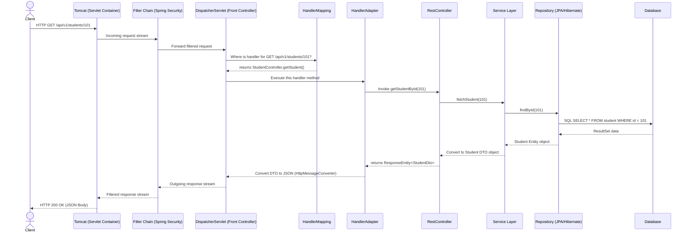

# ☕ Spring Boot REST API Flow & Implementation Guide

This guide details how REST APIs are architected and executed in **Spring Boot (Spring MVC)**. It covers the end-to-end request-response lifecycle (architectural flow), core REST annotations, layered design, global exception handling, and a full hands-on code example.

---

## 📂 Table of Contents
1. [The Spring Boot REST Request Lifecycle (The Flow)](#1-the-spring-boot-rest-request-lifecycle-the-flow)
2. [Core REST Annotations Explained](#2-core-rest-annotations-explained)
3. [The Layered Architecture Pattern](#3-the-layered-architecture-pattern)
4. [Global Exception Handling Mechanism](#4-global-exception-handling-mechanism)
5. [Complete Code Illustration: Student REST API](#5-complete-code-illustration-student-rest-api)

---

## 🔄 1. The Spring Boot REST Request Lifecycle (The Flow)

When a client (e.g., a browser or mobile app) sends an HTTP Request to a Spring Boot server, it passes through several architectural layers before returning a response.

### Architectural Flow Diagram



### Step-by-Step Breakdown of the Flow:

1. **Tomcat (Servlet Container)**: 
   Spring Boot runs on an embedded servlet container (typically Apache Tomcat). Tomcat listens on a port (e.g., `8080`), accepts the incoming TCP connection, parses the raw HTTP text stream into a `HttpServletRequest` object, and spawns a worker thread.
2. **Filter Chain (Servlet Filters)**:
   The request passes through a chain of filters (e.g., CORS Filters, Spring Security OAuth2/JWT verification filters). Filters intercept the request *before* it reaches the core application. They can reject requests (e.g., return `401 Unauthorized`) or modify headers.
3. **DispatcherServlet (The Heart)**:
   The request is handed over to the `DispatcherServlet`. This is the central controller (implementing the **Front Controller Design Pattern**) that orchestrates all incoming web traffic.
4. **HandlerMapping**:
   The `DispatcherServlet` queries `HandlerMapping`. `HandlerMapping` acts as an index lookup. It inspects the request URL (`/api/v1/students/101`) and HTTP Method (`GET`) and finds the matching controller class and method mapping.
5. **HandlerAdapter**:
   Once `DispatcherServlet` knows *which* method to run, it calls the `HandlerAdapter`. The controller method may have diverse inputs (e.g., path variables, request bodies). The `HandlerAdapter` binds the HTTP parameters to the Java method arguments.
6. **Controller Layer (`@RestController`)**:
   The controller method is invoked. It handles incoming user requests:
   - Validates input (e.g., using JSR-380 `@Valid` annotations).
   - Maps inputs to Data Transfer Objects (DTOs).
   - Invokes the appropriate Service Layer method.
7. **Service Layer (`@Service`)**:
   Contains the core business logic. It handles calculations, checks authorizations, enforces rules, and orchestrates transaction boundaries (using `@Transactional` for database rollbacks).
8. **Repository Layer (`@Repository` / JPA)**:
   Performs Database operations. If using Spring Data JPA, this is an interface. Spring generates the SQL queries dynamically. JPA (implemented by Hibernate) converts the SQL database rows into Java objects called **Entities**.
9. **Message Converter (`HttpMessageConverter`)**:
   When the controller returns a Java object (or a `ResponseEntity<T>`), the request flows back. Since we are building a REST API, the client expects JSON/XML. `DispatcherServlet` uses `HttpMessageConverter` (by default, utilizing the **Jackson Library's `ObjectMapper`**) to serialize the Java DTO object into a raw JSON string.
10. **Response Flow**:
    The JSON payload passes back through the Filter chain and Tomcat writes the HTTP status code, headers, and body onto the socket back to the client.

---

## 🏷️ 2. Core REST Annotations Explained

Spring Boot makes building REST APIs highly declarative using annotations. Here is the reference chart for key annotations:

* **`@RestController`**:
  A convenience annotation that combines `@Controller` and `@ResponseBody`. 
  - `@Controller`: Registers the class as a Spring Bean component in the web layer.
  - `@ResponseBody`: Directs Spring that the return values of *all* handler methods inside the class should be bound directly to the HTTP response body (automatically serialized into JSON/XML) instead of rendering an HTML view template.
* **`@RequestMapping(path = "/api/v1")`**:
  Maps HTTP requests to handler classes or methods. Used at the class level to establish a base URL prefix for all endpoints in the controller.
* **Endpoint HTTP Methods**:
  Spring provides shorthand annotations mapped to specific HTTP verbs:
  - `@GetMapping`: Read resource (`GET`).
  - `@PostMapping`: Create resource (`POST`).
  - `@PutMapping`: Update/replace resource (`PUT`).
  - `@PatchMapping`: Partially update resource (`PATCH`).
  - `@DeleteMapping`: Delete resource (`DELETE`).
* **Parameters Binding**:
  To extract data from the HTTP Request, use these binding annotations:
  
  | Annotation | Source | Example URL / Request | Use Case |
  | :--- | :--- | :--- | :--- |
  | **`@PathVariable`** | URI Path | `/api/students/{id}` $\rightarrow$ `/api/students/101` | Identifies a specific resource. |
  | **`@RequestParam`** | Query Parameter | `/api/students?dept=CS&page=1` | Filtering, sorting, and pagination. |
  | **`@RequestBody`** | HTTP Request Body | JSON payload in the request body | Capturing complex objects (e.g., on POST/PUT). |
  | **`@RequestHeader`**| HTTP Header | Headers (e.g., `Authorization`) | Reading metadata, tokens, or agent types. |

---

## 🏛️ 3. The Layered Architecture Pattern

Spring applications are structured using **Separation of Concerns** via three distinct logical layers:

```
[ Client ]
   |  HTTP Request / Response (JSON)
   v
=========================================
 🌐 WEB / CONTROLLER LAYER
 - Intercepts requests, validates inputs.
 - Converts raw HTTP requests to Java DTOs.
 - Sends DTOs to Service Layer.
=========================================
   |  DTOs / Values
   v
=========================================
 ⚙️ SERVICE / BUSINESS LAYER
 - Executes business rules & computations.
 - Orchestrates database transactions.
 - Isolates controllers from database structures.
=========================================
   |  Entities
   v
=========================================
 🗄️ REPOSITORY / DATA LAYER
 - Executes database operations (CRUD).
 - Speaks SQL/JPA to the DB.
=========================================
   |  SQL Queries
   v
[ Database ]
```

### Why separate DTOs (Data Transfer Objects) from Entities?
- **Security**: Preventing clients from modifying internal database table structures directly (e.g. preventing mass assignment vulnerabilities).
- **Performance**: An Entity might contain circular relationship references (e.g., a student has a department, and the department has a list of 500 students). Serializing this directly leads to stack overflow exceptions or excessive database queries. DTOs are flat and tailored exactly to what the client needs to see.

---

## 🛡️ 4. Global Exception Handling Mechanism

In production, you should never let exceptions escape directly to Tomcat (which renders ugly default stack traces with a `500 Internal Server Error`). Spring Boot handles exceptions globally using a central Interceptor framework:

1. **`@RestControllerAdvice`**: 
   A specialized interceptor class declared globally. It acts as an aspect-oriented interceptor that catches any exception thrown by *any* controller method in the entire application.
2. **`@ExceptionHandler(ExceptionClass.class)`**:
   Methods inside the `@RestControllerAdvice` class are marked with this annotation to define *how* to handle a specific Java exception.
3. **Flow**:
   If the Service layer throws a `StudentNotFoundException`, the Controller passes it up. The `@RestControllerAdvice` catches it, intercepts the error, wraps the message in a standardized `ErrorResponse` DTO, assigns a correct HTTP status (e.g., `404 Not Found`), and returns it to the client as clean JSON.

---

## 💻 5. Complete Code Illustration: Student REST API

Below is a complete, production-grade implementation of a Student REST API demonstrating all the layers, annotations, validation, and global exception handling.

### 1. The Entity Class (`Student.java`)
Represents the database table schema.
```java
package com.example.demo.entity;

import jakarta.persistence.*; // Import JPA annotations for ORM mapping
import lombok.*; // Import Lombok annotations to reduce boilerplate code

@Entity // Marks this Java class as a JPA entity mapped to a database table
@Table(name = "students") // Explicitly names the target database table as "students"
@Getter // Lombok: Generates getter methods for all fields automatically at compile time
@Setter // Lombok: Generates setter methods for all fields automatically at compile time
@NoArgsConstructor // Lombok: Generates a default constructor with no parameters (required by Hibernate)
@AllArgsConstructor // Lombok: Generates a constructor initializing all fields in order
@Builder // Lombok: Implements the Builder design pattern for clean object instantiations
public class Student {
    
    @Id // Marks this field as the primary key of the database table
    @GeneratedValue(strategy = GenerationType.IDENTITY) // Database automatically increments this ID value (Auto-Increment)
    private Long id; // Unique identifier for each student record
    
    @Column(nullable = false) // Maps to a database column that cannot be NULL
    private String name; // Holds the student's full name
    
    @Column(nullable = false, unique = true) // Column cannot be NULL and must contain unique values across the table
    private String email; // Holds the student's unique email address (used as login/username identifier)
    
    @Column(nullable = false) // Column cannot be NULL
    private Integer age; // Holds the student's age
    
    @Column(nullable = false) // Column cannot be NULL
    private String department; // Holds the department name (e.g., "Computer Science")
}
```

### 2. The DTO Classes (`StudentRequestDto.java` & `StudentResponseDto.java`)
Defines the structure for incoming payloads and outgoing JSON.
```java
package com.example.demo.dto;

import jakarta.validation.constraints.*; // Import validation constraint annotations (JSR-380)
import lombok.*; // Import Lombok annotations for getters, setters, and builders

// Request DTO (holds payload validation rules for incoming requests)
@Data // Lombok: Generates getters, setters, toString, equals, and hashCode methods
public class StudentRequestDto {
    
    @NotBlank(message = "Name cannot be empty") // Validates that the name has text and isn't just whitespace
    @Size(min = 2, max = 50, message = "Name must be between 2 and 50 characters") // Enforces character count constraints
    private String name; // Input field for student's name
    
    @Email(message = "Please enter a valid email address") // Validates standard email pattern formatting
    @NotBlank(message = "Email cannot be empty") // Email cannot be null or empty string
    private String email; // Input field for student's email
    
    @Min(value = 18, message = "Student must be at least 18 years old") // Enforces lower age limit
    @Max(value = 120, message = "Age limit exceeded") // Enforces upper age limit
    private Integer age; // Input field for student's age
    
    @NotBlank(message = "Department cannot be empty") // Department cannot be null or empty
    private String department; // Input field for student's department
}

// Response DTO (clean representation returned back to the client)
@Data // Lombok: Generates getters, setters, toString, equals, and hashCode
@Builder // Lombok: Generates a fluent builder API for object creation
public class StudentResponseDto {
    private Long id; // Read-only: Unique database ID of the student
    private String name; // Name of the student
    private String email; // Email address of the student
    private Integer age; // Age of the student
    private String department; // Department of the student
}
```

### 3. The Repository Layer (`StudentRepository.java`)
```java
package com.example.demo.repository;

import com.example.demo.entity.Student; // Import Student Entity class
import org.springframework.data.jpa.repository.JpaRepository; // Import JpaRepository parent interface
import org.springframework.stereotype.Repository; // Import repository stereotype annotation

import java.util.Optional; // Import java.util.Optional for null safety

@Repository // Registers this interface as a database access bean in Spring's ApplicationContext
public interface StudentRepository extends JpaRepository<Student, Long> {
    // Extends JpaRepository, specifying the Entity class 'Student' and ID type 'Long'
    
    // Derived query: Spring generates SQL to query by email automatically
    // SQL: SELECT * FROM students WHERE email = ?
    Optional<Student> findByEmail(String email);
    
    // Derived query: Spring generates SQL to check if an email exists
    // SQL: SELECT COUNT(*) FROM students WHERE email = ?
    boolean existsByEmail(String email);
}
```

### 4. Custom Exception Class (`ResourceNotFoundException.java`)
```java
package com.example.demo.exception;

// Custom Runtime Exception thrown when a requested database entity is missing
public class ResourceNotFoundException extends RuntimeException {
    
    // Passes custom error message description to the base JVM RuntimeException class
    public ResourceNotFoundException(String message) {
        super(message);
    }
}
```

### 5. The Service Layer (`StudentService.java` & `StudentServiceImpl.java`)
```java
package com.example.demo.service;

import com.example.demo.dto.StudentRequestDto; // Import request payload structure
import com.example.demo.dto.StudentResponseDto; // Import response payload structure

import java.util.List; // Import java.util.List for collecting search results

public interface StudentService {
    // Core business contract interface for Student operations
    
    StudentResponseDto createStudent(StudentRequestDto request); // Saves a student and returns its DTO
    
    StudentResponseDto getStudentById(Long id); // Fetches a student by ID or throws an error
    
    List<StudentResponseDto> getAllStudents(); // Fetches all students in the database
    
    void deleteStudent(Long id); // Removes a student from the database
}
```

```java
package com.example.demo.service.impl;

import com.example.demo.dto.StudentRequestDto; // Import request DTO
import com.example.demo.dto.StudentResponseDto; // Import response DTO
import com.example.demo.entity.Student; // Import Student database Entity
import com.example.demo.exception.ResourceNotFoundException; // Import custom 404 Exception
import com.example.demo.repository.StudentRepository; // Import JPA Repository layer
import com.example.demo.service.StudentService; // Import Service interface
import lombok.RequiredArgsConstructor; // Import Lombok constructor generator
import org.springframework.stereotype.Service; // Import Service stereotype annotation
import org.springframework.transaction.annotation.Transactional; // Import transactional annotation

import java.util.List; // Import Java List
import java.util.stream.Collectors; // Import stream utility to convert objects

@Service // Registers this class as the business logic service bean in Spring context
@RequiredArgsConstructor // Lombok: Generates constructor for all 'final' fields (enables Constructor-based Dependency Injection)
public class StudentServiceImpl implements StudentService {
    
    // Injection of database access layer (declared final for safety and testability)
    private final StudentRepository studentRepository;
    
    @Override // Declares implementation of the interface method
    @Transactional // Starts a database transaction. Rollback occurs automatically if a RuntimeException is thrown.
    public StudentResponseDto createStudent(StudentRequestDto request) {
        // Business Rule: Emails must be unique
        if (studentRepository.existsByEmail(request.getEmail())) {
            throw new IllegalArgumentException("Email already in use!"); // Throws exception if email duplicate is found
        }
        
        // Maps incoming Request DTO properties into the database Entity object
        Student student = Student.builder()
                .name(request.getName())
                .email(request.getEmail())
                .age(request.getAge())
                .department(request.getDepartment())
                .build();
                
        // Saves the entity to the DB via Hibernate. Triggers INSERT statement.
        Student savedStudent = studentRepository.save(student);
        
        // Maps the saved Entity back to a Response DTO and returns it
        return mapToResponseDto(savedStudent);
    }
    
    @Override
    @Transactional(readOnly = true) // Read-only optimization: disables Hibernate dirty check tracking, saving memory.
    public StudentResponseDto getStudentById(Long id) {
        // Queries DB. If Optional is empty, throws custom ResourceNotFoundException
        Student student = studentRepository.findById(id)
                .orElseThrow(() -> new ResourceNotFoundException("Student not found with ID: " + id));
        
        // Returns the mapped Response DTO representation of the student
        return mapToResponseDto(student);
    }
    
    @Override
    @Transactional(readOnly = true) // Read-only optimization for fetching lists
    public List<StudentResponseDto> getAllStudents() {
        // Fetches all student records, maps each to Response DTO using Java Stream API, and returns as a List
        return studentRepository.findAll().stream()
                .map(this::mapToResponseDto)
                .collect(Collectors.toList());
    }
    
    @Override
    @Transactional // Write operation transaction
    public void deleteStudent(Long id) {
        // Enforces check: Student must exist to be deleted
        if (!studentRepository.existsById(id)) {
            throw new ResourceNotFoundException("Cannot delete: Student not found with ID: " + id);
        }
        // Deletes the student record from the database. Triggers DELETE statement.
        studentRepository.deleteById(id);
    }
    
    // Helper mapper method to transform Entity objects into DTO outputs
    private StudentResponseDto mapToResponseDto(Student student) {
        return StudentResponseDto.builder()
                .id(student.getId())
                .name(student.getName())
                .email(student.getEmail())
                .age(student.getAge())
                .department(student.getDepartment())
                .build();
    }
}
```

### 6. The Web Layer Controller (`StudentController.java`)
```java
package com.example.demo.controller;

import com.example.demo.dto.StudentRequestDto; // Import incoming DTO schema
import com.example.demo.dto.StudentResponseDto; // Import outgoing DTO schema
import com.example.demo.service.StudentService; // Import service layer
import jakarta.validation.Valid; // Import jakarta validation execution trigger
import lombok.RequiredArgsConstructor; // Import Lombok constructor generator
import org.springframework.http.HttpStatus; // Import HttpStatus code constants
import org.springframework.http.ResponseEntity; // Import ResponseEntity wrapping class
import org.springframework.web.bind.annotation.*; // Import Spring Web annotations

import java.util.List; // Import Java list

@RestController // Combines @Controller and @ResponseBody (returns serializable DTOs directly as JSON)
@RequestMapping("/api/v1/students") // Maps the base REST endpoint URL path for this controller
@RequiredArgsConstructor // Lombok: Generates constructor for Service dependency injection
public class StudentController {
    
    // Injection of service layer bean
    private final StudentService studentService;
    
    // HTTP POST: Creates a new student record
    // Endpoint: POST /api/v1/students
    @PostMapping
    public ResponseEntity<StudentResponseDto> createStudent(@Valid @RequestBody StudentRequestDto request) {
        // @Valid: Triggers JSR-380 validation checks on the Request DTO
        // @RequestBody: Instructs Spring to bind the incoming JSON payload to the DTO object
        
        StudentResponseDto response = studentService.createStudent(request); // Invokes business logic
        return new ResponseEntity<>(response, HttpStatus.CREATED); // Returns response JSON with HTTP Status 201 Created
    }
    
    // HTTP GET: Fetches a single student by path variable ID
    // Endpoint: GET /api/v1/students/101
    @GetMapping("/{id}")
    public ResponseEntity<StudentResponseDto> getStudentById(@PathVariable Long id) {
        // @PathVariable: Binds the '{id}' string from the URL path to the Long parameter
        
        StudentResponseDto response = studentService.getStudentById(id); // Invokes business logic
        return ResponseEntity.ok(response); // Returns response JSON with HTTP Status 200 OK
    }
    
    // HTTP GET: Fetches all student records
    // Endpoint: GET /api/v1/students
    @GetMapping
    public ResponseEntity<List<StudentResponseDto>> getAllStudents() {
        List<StudentResponseDto> response = studentService.getAllStudents(); // Invokes business logic
        return ResponseEntity.ok(response); // Returns list JSON with HTTP Status 200 OK
    }
    
    // HTTP DELETE: Deletes a specific student record
    // Endpoint: DELETE /api/v1/students/101
    @DeleteMapping("/{id}")
    public ResponseEntity<Void> deleteStudent(@PathVariable Long id) {
        studentService.deleteStudent(id); // Invokes business logic to delete
        return ResponseEntity.noContent().build(); // Returns HTTP Status 204 No Content (standard for successful deletes)
    }
}
```

### 7. Global Exception Handler (`GlobalExceptionHandler.java`)
```java
package com.example.demo.exception;

import org.springframework.http.HttpStatus; // Import HTTP Status code constants
import org.springframework.http.ResponseEntity; // Import wrapper class for response headers, body, and status
import org.springframework.validation.FieldError; // Import validation error class
import org.springframework.web.bind.MethodArgumentNotValidException; // Import validation failure exception class
import org.springframework.web.bind.annotation.ExceptionHandler; // Import ExceptionHandler annotation
import org.springframework.web.bind.annotation.RestControllerAdvice; // Import advice controller annotation

import java.time.LocalDateTime; // Import time class
import java.util.HashMap; // Import HashMap for key-value error packaging
import java.util.Map; // Import Map

@RestControllerAdvice // Acts as an interceptor capturing exceptions thrown by any Controller in the app context
public class GlobalExceptionHandler {
    
    // Handle Custom Resource Not Found Exception (Returns HTTP 404 Not Found)
    @ExceptionHandler(ResourceNotFoundException.class) // Declares this method as the handler for ResourceNotFoundException
    public ResponseEntity<Map<String, Object>> handleNotFound(ResourceNotFoundException ex) {
        Map<String, Object> errorBody = new HashMap<>(); // Create error body map
        errorBody.put("timestamp", LocalDateTime.now()); // Record exact time of the error
        errorBody.put("status", HttpStatus.NOT_FOUND.value()); // Set status number (404)
        errorBody.put("error", "Not Found"); // Set standard HTTP error description string
        errorBody.put("message", ex.getMessage()); // Package the exception error message
        return new ResponseEntity<>(errorBody, HttpStatus.NOT_FOUND); // Return error map with HTTP 404 status
    }
    
    // Handle Input Validations Failures (Returns HTTP 400 Bad Request with field-specific errors)
    @ExceptionHandler(MethodArgumentNotValidException.class) // Triggered when @Valid annotations fail validation checks
    public ResponseEntity<Map<String, Object>> handleValidationExceptions(MethodArgumentNotValidException ex) {
        Map<String, Object> errorBody = new HashMap<>(); // Create base JSON response map
        errorBody.put("timestamp", LocalDateTime.now()); // Record current time
        errorBody.put("status", HttpStatus.BAD_REQUEST.value()); // Set status number (400)
        errorBody.put("error", "Validation Failed"); // Set error category
        
        Map<String, String> fieldErrors = new HashMap<>(); // Map to hold specific failing fields (e.g. "email" -> "invalid formatting")
        ex.getBindingResult().getAllErrors().forEach((error) -> { // Loop through all validation failures
            String fieldName = ((FieldError) error).getField(); // Extract the name of the failing variable field
            String errorMessage = error.getDefaultMessage(); // Extract the custom constraint message
            fieldErrors.put(fieldName, errorMessage); // Store in the field errors map
        });
        errorBody.put("validationErrors", fieldErrors); // Attach the validation map onto the main JSON body
        
        return new ResponseEntity<>(errorBody, HttpStatus.BAD_REQUEST); // Return map with HTTP 400 status
    }
    
    // Handle illegal arguments (Returns HTTP 400 Bad Request)
    @ExceptionHandler(IllegalArgumentException.class) // Catches custom illegal argument conditions (e.g. duplicate email checks)
    public ResponseEntity<Map<String, Object>> handleIllegalArgument(IllegalArgumentException ex) {
        Map<String, Object> errorBody = new HashMap<>(); // Create error payload map
        errorBody.put("timestamp", LocalDateTime.now()); // Log time
        errorBody.put("status", HttpStatus.BAD_REQUEST.value()); // Set status number (400)
        errorBody.put("error", "Bad Request"); // Category header
        errorBody.put("message", ex.getMessage()); // Set message details
        return new ResponseEntity<>(errorBody, HttpStatus.BAD_REQUEST); // Return with HTTP 400 status
    }
    
    // Generic fallback handler for unhandled server exceptions (Returns HTTP 500 Internal Server Error)
    @ExceptionHandler(Exception.class) // Catches all unhandled Java runtime exceptions (e.g. NullPointer, SQL errors)
    public ResponseEntity<Map<String, Object>> handleGeneralException(Exception ex) {
        Map<String, Object> errorBody = new HashMap<>(); // Create fallback error body
        errorBody.put("timestamp", LocalDateTime.now()); // Log current time
        errorBody.put("status", HttpStatus.INTERNAL_SERVER_ERROR.value()); // Set status number (500)
        errorBody.put("error", "Internal Server Error"); // Category
        errorBody.put("message", "An unexpected error occurred: " + ex.getMessage()); // Generic description (obscures database/system internals)
        return new ResponseEntity<>(errorBody, HttpStatus.INTERNAL_SERVER_ERROR); // Return with HTTP 500 status
    }
}
```
