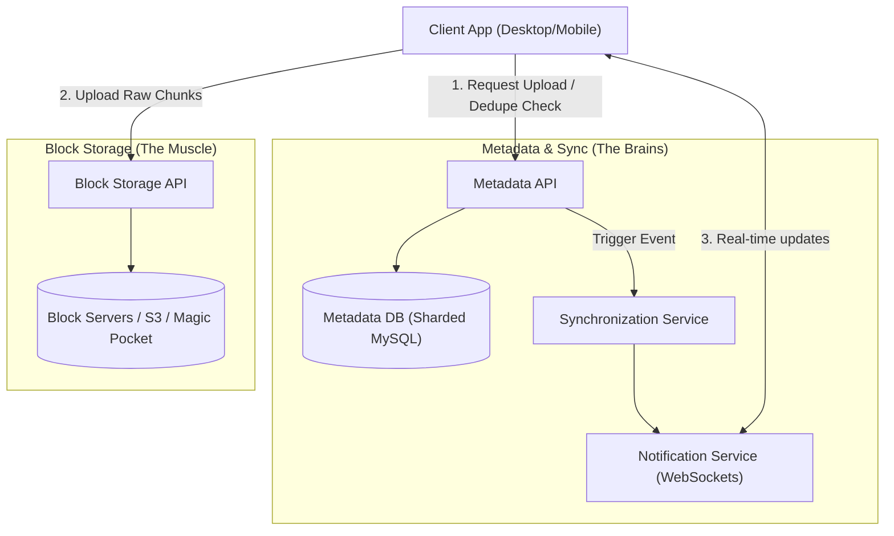
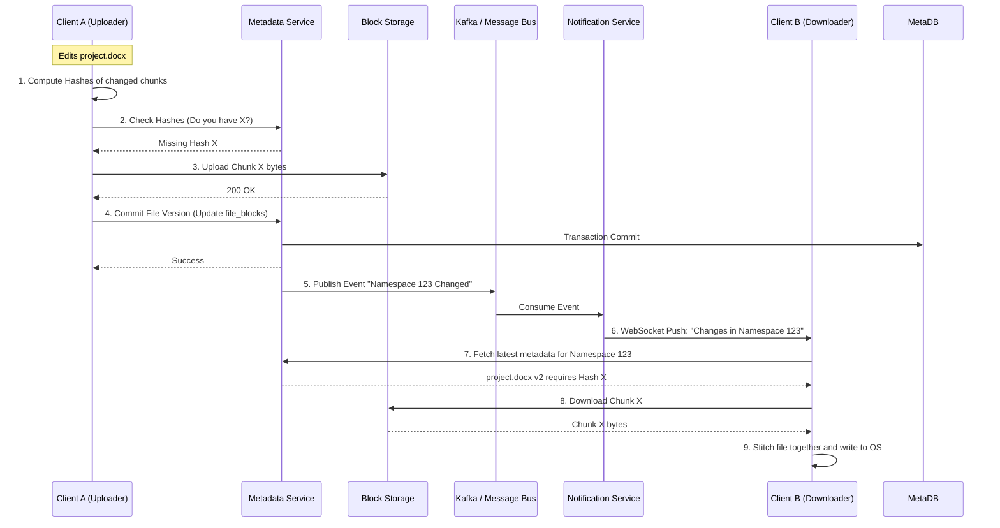

# System Design Deep Dive: Dropbox (File Sync & Storage)

This document presents a comprehensive technical deep dive into the system architecture of a global file synchronization and cloud storage service like Dropbox or Google Drive. It focuses heavily on the engineering trade-offs required to sync massive amounts of data efficiently across millions of concurrent devices while guaranteeing zero data loss.

---

## 1. Core Requirements & Scale

### A. Functional Requirements
1.  **Upload & Download**: Users can upload, download, and view files/folders.
2.  **Multi-Device Synchronization**: Files added or modified on one device must automatically sync to all other devices owned by the user.
3.  **Large File Support**: The system must handle very large files (e.g., 50GB video files) efficiently.
4.  **Offline Editing**: Users can edit files offline, and changes will sync automatically when the connection is restored.
5.  **File Sharing & Collaboration**: Users can share links to files or shared folders with strict permission controls.

### B. Non-Functional Requirements
1.  **High Durability (Zero Data Loss)**: $99.999999999\%$ (11 nines) durability. A lost file is a catastrophic business failure.
2.  **Optimized Bandwidth**: Minimize network usage. Syncing a 10MB change in a 1GB file should not require uploading 1GB.
3.  **Low Latency Sync**: Updates should propagate to connected devices in near real-time (seconds, not minutes).
4.  **Strong Consistency**: Metadata (the directory tree) must be strongly consistent to avoid corrupting file states or mismanaging permissions.

### C. The Scale Challenge
*   **Users**: 500+ Million.
*   **Files stored**: Billions to Trillions.
*   **Storage volume**: Exabytes of raw data.
*   **Concurrency**: Millions of persistent client connections (for real-time sync notifications).

---

## 2. The Golden Rule: Separation of Metadata and Block Storage

The most critical architectural decision in Dropbox is completely decoupling **Metadata** from **File Content (Block Storage)**. 

If you store metadata (file names, paths, permissions) in the same database or filesystem as the raw file bytes, the system cannot scale. 



### Trade-off Analysis: Why split them?
*   **Metadata** requires strict ACID transactional guarantees, low latency, and highly structured relational querying (e.g., "Get all files in Folder A where User B has read access"). Relational databases (MySQL/PostgreSQL) are perfect for this but terrible at storing exabytes of BLOBs.
*   **Block Storage** requires infinite horizontal scalability, high throughput, and cheap storage mediums (HDDs). It does not need relational logic; it simply maps a Hash to a BLOB of bytes (Object Storage).

---

## 3. Client-Side Architecture (The Heavy Lifting)

Unlike a simple web app, the Dropbox Desktop Client is a highly complex piece of software. It must monitor the OS file system, compute hashes, chunk files, and resolve network failures gracefully.

### A. File Chunking & Hashing
When a user adds a 10MB file, the client does not upload a single 10MB file. It splits the file into **Fixed-Size Chunks (e.g., 4MB)**.

1.  **Chunking**: File `video.mp4` is split into `Chunk 1 (4MB)`, `Chunk 2 (4MB)`, `Chunk 3 (2MB)`.
2.  **Hashing**: The client calculates the SHA-256 hash for *each* chunk.

#### Trade-off: Chunk Size (Why 4MB?)
*   **Smaller Chunks (e.g., 64KB)**: Extremely efficient for small edits (you only upload 64KB if you change one word). However, a 1GB file would generate $16,384$ chunks, creating immense pressure on the Metadata Database to store $16,384$ relationship rows.
*   **Larger Chunks (e.g., 64MB)**: Very little metadata overhead, but if you change 1 byte in a 64MB chunk, you must re-upload the entire 64MB, wasting user bandwidth.
*   **Conclusion**: 4MB is the empirical sweet spot balancing database load and network efficiency.

### B. Deduplication (Data Deduplication)
Before uploading any chunk, the client sends the SHA-256 hash of the chunk to the Metadata API.
*   **If the hash exists globally in the system**: The server replies "I already have this." The client skips the upload. 
*   **Result**: If 10,000 users upload the same viral 1GB video, Dropbox only stores it *once* and just creates 10,000 metadata links. This saves Petabytes of storage and bandwidth.

### C. Delta Sync
If a user edits a document, only the 4MB chunks that were modified change their SHA-256 hash. The client compares local chunk hashes against the server and only uploads the *changed* chunks (Delta Sync).

---

## 4. Metadata Database Design

To maintain strong consistency over file states, we use a Relational Database (MySQL/PostgreSQL), heavily sharded.

### Schema Design

#### 1. `users` Table
```sql
CREATE TABLE users (
    user_id BIGINT PRIMARY KEY,
    name VARCHAR(255),
    email VARCHAR(255) UNIQUE
);
```

#### 2. `workspaces` / `namespaces` Table
A namespace represents a root folder or a shared folder. Sharding by `namespace_id` ensures all files in a folder reside on the same DB shard, allowing transactional operations on a folder.
```sql
CREATE TABLE namespaces (
    namespace_id BIGINT PRIMARY KEY,
    owner_user_id BIGINT
);
```

#### 3. `files` Table (The logical files)
```sql
CREATE TABLE files (
    file_id BIGINT PRIMARY KEY,
    namespace_id BIGINT,
    parent_folder_id BIGINT,
    filename VARCHAR(255),
    version INT,
    is_deleted BOOLEAN,
    INDEX (namespace_id, parent_folder_id)
);
```

#### 4. `blocks` Table (The physical data)
```sql
CREATE TABLE blocks (
    block_hash VARCHAR(64) PRIMARY KEY, -- SHA-256
    storage_node_id INT,
    size INT
);
```

#### 5. `file_blocks` Table (Mapping File to Chunks)
```sql
CREATE TABLE file_blocks (
    file_id BIGINT,
    version INT,
    chunk_order INT,
    block_hash VARCHAR(64),
    PRIMARY KEY (file_id, version, chunk_order)
);
```

### Immutable Blocks & Versioning
When a user updates a file, we do **not** overwrite the old blocks in the `blocks` table or block storage. 
1. The new chunk gets a new `block_hash`.
2. We increment the file's `version` in the `files` table.
3. We create new rows in `file_blocks` mapping the new version to the new sequence of `block_hash`es.
This makes **File History/Version Recovery** trivial.

---

## 5. Block Storage Engine: Erasure Coding vs. Replication

Originally, Dropbox stored chunks on Amazon S3. As they scaled to Exabytes, the AWS bill became enormous, prompting them to build their own in-house storage system known as **Magic Pocket**.

### The Durability Trade-off
To prevent data loss if a hard drive or entire datacenter burns down, you must distribute copies of data.

*   **Approach 1: 3x Replication (HDFS/S3 Standard)**
    *   Store 3 identical copies of every 4MB chunk on 3 different physical servers.
    *   *Pros:* Fast recovery, fast reads.
    *   *Cons:* $300\%$ storage overhead. 1 Exabyte of user data costs 3 Exabytes of hard drives.
*   **Approach 2: Erasure Coding (Reed-Solomon)**
    *   Similar to RAID across a network. A chunk is split into $K$ data fragments and $M$ parity fragments. 
    *   For example, $10 + 4$ Erasure Coding: Split the data into 10 pieces, compute 4 parity math pieces. Distribute the 14 pieces across 14 racks. You can lose *any* 4 racks and still perfectly reconstruct the original data.
    *   *Pros:* Storage overhead is only $\approx 1.4x$ ($140\%$), saving billions of dollars at scale.
    *   *Cons:* If a piece is missing, the CPU must fetch the remaining pieces over the network and perform mathematical matrix multiplication to reconstruct the data (higher CPU and network cost during failure scenarios).

Because blocks in Dropbox are **WORM (Write Once, Read Many)** and rarely accessed after the first few weeks (cold data), **Erasure Coding** is the clear winner for cost-efficiency.

---

## 6. The Synchronization Flow (End-to-End)

Let's walk through what happens when User A saves a change to `project.docx` on their laptop, and User B has the same shared folder open on their desktop.



---

## 7. Real-Time Notifications (Long Polling vs. WebSockets)

When User A makes a change, how does User B's laptop know instantly?

1.  **Polling (Bad)**: If 500 million clients ask the server "Any updates?" every 5 seconds, the server will crash from pure HTTP overhead (100 million requests/sec doing nothing).
2.  **Long Polling / WebSockets (Good)**: The client opens a persistent TCP connection to the Notification Service. The server holds the connection open and sends nothing until an event occurs.
    *   The Notification Service holds millions of idle TCP connections. Modern load balancers (Envoy/HAProxy) and languages (Go/Erlang) can handle millions of concurrent idle connections per node with very low RAM overhead (epoll/kqueue).
    *   When the Metadata DB commits a change, it publishes a message to a Kafka topic partitioned by `namespace_id`.
    *   The Notification Service consumes the Kafka topic, finds the active TCP socket for User B (who is subscribed to that namespace), and pushes a tiny message: `{"type": "update", "namespace": 123}`.
    *   User B's client then initiates standard HTTP requests to pull the actual changes.

---

## 8. Conflict Resolution

**Scenario**: User A and User B both go offline. They both edit the same `project.docx`. They both come online at the exact same time.

Since Dropbox operates asynchronously without distributed file locks (which would cripple performance and make offline editing impossible), it must resolve conflicts after they happen.

1.  **Version Checking**: When User A commits, their metadata says: "Update `project.docx` from Version 1 to Version 2." The DB accepts it.
2.  **The Conflict**: User B tries to commit: "Update `project.docx` from Version 1 to Version 2."
3.  **Database Rejection**: The Metadata API rejects User B's commit because the current DB version is already 2. User B has a stale base.
4.  **Forking**: The client intercepts the rejection. It renames User B's local file to `project (User B's conflicted copy).docx` and uploads it as a brand new file. It then downloads User A's `project.docx`.
5.  **User Intervention**: The users now have both copies and must manually merge their work. This favors data preservation (no data is overwritten) at the expense of manual user cleanup.
