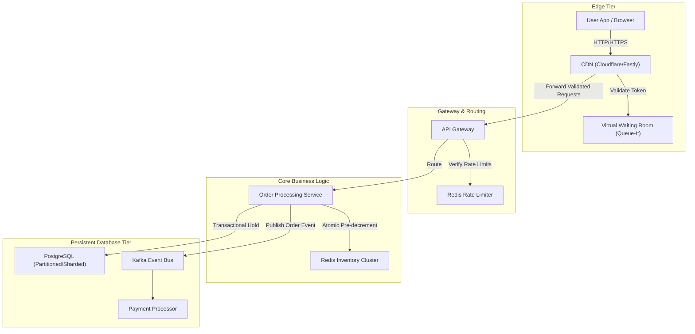
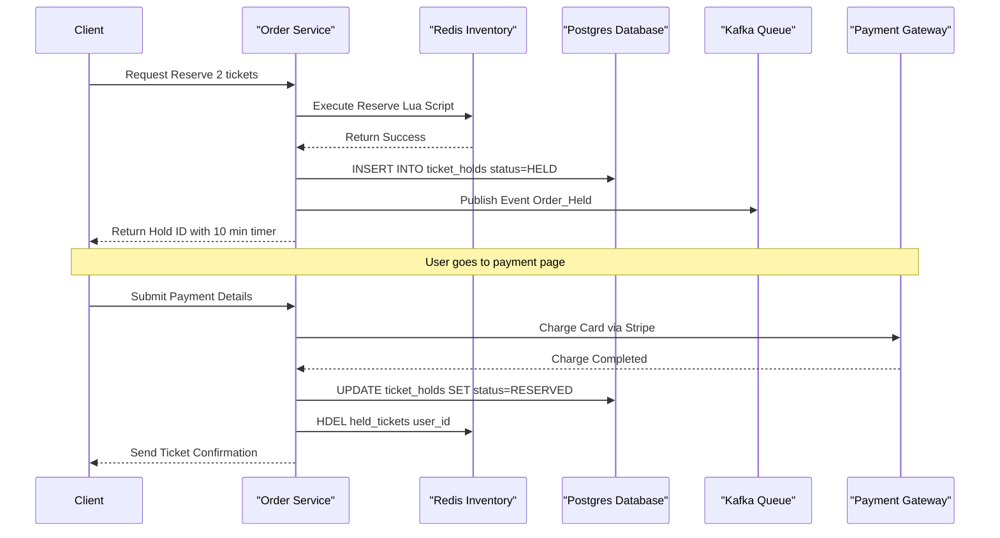

# System Design Deep Dive: High-Concurrency Ticket Booking & Flash Sale System

This document details the system design of a high-concurrency ticketing platform (e.g., Ticketmaster) or flash sale system. It covers the technical challenges of handling sudden surges of millions of concurrent requests targeting a highly scarce resource (e.g., 10,000 concert seats) without double-booking or system crashes.

---

## 1. The Core Engineering Challenge: The Traffic Funnel

In a flash sale, system traffic takes the shape of a massive funnel. The goal of a high-concurrency architecture is to **filter, rate-limit, and cache traffic as high up the stack as possible**, allowing only a tiny, manageable percentage of requests to touch the expensive database transaction layer.

```
       [ 1,000,000 Requests ]  ---> CDN / Edge Layer (Cached Pages, Static HTML/JS)
                 |
         [ 200,000 Requests ]  ---> Virtual Waiting Room (Token Issuance, Queueing)
                 |
          [ 50,000 Requests ]  ---> API Gateway (Rate Limiter, Auth Check)
                 |
          [ 10,000 Requests ]  ---> Redis Inventory Cache (Atomic Lua Pre-Decrement)
                 |
            [ 2,000 Requests]  ---> DB Transaction Layer (SQL Lock, Holding / Payment)
```

### Why Naive Systems Fail: The Database Lock Queue
If you route all traffic directly to a relational database (MySQL/PostgreSQL) and execute:
```sql
BEGIN;
SELECT stock FROM inventory WHERE product_id = 1 FOR UPDATE; -- Acquires Row Mutex
-- App check: if stock > 0, decrement
UPDATE inventory SET stock = stock - 1 WHERE product_id = 1;
COMMIT;
```
Under high concurrency:
1.  The first transaction locks the row.
2.  Thousands of other connection threads try to acquire the same row lock and are blocked, waiting in a queue.
3.  The database connection pool is immediately exhausted.
4.  Application servers run out of threads waiting for database connections.
5.  Health checks fail, and the entire system crashes (Cascading Failure).

---

## 2. High-Level System Architecture



---

## 3. The Virtual Waiting Room (Traffic Regulation at Edge)

When 1,000,000 users arrive at exactly 10:00 AM, we cannot let them all query the backend. We introduce a **Virtual Waiting Room** (e.g., Cloudflare Workers or Queue-It Integration).

### How it works:
1.  **Queue Redirection**: Before the sale starts, the CDN routes all traffic to a static holding page hosted entirely on Edge Key-Value storage.
2.  **Token Issuance**: When the sale goes live, the Edge worker issues a signed, cryptographically secure token (JWT) containing a queue position and a timestamp.
    ```json
    {
      "event_id": "concert_swift_2026",
      "queue_pos": 142095,
      "exp": 1775834400,
      "signature": "..."
    }
    ```
3.  **Active Gatekeeping**: The frontend polls the Waiting Room. When the queue manager determines it is user `142095`'s turn, the token is updated with an `active: true` status.
4.  **Edge Validation**: The API Gateway validates the signature of this token. If a user bypasses the waiting room, the API Gateway rejects the request with `403 Forbidden` at the network edge without querying the database or application servers.

---

## 4. In-Memory Inventory Pre-Decrementing (Redis + Lua)

To prevent database row locking, we manage inventory allocations in-memory using **Redis Cluster**. Because Redis operations are atomic, we can guarantee that tickets are not over-allocated.

### The Problem with "Check-then-Act" in Redis
If an application does:
```python
stock = redis.get("stock:1")
if stock > 0:
    redis.decr("stock:1")
```
Under concurrent threads, two threads can read `stock = 1` simultaneously, and both will decrement it, resulting in `stock = -1` (Over-allocation / Double-selling).

### The Solution: Atomic Lua Scripting
Redis executes Lua scripts **atomically** in its main thread. No other command can run while the Lua script is executing.

#### Lua Script for Ticket Reservation:
```lua
local inventory_key = KEYS[1]       -- e.g., "inventory:concert_123"
local held_users_key = KEYS[2]      -- e.g., "held_tickets:concert_123"
local user_id = ARGV[1]             -- e.g., "user_uuid_888"
local request_tickets = tonumber(ARGV[2]) -- e.g., 2

-- 1. Check current available stock
local current_stock = tonumber(redis.call('GET', inventory_key) or "0")

if current_stock < request_tickets then
    return -1 -- Code -1: Insufficient stock
end

-- 2. Check if the user already has a pending hold
local user_already_holding = redis.call('HEXISTS', held_users_key, user_id)
if user_already_holding == 1 then
    return -2 -- Code -2: User already has a reservation hold
end

-- 3. Perform atomic decrement
redis.call('DECRBY', inventory_key, request_tickets)

-- 4. Record the hold timestamp (for timeout releases)
redis.call('HSET', held_users_key, user_id, redis.call('TIME')[1])

return 1 -- Code 1: Success (Reservation held)
```

### Synchronizing Redis and DB (Eventual Consistency)
*   **Write-Back Caching**: The database does *not* receive updates immediately.
*   Once the Lua script returns `1`, the Order Service writes a pending order state to the Database and publishes a `TICKET_HELD` event to Kafka.
*   The user is given **10 minutes** to complete the payment.

---

## 5. Database Design & Locking Strategies

Once Redis confirms a temporary ticket reservation, the transaction moves to the database.

### A. Database Table Schemas
Ticketing systems separate **Seat Inventory** from **Reservation State** to optimize query patterns.

#### Seats Table (Read-Heavy / Immutable during event):
```sql
CREATE TABLE seats (
    seat_id SERIAL PRIMARY KEY,
    venue_id INT NOT NULL,
    section VARCHAR(16) NOT NULL,
    row_num VARCHAR(8) NOT NULL,
    seat_num INT NOT NULL,
    price DECIMAL(10,2) NOT NULL,
    UNIQUE (venue_id, section, row_num, seat_num)
);
```

#### Ticket Holds Table (Write-Heavy / Short TTL):
```sql
CREATE TABLE ticket_holds (
    hold_id UUID PRIMARY KEY DEFAULT gen_random_uuid(),
    seat_id INT REFERENCES seats(seat_id),
    user_id UUID NOT NULL,
    status VARCHAR(32) NOT NULL DEFAULT 'HELD', -- HELD, RESERVED, RELEASED
    expires_at TIMESTAMPTZ NOT NULL,
    created_at TIMESTAMPTZ DEFAULT clock_timestamp()
);

-- Index to quickly find and expire stale holds
CREATE INDEX idx_holds_expiry ON ticket_holds (expires_at) WHERE status = 'HELD';
```

### B. Hotspot Sharding & Row-Level Lock Mitigation
If thousands of users are still buying general-admission (GA) tickets (where seats aren't assigned, just pool-based like "10,000 standing floor tickets"), we encounter a SQL write bottleneck on the main inventory row.

#### Mitigation: Row Sharding / Inventory Bucketing
Instead of representing general admission stock with a single database row:
`UPDATE inventory SET stock = stock - 1 WHERE event_id = 99;` (Hotspot)

We split the stock into $N$ distinct buckets:
```sql
CREATE TABLE inventory_buckets (
    event_id INT,
    bucket_id INT, -- Range 1 to N (e.g., 1 to 10)
    stock_count INT NOT NULL,
    PRIMARY KEY (event_id, bucket_id)
);
```
When booking, the application randomly selects a bucket $B \in [1, N]$ and decrements it. This divides database lock contention on that row by a factor of $N$.
```sql
UPDATE inventory_buckets 
SET stock_count = stock_count - 1 
WHERE event_id = 99 AND bucket_id = 4 AND stock_count > 0;
```

---

## 6. The Checkout Lifecycle: State Synchronization & Saga Pattern



### Handling Timeout Releases (The "Abandoned Cart" Problem)
If the user closes their browser or their card fails, the 10-minute hold expires. We must release the tickets back to the pool.

1.  **Passive Expiry**: Any database query for active holds checks the timestamp:
    ```sql
    SELECT * FROM ticket_holds WHERE expires_at > NOW() AND status = 'HELD';
    ```
2.  **Active Cron Cleanup**: A background worker queries the database every 10 seconds for expired holds:
    ```sql
    UPDATE ticket_holds 
    SET status = 'RELEASED' 
    WHERE expires_at <= NOW() AND status = 'HELD' 
    RETURNING seat_id;
    ```
3.  **Redis Restock**: For every released seat returned by the query, the worker sends a command to Redis to increment the inventory pool back up:
    ```redis
    INCRBY inventory:concert_123 2
    ```

---

## 7. Resiliency & High Concurrency Safeguards

### A. Cache Stampede Prevention (Mutex Locking)
Under massive load, if the cache key for an event's details (price, date, performer) expires, thousands of concurrent requests will check the cache, see a miss, and query the primary database simultaneously. This is called a **Cache Stampede** (or Cache Collapse).

```
Cache Stampede (Without Mitigation):
Cache Miss -> Node 1 -> DB Query ----\
Cache Miss -> Node 2 -> DB Query -----+---> DB Crashes
Cache Miss -> Node 3 -> DB Query ----/
```

#### Mitigation: Singleflight (Go) / Lock-free Cache Loader
We ensure only **one** backend thread queries the database for a cache miss, while all other concurrent threads wait for that single result to populate the cache:
```go
import "golang.org/x/sync/singleflight"

var g singleflight.Group

func getEventDetails(eventId string) (Event, error) {
    // 1. Check cache
    val, err := redis.Get("event:" + eventId)
    if err == nil {
        return parseEvent(val), nil
    }

    // 2. Cache Miss - Wrap DB query in Singleflight
    res, err, _ := g.Do(eventId, func() (interface{}, error) {
        // Only 1 thread executes this block
        event, dbErr := queryDatabaseForEvent(eventId)
        if dbErr == nil {
            redis.Set("event:"+eventId, serialize(event), 300) // Re-populate cache
        }
        return event, dbErr
    })

    return res.(Event), err
}
```

### B. Cache Penetration Mitigation (Bloom Filters)
Malicious users or scrapers might request non-existent tickets (e.g., querying `ticket:99999999`). Since they don't exist in the cache, these requests always hit the database.

*   **Solution**: We run a **Bloom Filter** (in-memory or Redis-based) containing all valid ticket/event IDs. 
*   If the ID is not in the Bloom Filter, we reject the query immediately without checking Redis or the database.

### C. Load Shedding
When CPU usage exceeds 90% or the web server's request queue length overflows, we must drop incoming requests to protect core system stability.

*   We implement an API Gateway middleware that monitors system performance metrics.
*   If processing time spikes, the gateway immediately returns `503 Service Unavailable` or routes new connections directly to the Waiting Room. This preserves system resources for transactions already in the payment checkout phase.
