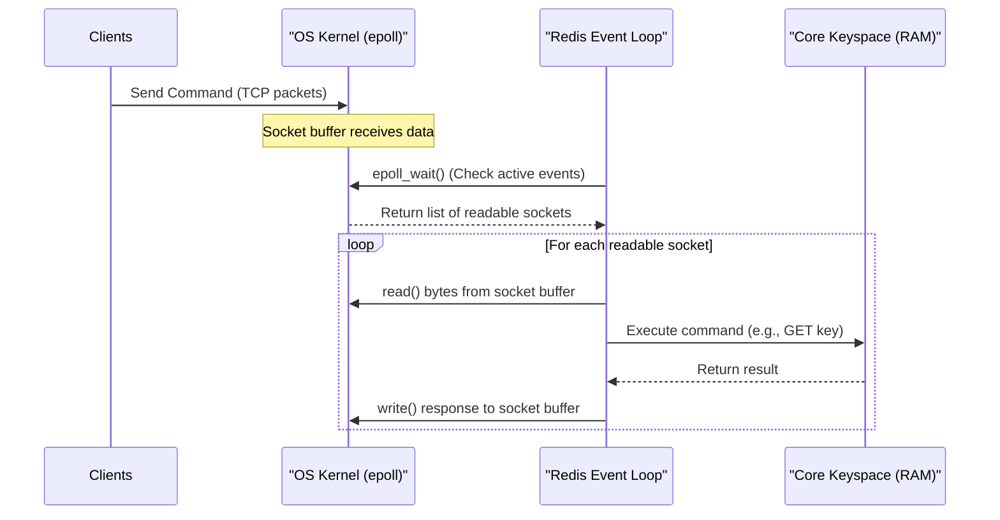
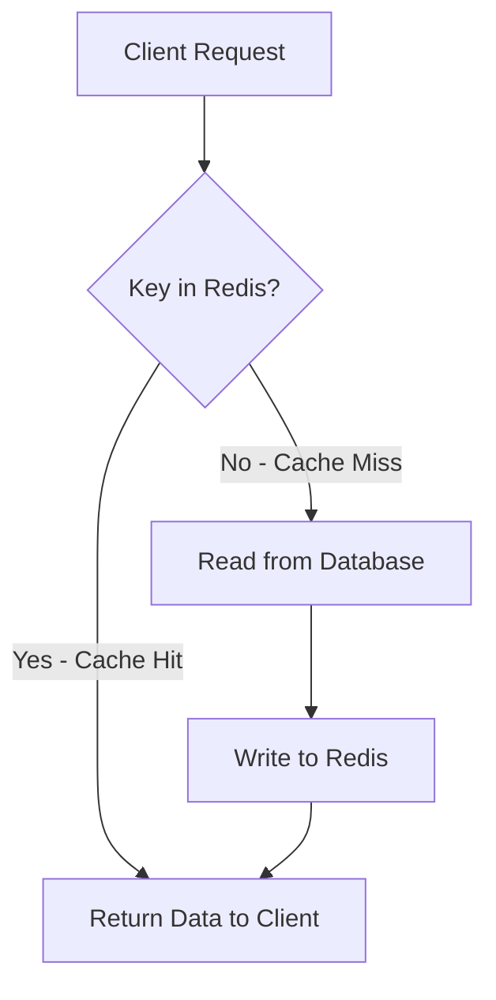

# DEEP Dive: Redis (Remote Dictionary Server)

This document is a comprehensive, production-grade technical deep dive into **Redis**. It covers the internals of how Redis achieves microsecond latency, its internal memory layout, threading architecture, hardware-level interactions, and best practices.

---

## 1. What is Redis? (High-Level Overview & Core Concepts)

At its surface, **Redis** is an open-source, in-memory, key-value data structure store used as a database, cache, message broker, and streaming engine. Unlike simple key-value stores (which map string keys to string values), Redis supports a rich set of data structures.

### The Core Analogy: The Master Chef’s Prep Table
*   **Traditional Disk-Based Database (PostgreSQL/MySQL):** Imagine a huge record library inside a basement. Every time you need a record, an archivist must take an elevator to the basement, search through physical filing cabinets, load the file into a cart, and bring it back up. Even with indexes (a catalog book), the mechanical movement and retrieval path (Disk I/O) are slow.
*   **Redis:** Imagine a master chef with a high-speed prep table right in front of them. Every ingredient, tool, and recipe card is organized in custom-shaped slots directly on the table. The chef does not leave the table. Retrieval is instant (RAM access) because there are no elevators or stairs.

```mermaid
flowchart TD
    subgraph Disk_Database ["Disk-Based DB (SQL/NoSQL)"]
        A[Client Request] --> B[Query Parser]
        B --> C[Buffer Pool Cache Check]
        C -->|Cache Miss| D[Disk Read / Page Fetch]
        D --> E[SATA/NVMe Bus Controller]
        E --> F[Spinning Platter / Flash Memory]
    end

    subgraph Redis_DB ["Redis In-Memory DB"]
        G[Client Request] --> H[Kernel TCP Buffer]
        H --> I[Event Loop epoll]
        I --> J[RAM Lookup via Hash Table]
        J --> K["O(1) Return"]
    end
```



---

## 2. Why is Redis So Fast? (Software Architecture & Data Structures)

Redis doesn't just run in memory; it employs data structures custom-tailored for memory layout, avoiding overhead and maximizing cache locality.

### A. The `redisObject` Structure
Every value in Redis is wrapped in a structure called `redisObject` defined in `server.h`:

```c
typedef struct redisObject {
    unsigned type:4;        // Redises data type (string, list, set, etc.)
    unsigned encoding:4;    // How the data is encoded (int, embstr, raw, hashtable, etc.)
    unsigned lru:LRU_BITS;  // LRU time (relative to global lruclock) or LFU data
    int refcount;           // Reference counting
    void *ptr;              // Pointer to the actual value
} robj;
```

By separating `type` (logical) from `encoding` (physical), Redis can dynamically change how data is stored under the hood based on its size to optimize memory and speed.

### B. Specialized Internal Data Encodings

| Logical Type          | Encoding Name | Underlying C Structure            | Trigger / Optimization Target                                                                                                                                                     |
| :-------------------- | :------------ | :-------------------------------- | :-------------------------------------------------------------------------------------------------------------------------------------------------------------------------------- |
| **String**            | `int`         | Long integer                      | If the string can be parsed as a 64-bit signed integer. Avoids storing string bytes.                                                                                              |
|                       | `embstr`      | Embedded String                   | For strings $\le 44$ bytes. The `redisObject` and the string data are allocated in a **single contiguous block** of memory. Extremely cache-friendly.                             |
|                       | `raw`         | Raw SDS                           | For strings $> 44$ bytes. Requires two memory allocations: one for `redisObject` and one for the string.                                                                          |
| **Hash / List / Set** | `listpack`    | Contiguous byte array             | Replaced `ziplist` in Redis 7+. Stores elements sequentially without pointers to eliminate pointer-chasing overhead and reduce memory fragmentation. Used for small hashes/lists. |
| **Hash**              | `hashtable`   | Dict (Chained Hash Table)         | Triggered when hash exceeds element limit or byte size. Standard O(1) lookups but introduces pointer chasing.                                                                     |
| **List**              | `quicklist`   | Doubly linked list of `listpacks` | Balances pointer overhead and memory compaction.                                                                                                                                  |
| **Sorted Set**        | `skiplist`    | Skip List + Hash Table            | Allows $O(\log N)$ range queries and lookups.                                                                                                                                     |

#### The Magic of `listpack` (formerly `ziplist`)
A traditional linked list contains pointers (`prev` and `next`), which require 8 bytes each on 64-bit systems. If you store 1-byte integers, the pointer overhead is 1600%! 
Furthermore, pointers cause memory fragmentation, meaning CPU cache lines cannot fetch data contiguously. 
A `listpack` eliminates pointers by serializing data into a contiguous block of bytes:

```
+--------------+--------------+------------------+ ... +--------------+
| Total Bytes  | Num Elements | Element 1 Details|     | End Sentinel |
+--------------+--------------+------------------+ ... +--------------+
```
This design fits entirely inside CPU caches, allowing the CPU to read consecutive elements without loading new DRAM pages.

#### The Sorted Set (`zset`) & Skip List
A Skip List is a probabilistic data structure that behaves like a balanced binary tree but is much simpler to implement and rebalance under high concurrency. It builds layers of links so that nodes can be skipped:

```
Level 3: [1]------------------------------>[9]-------> NULL
Level 2: [1]-------------->[5]-------------->[9]-------> NULL
Level 1: [1]---->[3]---->[5]---->[7]---->[9]---->[10]-> NULL
```

Redis pairs a **Skip List** (for range queries like `ZRANGEBYSCORE`) with a **Hash Table** (for $O(1)$ point lookups like `ZSCORE`).

---

## 3. How Threading Works in Redis

A common interview question is: *"Is Redis single-threaded or multi-threaded?"*
The correct answer is: **The core execution model is single-threaded, but the server as a whole is multi-threaded.**

### A. The Single-Threaded Core: The Reactor Pattern
The core engine that parses commands, runs business logic, and writes responses operates on a **single thread**.

#### Why Single-Threaded?
1.  **No Lock Contention:** Multithreaded systems require mutexes, read-write locks, or spinlocks to prevent race conditions on shared memory (the keyspace). Locking introduces context switching, thread synchronization latency, and risks of deadlocks.
2.  **No Context Switching:** Thread scheduling overhead is avoided.
3.  **CPU is Not the Bottleneck:** In memory databases, the performance bottle neck is typically **network bandwidth** and **memory bandwidth**, not CPU compute capacity.
4.  **Simplicity:** Writing thread-safe data structures like Skip Lists is notoriously complex.

#### The Event Loop (I/O Multiplexing)
To handle tens of thousands of concurrent connections on one thread, Redis uses OS-specific network multiplexing system calls (e.g., `epoll` on Linux, `kqueue` on macOS/BSD, `select`/`poll` as fallbacks).

Instead of waiting for a client socket to become readable, Redis registers sockets with `epoll` and enters a loop. When the OS kernel detects data on a socket, it wakes up the loop, and Redis processes the event.



### B. Modern Redis Multi-Threading (Redis 6.0+)
In Redis 6.0, I/O multiplexing was enhanced to solve a major bottleneck: **parsing network protocols and serialization/deserialization**.

While executing `GET` or `SET` inside RAM is incredibly fast, reading bytes from TCP sockets and formatting the Redis protocol response (RESP) is CPU-intensive. Under high load, the single thread spends most of its time doing network read/write operations rather than memory lookups.

#### Threaded I/O Architecture
1.  **Main Thread:** Continues to handle the event loop and **executes all commands** sequentially.
2.  **I/O Threads (Workers):** Background threads that handle reading from client sockets, parsing the RESP protocol, and formatting the response.
3.  **Synchronization:** The main thread coordinates the workers. A complete batch of client commands is parsed in parallel by I/O threads, then executed **sequentially** by the main thread, and then the responses are written back to sockets by the I/O threads.

```
                  +-------------------+
                  |   Client Sockets  |
                  +---------+---------+
                            |
           +----------------+----------------+
           |                                 |
+----------v----------+           +----------v----------+
|  I/O Thread 1       |           |  I/O Thread 2       |
|  (Read/Parse RESP)  |           |  (Read/Parse RESP)  |
+----------+----------+           +----------+----------+
           |                                 |
           +----------------+----------------+
                            | (Parsed Commands Queue)
                  +---------v---------+
                  |    Main Thread    | <-- Execute Commands Sequentially (O(1))
                  +---------+---------+
                            | (Response Buffers)
           +----------------+----------------+
           |                                 |
+----------v----------+           +----------v----------+
|  I/O Thread 1       |           |  I/O Thread 2       |
| (Serialize & Write) |           | (Serialize & Write) |
+---------------------+           +---------------------+
```

### C. Background Helper Threads (Bio Threads)
In addition to network I/O threads, Redis spawns background threads for heavy filesystem and memory operations:
*   **`bio_close_file`:** Closes file descriptors asynchronously (avoiding disk sync freezes during file close).
*   **`bio_aof_fsync`:** Handles the heavy task of flushing the Append-Only File cache to physical disk (using the `fsync()` system call).
*   **`bio_lazy_free`:** Destroys large structures in the background. If you run `DEL heavy_key` containing millions of elements, freeing that memory on the main thread would freeze Redis for seconds. The `UNLINK` command offloads this garbage collection to a background thread.

---

## 4. How Redis Ties into Hardware

To truly master Redis, we must understand how it interacts with the physical server hardware: CPU cache, DRAM, system bus, page tables, and the kernel.

### A. The Memory Hierarchy & Cache Locality
CPUs are orders of magnitude faster than system memory (DRAM). A CPU register access takes $< 1\text{ ns}$, L1 cache takes $\approx 1\text{ ns}$, L3 cache takes $\approx 15\text{ ns}$, while a DRAM access takes $\approx 50-100\text{ ns}$.

```
+--------------------------------------------+-----------------------+
| Hardware Level                             | Access Latency        |
+--------------------------------------------+-----------------------+
| CPU Registers                              | < 1 ns                |
| L1 Cache (Per Core)                        | ~1-2 ns               |
| L2 Cache (Per Core)                        | ~4-5 ns               |
| L3 Cache (Shared across socket)            | ~15-20 ns             |
| Main Memory (DRAM)                         | ~60-100 ns            |
| NVMe SSD (Flash)                           | ~10,000-50,000 ns     |
| Magnetic Disk (SATA)                       | ~5,000,000-10,000,000 ns|
+--------------------------------------------+-----------------------+
```

*   **Cache Lines:** When the CPU requests data from DRAM, it doesn't fetch a single byte; it fetches a **64-byte Cache Line**.
*   **Pointer Chasing vs. Sequential Layouts:** 
    *   *Pointer Chasing:* A linked list where nodes are scattered across RAM forces the CPU to stall (wait) for DRAM on every node jump.
    *   *Contiguous Memory:* Data structures like `listpack` or `embstr` strings store elements contiguously. When the first element is read, the next several elements are pre-fetched into L1/L2 cache automatically. This is why Redis uses dense arrays for small data sizes.

### B. NUMA (Non-Uniform Memory Access) Bottlenecks
Modern multi-socket motherboards partition RAM into zones dedicated to specific CPU sockets. If a thread running on CPU Socket 0 accesses RAM connected to CPU Socket 1, it must cross the interconnect bus (e.g., Intel UPI or AMD Infinity Fabric), which adds substantial latency.

#### Optimization: CPU Pinning (CPU Affinity)
To prevent the OS scheduler from bouncing the Redis process across different CPU cores and sockets (which flushes L1/L2 caches and triggers remote NUMA node lookups), you should pin Redis to a specific physical core:
```bash
# Pin Redis to Core 0
taskset -c 0 redis-server /path/to/redis.conf
```
*Caution:* If you pin Redis to Core 0, ensure background processes (like AOF rewrites or system tasks) are pinned to other cores so they don't fight with the main event loop.

### C. Copy-on-Write (COW) & The Virtual Memory Subsystem
Redis persists data using background snapshots (`BGSAVE`). It does this without blocking the main event loop by using the OS `fork()` system call.

#### How `fork()` and Copy-on-Write work:
1.  **Page Tables:** The OS maps virtual memory addresses (used by processes) to physical memory addresses (RAM chips) using structures called **Page Tables**.
2.  **Snapshot Trigger:** When `BGSAVE` starts, Redis calls `fork()`. The OS creates a child process.
3.  **No Data Copying:** The child process does **not** copy the actual memory contents. Instead, it copies only the **Page Tables** of the parent. This is extremely fast. Both parent and child now point to the exact same physical memory pages.
4.  **Read-Only Flags:** The OS marks these physical pages as **Read-Only**.
5.  **Write Interception:** When a client sends a write request (e.g., `SET user:1 "new_val"`), the CPU tries to write to the memory page. Since it's marked read-only, it triggers a **Page Fault**.
6.  **Page Copying:** The kernel intercepts this fault, duplicates the target 4KB memory page into a new physical location, updates the parent's page table to point to this new page, marks it read-write, and performs the update there. The child process's page tables still point to the original, unmodified page.

```
Initial State (Immediately after fork):
Parent Process (Redis) ---> [ Page Table A ] ---\
                                                 +---> [ Physical RAM Page (Key: "val") ]
Child Process (BGSAVE) ---> [ Page Table B ] ---/

After Parent Writes to Key:
Parent Process (Redis) ---> [ Page Table A (Updated) ] ---> [ Physical RAM Page (Key: "new_val") ]
                                                            
Child Process (BGSAVE) ---> [ Page Table B ] -------------> [ Physical RAM Page (Key: "val") ] (Unchanged)
```

#### Hardware Risks with Copy-on-Write:
*   **Memory Inflation:** If your database is write-heavy, many memory pages will be duplicated during the snapshot. In a worst-case scenario, you could require **double the memory allocation**. If memory runs out, the OS will trigger the Out-Of-Memory (OOM) killer.
*   **Huge Pages (Transparent Huge Pages - THP):** Linux OS uses a feature called THP, which groups standard 4KB memory pages into 2MB huge pages. Under Copy-on-Write, if a single byte in a 2MB block is modified, the kernel must duplicate the **entire 2MB block** instead of a 4KB page. This drastically increases write latency and memory usage. **Always disable THP in production for Redis.**

---

## 5. How Should Redis Be Used? (Patterns & Best Practices)

Redis is highly versatile. Below are the primary design patterns used in production systems.

### A. Caching Patterns



1.  **Cache-Aside (Lazy Loading):** (Most common) Application queries Redis first. On cache miss, it reads from the primary DB, writes the result to Redis, and returns it.
    *   *Key expiration (TTL):* Always set TTLs to prevent stale data.
2.  **Write-Through:** Application writes to Redis, and Redis (or an intermediary driver) immediately updates the primary DB.
3.  **Write-Behind (Write-Back):** Application writes to Redis only. A background worker periodically flushes accumulated writes from Redis to the primary DB. Excellent for high-speed write buffering.

### B. Distributed Locks (Mutual Exclusion)
To coordinate tasks across multiple microservices without database locks, Redis is used.

#### Single-Instance Lock Protocol:
*   **Acquire:** Use `SET key value NX PX milliseconds`
    *   `NX`: Set only if the key does not exist (atomicity).
    *   `PX`: Set expiration to prevent deadlocks if the lock holder crashes.
    *   *Value:* Must be a unique, cryptographically random identifier generated by the client (to ensure you only release your own lock).
*   **Release:** Done via a Lua Script (atomic execution on the main thread):
    ```lua
    if redis.call("get", KEYS[1]) == ARGV[1] then
        return redis.call("del", KEYS[1])
    else
        return 0
    end
    ```

### C. Rate Limiters
Using Redis for IP or API token rate limiting.

#### Token Bucket Pattern (with Lua Script):
Instead of querying and saving timestamps constantly, we store a hash representing the bucket capacity and last check time:
```lua
local key = KEYS[1]
local limit = tonumber(ARGV[1])
local current = tonumber(redis.call('get', key) or "0")

if current + 1 > limit then
    return 0 -- Rate limit exceeded
else
    redis.call("INCRBY", key, 1)
    if current == 0 then
        redis.call("EXPIRE", key, ARGV[2]) -- TTL window
    end
    return 1 -- Allowed
end
```

### D. Message Queues
*   **Redis List (`LPUSH` & `BRPOP`):** Simple queue. `BRPOP` is a blocking pop command that keeps the connection open until an element is pushed, avoiding busy-waiting loops.
*   **Pub/Sub (`PUBLISH` / `SUBSCRIBE`):** Fire-and-forget message delivery. Subscribers must be online to receive messages; no historical replay.
*   **Streams:** A append-only log structure modeled after Apache Kafka, featuring consumer groups, offset tracking, and message acknowledgment.

---

## 6. Persistence: Under the Hood

Because Redis is in RAM, a power loss would result in complete data loss without persistence. Redis provides two primary persistence engines:

### A. RDB (Redis Database) Snapshotting
*   **What it does:** Performs point-in-time binary snapshots of the keyspace to disk (e.g., `dump.rdb`).
*   **Pros:** Highly compressed single file, fast to load during server startup.
*   **Cons:** Data loss window. If Redis crashes between snapshots (e.g., snapshots run every 15 minutes), all writes in that window are lost.

### B. AOF (Append-Only File) Logging
*   **What it does:** Logs every write command received by the server to a disk file.
*   **`fsync()` Policies:**
    *   `appendfsync always`: Calls `fsync` on every write. Safest, but severely degrades performance (limited by disk write speeds).
    *   `appendfsync everysec`: (Recommended Default) A background bio thread calls `fsync` every second. Maximizes performance while limiting data loss to at most 1 second.
    *   `appendfsync no`: Let the operating system handle flushing cache buffers (usually every 30 seconds). High risk of data loss.

### C. Hybrid Persistence (Redis 4.0+)
A combination of both: The AOF file is rewritten with a binary RDB file at its beginning, followed by incremental append-only text commands. This achieves both fast loading times and minimal data loss.

---

## 7. Eviction Policies (Memory Management)

When Redis memory usage exceeds the configured `maxmemory` limit, it must discard keys to make room for new writes. The policy is configured via `maxmemory-policy`.

### The Core Eviction Strategies:
1.  **`noeviction`:** (Default) Returns errors on write operations but continues to serve read queries.
2.  **`volatile-lru`:** Evicts the Least Recently Used keys among those with an expiration set (TTL).
3.  **`allkeys-lru`:** Evicts the Least Recently Used keys across the entire keyspace.
4.  **`volatile-lfu`:** Evicts the Least Frequently Used keys among those with a TTL.
5.  **`volatile-ttl`:** Evicts the keys closest to expiring (shortest TTL remaining).

#### How Redis Implements LRU (Approximated LRU)
A true LRU algorithm requires maintaining a doubly linked list of all items in memory. When an item is accessed, it must be moved to the head of the list. This operation incurs massive pointer-manipulation and locking overhead.

Instead, Redis uses an **approximated LRU algorithm**:
1.  Every `redisObject` contains a 24-bit `lru` field storing the Unix timestamp of its last access.
2.  When memory needs to be reclaimed, Redis does not check every key. Instead, it randomly samples a set of keys (e.g., 5 keys, configurable via `maxmemory-samples`).
3.  It finds the oldest key among the sample set and evicts it.
4.  This approximation performs nearly identically to a true LRU while consuming zero additional CPU overhead for sorting.

---

## 8. Summary Checklist for Production Deployment

To ensure Redis performs optimally in production, verify the following system configurations:

1.  **Overcommit Memory:** Set `vm.overcommit_memory = 1` in `/etc/sysctl.conf` to allow background processes to fork memory blocks safely without running out of virtual address space.
2.  **Disable Transparent Huge Pages (THP):** run `echo never > /sys/kernel/mm/transparent_hugepage/enabled` to prevent massive memory duplication overhead during Copy-on-Write forks.
3.  **File Descriptors:** Increase client socket limits (`ulimit -n 65536`) to handle thousands of concurrent TCP connections.
4.  **TCP Backlog:** Increase the OS queue limit for half-open connections to avoid dropped packets during connection spikes.
5.  **Bind and Protect:** Always set a password (`requirepass`) and bind Redis to local interfaces or place it behind a private VPC. Never expose raw Redis port `6379` to the public internet.
