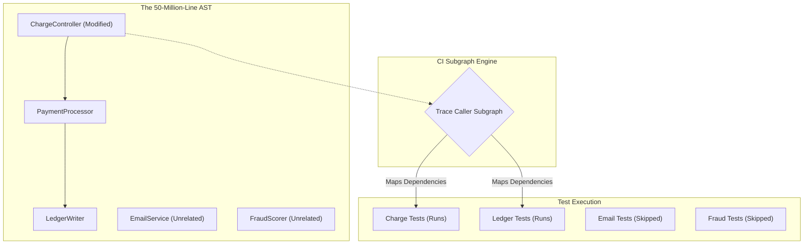
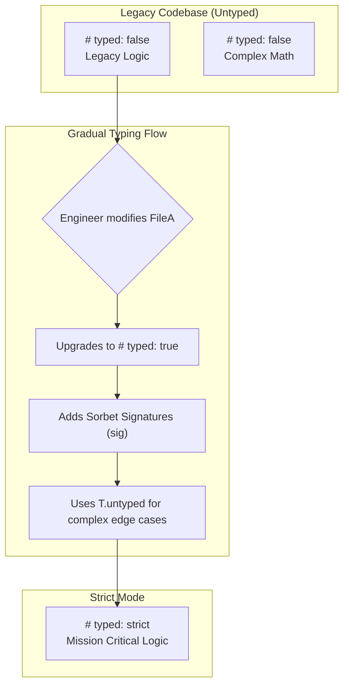
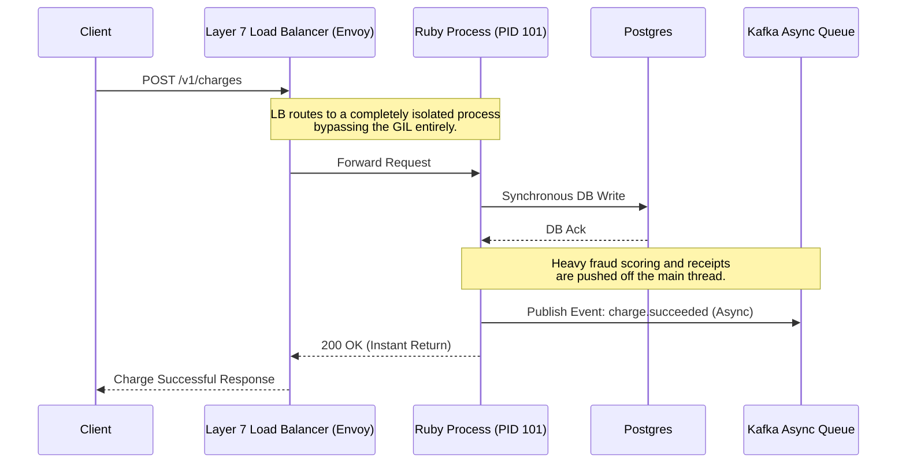
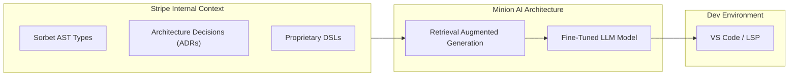

# The Monolith's Revenge: How Stripe Scaled a 50-Million-Line Ruby Codebase

*Published in Engineering Deep Dives | Architecture & Scaling*

In the modern era of backend engineering, there is an unwritten dogma: *Once a codebase reaches a certain size, it must be shattered into microservices.* The promised land of distributed systems offers independent deployment pipelines, polyglot persistence, and isolated failure domains. 

Yet, beneath the surface of this industry consensus lies a hidden truth: microservices introduce staggering operational complexity. Network latency, distributed transactions (Sagas), and tracing become full-time engineering nightmares.

Stripe—handling hundreds of billions of dollars in transaction volume—chose a radically different path. They rejected the microservice dogma and kept their core payment engine as a **massive, 50-million-line Ruby Monolith**. 

###  The Architectural Trade-off

| Feature | Traditional Microservices | Stripe's Monolith Approach |
| :--- | :--- | :--- |
| **Codebase** | Hundreds of small, isolated repositories. | One massive 50M+ line repository. |
| **Deployment** | Independent, complex orchestration (K8s). | Unified, heavy deployment train. |
| **Failure Domain** | Isolated (Service A crashing doesn't kill B). | Shared (Mitigated by process-level isolation). |
| **CI Speed** | Naturally fast (testing small services). | Achieved via AST Selective Test Execution. |
| **Type Safety** | Guaranteed by languages (Go, Java). | Augmented via custom C++ Compiler (Sorbet). |

> [!IMPORTANT]
> The core architectural takeaway from Stripe is the **Separation of Bottlenecks**:
> 1. **Productivity Bottlenecks** (Type safety, CI speed) were solved using custom compiler tooling.
> 2. **Performance Bottlenecks** (The GIL, latency) were solved using process-level architecture.

---

## Part I: The Build Latency Crisis and the Dependency Graph

As a monolith grows, the first system to break is Continuous Integration (CI). If CI takes three hours to complete, developer velocity grinds to a halt.

### The Mechanism: Static Analysis and Caller Subgraphs
Instead of running every test, Stripe's CI infrastructure dynamically computes exactly what code was touched in a Pull Request and traces it through the monolith's dependency tree.

> [!TIP]
> **The 5% Metric**: By pruning the testing tree, a commit on average only triggers **~5% of the total test suite**. They built the agility of a microservice architecture entirely via compiler-level static analysis, avoiding the network overhead of distributed systems entirely.

---

## Part II: Taming the Dynamic Beast with Sorbet

Ruby is famously dynamic. It duck-types, heavily utilizes metaprogramming, and evaluates code at runtime. For a financial giant processing GDP-level transaction volumes, dynamic typing becomes a ticking time bomb.

### Why Not Rewrite in Java or Go?
A complete rewrite of millions of lines of code would stall product velocity for years. Instead, Stripe decided to *augment* Ruby by building **Sorbet**, a gradual static type checker.

### Why Build Sorbet in C++? (The Performance Imperative)
To achieve instant feedback, Stripe wrote the Sorbet compiler entirely in **C++**. 

> [!NOTE]
> By leveraging C++'s bare-metal memory management and true thread-level concurrency, Sorbet parses and type-checks over **100,000 lines of Ruby code per core, per second**.

### The Magic of Gradual Typing (`T.untyped`)
If Stripe forced strict typing immediately, millions of lines of legacy code would instantly fail CI. Instead, Sorbet introduced file-by-file strictness levels, allowing teams to adopt types at their own pace.

> [!WARNING]
> **Fearless Refactoring**: Before Sorbet, engineers were terrified to make sweeping changes. With Sorbet enforcing compile-time contracts, a single Stripe engineer famously converted **3.7 million lines of code** in a single Pull Request safely.

---

## Part III: The Concurrency Illusion and the GIL

Stripe still had to solve the *performance* bottleneck inherent to Ruby: **The Global Interpreter Lock (GIL)**. The GIL ensures that even on a multi-core machine, only one thread can execute Ruby code at a time per process.

### The Process-Level Architecture
Stripe recognized that they could not scale concurrency at the thread level. The solution was horizontal scaling at the **process level**.

Instead of trying to force a single Ruby monolith to multithread, Stripe's infrastructure spins up heavy clusters of entirely isolated Ruby processes. Each process owns a dedicated CPU core, entirely bypassing the GIL constraint because they share no memory space.

---

## Part IV: Next-Generation Developer Tooling

When a codebase scales beyond human comprehension, developer tooling becomes the primary limiting factor for engineering output.

### Ruby FMT (The Rust Rewrite)
Standard open-source Ruby formatters (like RuboCop) are written in Ruby. Parsing and formatting millions of lines of AST in Ruby is incredibly slow. Stripe rewrote their auto-formatter in **Rust**. Rust's zero-cost abstractions achieved orders-of-magnitude faster execution, dropping formatting times from minutes to milliseconds.

### Minions: Proprietary AI Agents
Commercial LLMs (like GPT-4) failed spectacularly when dropped into Stripe's codebase. They hallucinated when dealing with Stripe's proprietary Ruby DSLs and Sorbet signatures. 

To solve this, Stripe built **Minions**—in-house AI agents trained specifically on their internal environment.

By constraining the AI's context to their exact technological reality, they unlocked highly accurate AI-assisted development inside a bespoke monolith.

---

## Conclusion: The Golden Rule of Scaling

Stripe's engineering journey proves a massive industry counter-narrative: **Microservices are not a strict prerequisite for massive scale.** 

By investing internally rather than chasing the distributed systems hype, Stripe successfully scaled a monolith to handle a measurable percentage of global internet commerce.
