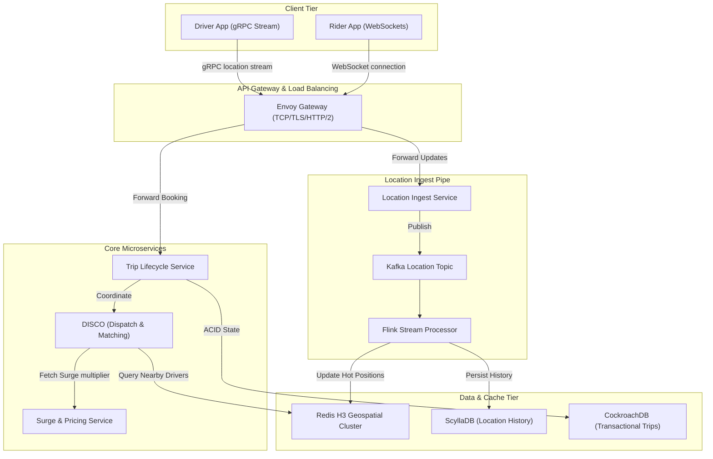

# System Design Deep Dive: Uber (Global Ride-Hailing Platform)

This document presents a comprehensive, production-grade system architecture design for a global ride-hailing platform like Uber. It details the ingestion pipeline, geospatial partitioning, transactional database sharding, caching strategies, distributed state management, and real-time dispatch matching.

---

## 1. Core Requirements & Scale Estimations

### A. Functional Requirements
1.  **Real-Time Driver Location Ingestion**: Active drivers broadcast their coordinates (lat, lon) every 4 seconds.
2.  **Dynamic Matching (Dispatch)**: Riders request a ride; the system matches them with the optimal nearby driver.
3.  **Real-Time Tracking**: Riders track driver locations in real-time during dispatch and during the trip.
4.  **Fare Estimation & Routing**: Dynamic fare calculation based on traffic, demand, and distance.
5.  **Trip Lifecycle Management**: Creation, state updates (pickup, dropoff), billing, and archival.

### B. Non-Functional Requirements
1.  **Ultra-Low Latency Ingestion**: Location updates must be processed within $< 100\text{ ms}$ at the gateway.
2.  **High Availability**: $99.999\%$ uptime for core booking and tracking pathways.
3.  **Zero Double-Matching**: Strict mutual exclusion—a driver can only be matched to one rider at a time.
4.  **Global Scalability**: Scale to millions of active drivers, tens of millions of active riders, and millions of concurrent trips.

### C. Scale Assumptions
*   **Active Drivers**: $5\text{ million}$ concurrent drivers.
*   **Active Riders**: $40\text{ million}$ concurrent riders.
*   **Location Ingestion Rate**: $5\text{ million drivers} \times 0.25\text{ updates/sec} = 1.25\text{ million writes/sec}$.
*   **Ride Requests**: Peak rate of $50,000\text{ requests/sec}$ globally.
*   **Tracking Reads**: $40\text{ million active riders} \times 0.25\text{ reads/sec} = 10\text{ million reads/sec}$ (assuming 4-second polling or WebSocket delivery).

---

## 2. High-Level Architecture Overview



---

## 3. Geospatial Indexing: H3 Hexagonal Grid

A flat latitude/longitude coordinates system is highly inefficient for radius querying ($O(N)$ scanning). To solve this, we divide the earth's surface into discrete grid cells. 

### Why Uber H3 over Google S2 or Geohash?
1.  **Hexagonal Symmetry**: Unlike squares (Geohash/S2), where neighbors are at different distances (orthogonal vs. diagonal), every neighbor of a hexagon is **exactly equidistant** from its center. This simplifies radius searches, routing circles, and distance calculations.
2.  **Hierarchical Resolution**: H3 provides 16 resolution levels.
    *   **Resolution 8** (edge length $\approx 461\text{ meters}$, area $\approx 0.7\text{ km}^2$) is ideal for local driver matching.
    *   **Resolution 6** (edge length $\approx 3.2\text{ km}$, area $\approx 36\text{ km}^2$) is ideal for calculating localized surge pricing.

```
H3 Resolution Hierarchy:
      /\
     /  \
    |Res 6| 
   / \  / \
  /   \/   \
 |Res8| |Res8|  <-- Equidistant centers make neighborhood traversal O(1)
  \  /  \  /
   \/    \/
```

---

## 4. Database Schema & Detailed Sharding Strategy

To scale horizontally without hotspots, data is split across distinct databases optimized for either **high-write transient keys** (locations) or **highly consistent transaction states** (trips).

### A. Driver Location History Database (ScyllaDB / Cassandra)
*   **Characteristics**: Write-heavy, wide-row schema, predictable queries.
*   **Partition Key**: `driver_id`. This distributes writing loads evenly across the cluster ring.
*   **Clustering Key**: `bucket_date` and `timestamp DESC`. This stores location history sequentially on physical disk blocks for immediate time-range scans.

#### Database Schema:
```sql
CREATE KEYSPACE driver_telemetry WITH replication = {
    'class': 'NetworkTopologyStrategy', 
    'us-east': 3, 
    'us-west': 3
};

CREATE TABLE driver_telemetry.location_history (
    driver_id uuid,
    bucket_date date, -- YYYY-MM-DD to bound partition sizes
    timestamp timestamp,
    h3_res8_index text,
    latitude double,
    longitude double,
    speed_mps float,
    heading_degrees int,
    altitude_m float,
    PRIMARY KEY ((driver_id, bucket_date), timestamp)
) WITH CLUSTERING ORDER BY (timestamp DESC);
```

#### What is written on each Shard?
1.  The coordinator hashes the composite Partition Key `(driver_id, bucket_date)` to produce a 64-bit Murmur3 token.
2.  The token maps to a specific replica node range in the Cassandra/Scylla ring.
3.  Each write appends to the node's memory table (Memtable) and Write-Ahead Log (WAL) sequentially.
4.  No read-before-write: updates are pure append operations.

---

### B. Hot Geospatial Cache (Redis Cluster)
*   **Characteristics**: In-memory, sub-millisecond reads/writes, TTL-based eviction.
*   **Purpose**: Map H3 cells to active, available drivers.

#### Sharding Strategy:
*   We use a Redis Cluster with 16,384 hash slots.
*   To avoid cross-slot queries (which require network hops between Redis nodes), we partition data by H3 Resolution 6 cells.
*   **Key Design**: `geo:h3:res6:{<H3_Cell_Hex>}`. By enclosing the H3 index in curly braces, Redis hashes *only* the H3 cell string for slot assignment. This guarantees that all driver keys within that larger geographical cell are stored on the **same physical Redis node**.

#### Data Structure:
Each key is a **Sorted Set (ZSET)**.
*   **Value (Member)**: `driver_id`
*   **Score**: Unix Timestamp of last location update.

#### Flow of Updates:
1.  When a location update arrives for a driver in cell `882a100d23fffff` (Res 8), we compute its parent cell at Res 6: `862a100d7ffffff`.
2.  Write to Redis:
    ```redis
    ZADD geo:h3:res6:{862a100d7ffffff} 1775342400 "driver_uuid_102"
    ```
3.  Pruning expired drivers (drivers who haven't updated in 30 seconds):
    ```redis
    ZREMRANGEBYSCORE geo:h3:res6:{862a100d7ffffff} -inf (1775342370)
    ```

---

### C. Trip Transaction Store (CockroachDB)
*   **Characteristics**: Multi-master replication, serializable transactions, horizontal scaling, automatic range splitting.
*   **Sharding Strategy**: Partitioned by `trip_id` (UUIDv7). UUIDv7 contains a time-based prefix, ensuring spatial sorting while preventing the single-node write hotspotting common with sequential integer auto-increment keys.

#### Table Schema:
```sql
CREATE TABLE trips (
    trip_id UUID PRIMARY KEY DEFAULT gen_random_uuid(),
    rider_id UUID NOT NULL INDEX,
    driver_id UUID INDEX,
    status VARCHAR(32) NOT NULL DEFAULT 'REQUESTED', -- REQUESTED, MATCHING, ACCEPTED, EN_ROUTE, ON_TRIP, COMPLETED, CANCELLED
    pickup_h3_res8 VARCHAR(15) NOT NULL,
    dropoff_h3_res8 VARCHAR(15) NOT NULL,
    fare_amount DECIMAL(10,2) NOT NULL,
    surge_multiplier DECIMAL(3,2) DEFAULT 1.0,
    created_at TIMESTAMPTZ DEFAULT clock_timestamp(),
    updated_at TIMESTAMPTZ DEFAULT clock_timestamp(),
    CONSTRAINT status_check CHECK (status IN ('REQUESTED', 'MATCHING', 'ACCEPTED', 'EN_ROUTE', 'ON_TRIP', 'COMPLETED', 'CANCELLED'))
);

CREATE TABLE trip_events (
    event_id UUID PRIMARY KEY DEFAULT gen_random_uuid(),
    trip_id UUID REFERENCES trips(trip_id) ON DELETE CASCADE,
    old_status VARCHAR(32),
    new_status VARCHAR(32) NOT NULL,
    timestamp TIMESTAMPTZ DEFAULT clock_timestamp()
);
```

---

## 5. Live Ingestion & Location Processing Pipeline

A location update must pass from the driver's phone to the matching engine with minimal delay.

### Ingestion Flow:
1.  **Driver App Client**: Collects raw GPS data. Applies a **Kalman Filter** on the device to smooth noise caused by tall buildings (urban canyons) and filters out stationary updates (reducing network usage).
2.  **Network Layer**: Opens a long-lived gRPC bidirectional streaming connection (`LocationService/StreamLocation`) over HTTP/2. This avoids the TCP handshake and HTTP header parsing overhead of REST.
3.  **API Gateway (Envoy)**: Standardizes TLS termination, extracts claims from JWT, routes the stream to the `Location Ingest Service`.
4.  **Kafka Location Topic**: Ingestion service publishes message to Kafka.

#### Protobuf Schema for Location:
```protobuf
syntax = "proto3";
package telemetry;

message LocationUpdate {
  string driver_id = 1;
  double latitude = 2;
  double longitude = 3;
  float speed = 4;
  int32 heading = 5;
  int64 timestamp_epoch_ms = 6;
  enum DriverStatus {
    OFFLINE = 0;
    AVAILABLE = 1;
    ON_TRIP = 2;
  }
  DriverStatus status = 7;
}
```

#### Kafka Partitioning Strategy:
*   Topic: `driver-locations`
*   Partition Key: `driver_id` (UUID). This guarantees that all updates for a specific driver are ordered sequentially inside a single partition, avoiding out-of-order state updates.
*   Consumer Group: **Apache Flink Processing Job**.

```
                       +-------------------+
                       |  Kafka Partition  |
                       | (driver_id Hash)  |
                       +---------+---------+
                                 |
                       +---------v---------+
                       | Flink Job worker  |
                       +----+---------+----+
                            |         |
         +------------------+         +------------------+
         | (Updates keyspace)                            | (History Append)
+--------v--------+                             +--------v--------+
|  Redis ZSET     |                             | ScyllaDB        |
|  (Geo Cache)    |                             | (Telemetry log) |
+-----------------+                             +-----------------+
```

---

## 6. The Dispatch & Match Engine (DISCO)

Matching a rider to a driver is not a simple "first-in, first-out" search. Doing so leads to sub-optimal routing.

```
Sub-optimal vs. Batch Matching (The Bipartite Matching Problem):

      R1 (Rider 1)                R1                      R1
         \                         \                      /
     2 min\                         \ 2 min        5 min /
           \                         \                  /
            D1 (Driver 1)             D1               D1
           /                                           
     3 min/                                            
         /                                             
      R2 (Rider 2)                R2                      R2
                                   \                      /
                                    \ 3 min        1 min /
                                     \                  /
                                      D2               D2
                                   
   [FIFO Greedy Model]          [Batch 1 Matching]      [Batch 2 Matching]
   R1 matched to D1 (2m)        R1 matched to D1 (2m)   R1 matched to D1 (5m)
   R2 matched to D2 (??)        R2 matched to D2 (3m)   R2 matched to D2 (1m)
   Total Wait: 2m + 12m = 14m   Total Wait: 2m+3m = 5m  Total Wait: 5m+1m = 6m
```

### A. Batch Matching (Combinatorial Optimization)
Instead of matching a request instantly, the **DISCO Engine** collects ride requests and driver locations in **4-second temporal windows**.

1.  **Gathering Candidates**: For all ride requests in a target H3 Res 8 cell, query the parent Res 6 cells in the Redis ZSET for available drivers.
2.  **Routing Queries (Distance Matrix)**: Calculate the actual routing distance and Estimated Time of Arrival (ETA) for each driver-rider pair using an OSRM (Open Source Routing Machine) cluster.
3.  **Cost Function**: Construct a bipartite graph where:
    *   Left Nodes: Ride Requests ($R$).
    *   Right Nodes: Available Drivers ($D$).
    *   Edges: Cost ($C$) calculated as:
        $$C = \text{ETA} + \text{SurgeMultiplierPenalty} + \text{DriverRatingWeight}$$
4.  **Optimization Algorithm**: Run the **Kuhn-Munkres (Hungarian) Algorithm** or a minimum-cost flow algorithm on the bipartite graph to minimize the global sum of ETAs for the batch.

---

### B. Driver State Machine & Locking (Double-Match Prevention)
To ensure two riders aren't dispatched to the same driver simultaneously under high concurrency, we model driver states and protect them with atomic distributed locks.

#### Driver States:
```
       +-----------+
       |  OFFLINE  |
       +-----+-----+
             | Go Online
       +-----v-----+
       | AVAILABLE <----------------------------------+
       +-----+-----+                                  | Reject /
             | Dispatch Match Offered                 | Expiry
       +-----v-----+                                  |
       |  OFFERED  +----------------------------------+
       +-----+-----+
             | Accept Offer
       +-----v-----+
       | EN_ROUTE  |
       +-----+-----+
             | Arrive / Start Trip
       +-----v-----+
       |  ON_TRIP  |
       +-----+-----+
             | Dropoff Complete
       +-----+-----+
       | COMPLETED | -- (Returns back to AVAILABLE)
       +-----------+
```

#### The Atomic Match Transaction (Step-by-Step):
When the dispatch matching algorithm pairs `driver_789` with `trip_456`:

1.  **Acquire Distributed Lock**: The Dispatch Engine requests a Redis-based distributed lock for the driver ID:
    ```redis
    SET lock:driver:789 "disco_engine_node_01" NX PX 5000
    ```
2.  **Check and Set State**: Within the lock window, query the trip table in CockroachDB. The trip state must be `REQUESTED` and the driver's state in the local memory cache must be `AVAILABLE`.
3.  **Update Database Transactionally**:
    ```sql
    BEGIN;
    UPDATE trips 
    SET driver_id = 'driver_789_uuid', status = 'ACCEPTED', updated_at = clock_timestamp() 
    WHERE trip_id = 'trip_456_uuid' AND status = 'REQUESTED';
    
    -- In a distributed system, check the affected rows count
    -- If 0, rollback (means another thread updated it first)
    COMMIT;
    ```
4.  **Set State in Cache**: Update the driver status in the Redis Geospatial store by moving them to a `driver:busy` hash set (with a TTL of 10 seconds to allow the driver to accept/reject the offer).
5.  **Release Lock**: Release the Redis lock using the standard Lua script (verifying lock ownership).
6.  **Dispatch Notification**: Emit a match notification payload over WebSocket/APNs to the driver's device.

---

## 7. Caching & Eviction Strategies

Caching is applied at multiple layers to protect primary transactional databases and speed up client lookups.

```
+------------------+-----------------------+-----------------------------+
| Layer            | Data Cached           | Cache Engine / Pattern      |
+------------------+-----------------------+-----------------------------+
| Edge API Gateway | Dynamic ETAs / Routes | Redis / Cache-Aside         |
| Core Services    | Driver Metadata       | Redis Cluster / Read-Through|
| Ingestion        | Active Driver GeoPos  | Redis Sorted Set / Write-Back|
| User Session     | Rider/Driver Token    | Redis Hash / Cache-Aside    |
+------------------+-----------------------+-----------------------------+
```

### Eviction & Maintenance Policies:
*   **Active Driver Pos Cache**: ZSET members expire using scores. Cleanups run as a cron task deleting entries older than 30 seconds:
    ```redis
    ZREMRANGEBYSCORE geo:h3:res6:{cell} -inf <current_time - 30>
    ```
*   **Static Metadata Cache**: Standard Redis keys containing profiles use a TTL of 24 hours. The eviction policy is configured as `volatile-lru` (Least Recently Used with TTL).
*   **Cache-Aside Pattern for Driver Profiles**:
    1. Check Redis for key `driver:profile:{uuid}`.
    2. If cache hit, deserialize Protobuf payload and return.
    3. If cache miss, query postgres/Spanner primary DB.
    4. Write back to Redis with a 1-hour TTL.

---

## 8. Queue Processing & Asynchronous Event-Driven Flows

Critical flows (like payment settlement, ride receipt generation, fraud detection, and analytics) are offloaded from the transactional path into asynchronous event processors.

### Kafka Topic Architecture:

```
                            +--------------------------+
                            |    Kafka Booking Topic   |
                            | (Key: trip_id, Partitions)|
                            +------------+-------------+
                                         |
            +----------------------------+----------------------------+
            |                            |                            |
+-----------v-----------+    +-----------v-----------+    +-----------v-----------+
|   Payment Consumer    |    |   Receipt Consumer    |    |   Analytics Consumer  |
| - Charge payment gateway|  - Generate PDF receipt   |  - Clickhouse Analytics   |
| - Write to DB ledger  |    - Send email via SES    |  - Machine learning feeds |
+-----------------------+    +-----------------------+    +-----------------------+
```

### Handling Failure: Dead Letter Queues (DLQ) & Idempotency
1.  **Idempotent Event Processing**: Every consumer operation must be idempotent.
    *   *Payment Charge Example:* The billing service uses the composite key `trip_id + event_type` (e.g., `trip_456_settle`) as an idempotency key against the stripe/stripe gateway API to prevent double-charging a rider if a message is retried.
2.  **Retry Queues & Exponential Backoff**:
    *   If a payment gateway is down, the message is routed to `payment-retry-1` with a delay metadata field.
    *   After 3 failed retry attempts, the message is routed to `payment-dlq` (Dead Letter Queue).
3.  **DLQ Intervention**: Alerts wake up on-call engineers for manual reconciliation or custom scripting.

---

## 9. Fault Tolerance, High Availability & Disaster Recovery

### A. Multi-Region Active-Active Deployments
Uber operates in multiple global regions (e.g., `us-east`, `eu-west`, `ap-south`).
*   **Anycast Routing**: User requests route to the nearest geographical datacenter.
*   **Database Synchronization**: Transactional databases like CockroachDB or Google Spanner natively replicate data across regions using consensus algorithms (Raft/Paxos). A user's account details and ride histories are replicated globally.
*   **Dynamic Failover**: If a regional datacenter collapses (e.g., network fiber cut), DNS routers shift routing tables. The active matching state is rebuilt quickly:
    *   Client apps reconnect to the new regional gateway.
    *   Within 2-3 location broadcast cycles (8-12 seconds), the Redis cluster in the recovery region is fully populated with active driver coordinates.
