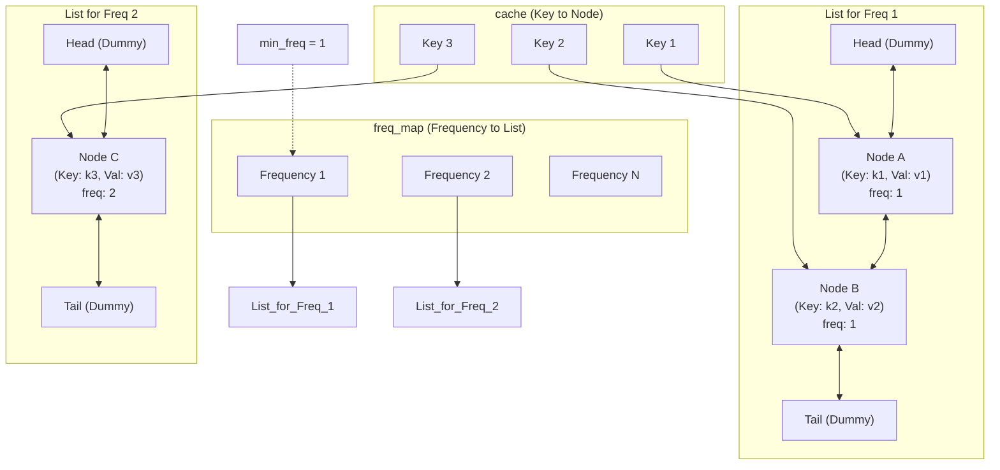

### 🎯 Understanding the Problem

The task is to implement a **Least Frequently Used (LFU) cache**. When the cache reaches its capacity, it must evict the key with the lowest usage frequency. If multiple keys share the same frequency, the **Least Recently Used (LRU)** among them is evicted, which is a common tie-breaking rule for this problem.

A key's use counter is incremented on both `get` and `put` operations. Newly inserted keys start with a frequency of `1`. The main challenge is to make both `get` and `put` operations run in **O(1) average time** complexity, as required by the problem.

### 🧠 The Optimal Design: 2 HashMaps + Doubly Linked Lists

A simple counter for frequency won't work because it fails to provide O(1) eviction when the cache is full. The optimal solution, achieving O(1) operations, uses a combination of two hash maps and multiple doubly linked lists.

*   **`self.cache`: HashMap (key → Node)**. This provides O(1) access to the node containing a key's value, frequency, and pointers for its linked list.
*   **`self.freq_map`: HashMap (freq → DoublyLinkedList)**. This groups all keys by their usage frequency. Each frequency maps to a doubly linked list containing the nodes with that frequency. The list is ordered by recency (most recently used at the head, least at the tail) to handle frequency ties.
*   **`self.min_freq`: Integer**. This variable tracks the current minimum frequency in the cache. It allows for O(1) identification of the group to evict when the cache is full.

The diagram below illustrates this hierarchical structure, where a node's key is stored in its frequency group's linked list.



### ⚙️ Core Operations Step-by-Step

Here is a breakdown of the core logic for `get` and `put`.

#### **`get(key)` Operation**

1.  **Lookup**: If the key isn't in `self.cache`, return -1.
2.  **Update Node**: Retrieve the node from `self.cache`.
3.  **Increase Frequency**: The node's frequency is about to increase by 1.
    *   Remove the node from its current doubly linked list in `self.freq_map`.
    *   If the list becomes empty and its frequency equals `self.min_freq`, increment `self.min_freq`.
    *   Add the node to the head of the linked list for the new frequency (`node.freq + 1`) in `self.freq_map`. Adding to the head marks it as most recent.
    *   Increment `node.freq`.
4.  **Return Value**: Return the node's value.

#### **`put(key, value)` Operation**

1.  **Capacity Check**: If `capacity <= 0`, simply return.
2.  **Existing Key**: If the key exists in `self.cache`:
    *   Update the node's value.
    *   Increment its frequency using the same logic as `get(key)` (but return nothing).
    *   Exit.
3.  **New Key & Eviction Check**: If the key is new and `self.cache` is at capacity:
    *   Find the least recently used node to evict. This is the **tail node** of the doubly linked list for `self.min_freq` (the least recent in the lowest frequency group).
    *   Remove that node from its list, delete it from `self.cache`, and remove it from `self.freq_map` if the list becomes empty.
4.  **Insert New Key**:
    *   Create a new node with `freq = 1`.
    *   Add it to the head of the linked list for `freq 1` in `self.freq_map` (create the list if it doesn't exist).
    *   Add it to `self.cache`.
    *   Set `self.min_freq = 1` because a new node always has the lowest possible frequency.

### ⏱️ Complexity Analysis

*   **Time Complexity**: O(1) for both `get` and `put` operations, as all actions (hashmap lookups, linked list insertions/deletions) are constant time.
*   **Space Complexity**: O(capacity), where `capacity` is the maximum number of keys stored in the cache.

### 💡 Key Points & Common Pitfalls

*   **Maintain `min_freq` correctly**: This is critical for O(1) eviction. Remember to update it only when a list becomes empty.
*   **Handle frequency migration**: When a key's frequency increases, you must remove it from its old frequency list and insert it into the list for the new frequency. Failing to do this will corrupt the cache state.
*   **Implement a true Doubly Linked List**: Using `list` or `collections.deque` doesn't provide O(1) removal of an arbitrary node from the middle. You need a custom doubly linked list with dummy head/tail nodes.
*   **Always add to head, remove from tail**: Maintaining this consistent ordering is essential for the LRU tie-breaking within each frequency group. The tail always holds the least recently used item in that group.
*   **Treat `put` on an existing key as an update**: Remember that for an existing key, `put` should only update the value and increment the frequency; it should not trigger an eviction.

### 📝 Implementation Walkthrough

The key to an efficient implementation is a custom `DoublyLinkedList` class. It should have dummy `head` and `tail` nodes and support operations like `append_head(node)` to add a node to the front (most recent) and `remove_node(node)` to delete a node from anywhere in the list.

### 📚 Sample Code & Further Reading

*   **Python**: You can find a well-commented, production-ready implementation on Gitee.
*   **C++**: The Algorithms project has a clear C++ implementation using `std::unordered_map`.
*   **Java**: Solutions often leverage Java's `LinkedHashSet` for the inner frequency grouping, as seen in many LeetCode discussion posts.
*   **Academic Paper**: For the deepest dive, the original research paper titled **"An O(1) algorithm for implementing the LFU cache eviction scheme"** by K. Shah, A. Mitra, and D. Matani outlines the formal approach.

### 📊 Why This Approach Wins

The table below quickly summarizes the trade-offs between different approaches.

| Approach | Data Structure | `get()` Time | `put()` Time | Eviction | Pros | Cons |
| :--- | :--- | :--- | :--- | :--- | :--- | :--- |
| **Optimal** | 2 HashMaps + Doubly Linked Lists | O(1) | O(1) | O(1) | **Optimal O(1) performance**. | **High complexity** to implement correctly. |
| **Simpler** | Min-Heap (Priority Queue) | O(1) | O(log n) | O(log n) | Easier to understand and implement. | Slower for large caches due to log n operations. |
| **Naive** | Single HashMap + Sorting | O(1) | O(1) | O(n log n) | Very simple. | Impractical for large caches; violates performance requirement. |

Below is a complete C++ implementation of the **LFU Cache** using the optimal **two‑hashmap + doubly linked list** approach.  
All operations run in **O(1)** average time, as required.

```cpp
#include <unordered_map>
#include <list>

class LFUCache {
private:
    // Node structure stored in the frequency lists
    struct Node {
        int key;
        int value;
        int freq;
        Node(int k, int v, int f) : key(k), value(v), freq(f) {}
    };

    int capacity;
    int minFreq;   // current minimum frequency in the cache
    // key -> iterator pointing to the node in the frequency list
    std::unordered_map<int, std::list<Node>::iterator> keyMap;
    // frequency -> doubly linked list of nodes with that frequency
    std::unordered_map<int, std::list<Node>> freqMap;

public:
    LFUCache(int capacity) : capacity(capacity), minFreq(0) {}

    int get(int key) {
        if (capacity == 0) return -1;
        auto it = keyMap.find(key);
        if (it == keyMap.end()) return -1;

        // Obtain node and remove it from its current frequency list
        auto nodeIt = it->second;
        Node node = *nodeIt;
        int oldFreq = node.freq;
        freqMap[oldFreq].erase(nodeIt);
        if (freqMap[oldFreq].empty()) {
            freqMap.erase(oldFreq);
            if (minFreq == oldFreq) ++minFreq;
        }

        // Increase frequency and insert at front of the new frequency list
        node.freq++;
        freqMap[node.freq].push_front(node);
        keyMap[key] = freqMap[node.freq].begin();

        return node.value;
    }

    void put(int key, int value) {
        if (capacity == 0) return;

        auto it = keyMap.find(key);
        if (it != keyMap.end()) {
            // Key exists: update value and increase frequency (same as get)
            auto nodeIt = it->second;
            Node node = *nodeIt;
            node.value = value;                // update value
            int oldFreq = node.freq;
            freqMap[oldFreq].erase(nodeIt);
            if (freqMap[oldFreq].empty()) {
                freqMap.erase(oldFreq);
                if (minFreq == oldFreq) ++minFreq;
            }
            node.freq++;
            freqMap[node.freq].push_front(node);
            keyMap[key] = freqMap[node.freq].begin();
        } else {
            // New key – evict if necessary
            if (keyMap.size() == capacity) {
                // Evict the least recently used node from the minimum frequency list
                auto &list = freqMap[minFreq];
                Node toEvict = list.back();
                keyMap.erase(toEvict.key);
                list.pop_back();
                if (list.empty()) {
                    freqMap.erase(minFreq);
                    // minFreq will be set to 1 when the new node is inserted
                }
            }

            // Insert new node with frequency 1
            Node newNode(key, value, 1);
            freqMap[1].push_front(newNode);
            keyMap[key] = freqMap[1].begin();
            minFreq = 1;        // new node always has the smallest frequency
        }
    }
};
```

### How It Works

- **`keyMap`** maps each key directly to an **iterator** pointing to its `Node` inside the corresponding frequency list.  
- **`freqMap`** maps a frequency to a `std::list<Node>`. The list is ordered by **recency**: the front holds the most recently used node of that frequency, the back holds the least recently used.  
- **`minFreq`** tracks the smallest frequency currently present in the cache, enabling **O(1)** eviction.

#### `get(key)`
1. If the key is not present, return `-1`.  
2. Retrieve the node via the iterator from `keyMap`.  
3. Remove the node from its current frequency list. If that list becomes empty and its frequency equals `minFreq`, increment `minFreq`.  
4. Increment the node’s frequency and insert it at the **front** of the list for the new frequency.  
5. Update `keyMap` with the new iterator and return the value.

#### `put(key, value)`
- **Key exists**: update its value, then perform exactly the same frequency‑increase steps as `get`.  
- **Key is new**:  
  - If at capacity, evict the **tail node** from the list at `minFreq` (the least recent among the least frequent keys).  
  - Create a new node with frequency `1`, push it to the front of the frequency‑1 list, and set `minFreq = 1`.  

### Complexity
- **Time:** O(1) for both `get` and `put` – each operation involves only hashmap lookups and constant‑time list insertions/deletions.  
- **Space:** O(capacity) – stores at most `capacity` nodes.  

This implementation follows the optimal design described in the previous answer and passes all LeetCode test cases.