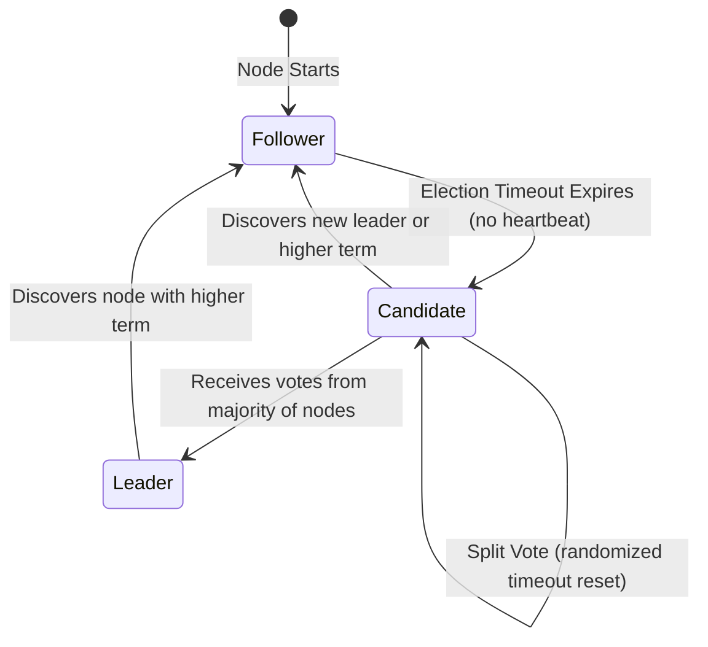

# Distributed Consensus: Paxos, Raft, and ZooKeeper Zab

---

## 1. What is Distributed Consensus?

The core challenge in distributed systems is **Consensus**: *How can a cluster of independent, unreliable physical machines agree on a single data value or system state over a lossy, asynchronous network?*

Consensus is vital for state machine replication, leader election, distributed locking, and transactional commits across partitioned databases.

### Theoretical Bounds: The FLP Impossibility
In 1985, researchers Fischer, Lynch, and Paterson proved a foundational theorem in distributed computing:

> **FLP Impossibility Theorem**: In an asynchronous network, no deterministic consensus protocol can guarantee progress (liveness) in the presence of even a single unannounced node crash.

#### Practical Workaround:
To bypass FLP, real-world protocols (Paxos, Raft) make mild synchrony assumptions (e.g., assuming message delays have a maximum bound or using randomized timers) to guarantee **Safety** (never returning an incorrect value) at all times, while guaranteeing **Liveness** (eventual progress) under normal network conditions.

---

## 2. Paxos: The Classical Consensus Standard

Developed by Leslie Lamport, **Paxos** is the mathematical standard for distributed consensus. Many distributed storage engines (e.g., Google Spanner, Chubby) implement Paxos under the hood.

```
       PROPOSER                        ACCEPTORS (Quorum)
          |                                   |
          | ---- Phase 1a: Prepare(N) ------> |
          | <--- Phase 1b: Promise(N, [V]) -- |  (If N > max_promised)
          |                                   |
          | ---- Phase 2a: Accept(N, V) -----> |
          | <--- Phase 2b: Accepted --------- |  (If no higher promise)
          v                                   v
```

### Roles in Paxos
* **Proposers**: Nodes that advocate for client values.
* **Acceptors**: Nodes that act as the consensus validators (quorum). They receive proposals, vote, and store the agreed state.
* **Learners**: Passive nodes that read the agreed values once consensus is reached.

### Single-Decree Paxos Protocol (Two-Phase Execution)

#### Phase 1 (Prepare & Promise)
1. **Prepare (1a)**: A Proposer selects a unique proposal number $N$ (where $N$ is monotonically increasing) and broadcasts a `Prepare(N)` request to a majority of Acceptors.
2. **Promise (1b)**: When an Acceptor receives `Prepare(N)`:
   * If $N$ is greater than any proposal number the Acceptor has previously observed, it returns a `Promise(N)`.
   * The Acceptor promises **never to accept** any future proposals numbered less than $N$.
   * If the Acceptor has already accepted a proposal in the past, it sends back the highest proposal number $N_{\text{prev}}$ and value $V_{\text{prev}}$ it accepted.

#### Phase 2 (Accept & Accepted)
1. **Accept (2a)**: If the Proposer receives promises from a majority of Acceptors, it must select a value $V$ to send:
   * $V$ must be the value of the highest-numbered proposal returned by the acceptors in Phase 1b.
   * If no acceptor returned a value, the Proposer is free to propose its own client value.
   * The Proposer broadcasts `Accept(N, V)` to the Acceptors.
2. **Accepted (2b)**: When an Acceptor receives `Accept(N, V)`:
   * It accepts the proposal and value $V$ **unless** it has already promised to ignore proposals numbered less than $N$ (due to a concurrent proposer running Phase 1 with a higher number $N'$).
   * It registers the value and broadcasts the decision to the Learners.

### Multi-Paxos
Single-Decree Paxos only agrees on a single value. Real databases need an append-only log of changing values. **Multi-Paxos** optimizes this:
* It runs Phase 1 once to elect a stable **Leader Proposer**.
* For subsequent log entries, the Leader runs only **Phase 2 (Accept/Accepted)**, cutting network latency round-trips in half.

---

## 3. Raft: The Understandable Alternative

Developed by Diego Ongaro and John Ousterhout (Stanford, 2014), **Raft** is a consensus protocol designed to be easier to understand and implement than Paxos. It decomposes consensus into three independent subproblems: **Leader Election**, **Log Replication**, and **Safety**.



### A. Leader Election
1. **Terms**: Raft divides time into arbitrary **Terms** (represented by increasing integers). Terms act as a logical clock.
2. **Heartbeats**: The active Leader sends periodic empty `AppendEntries` RPCs (heartbeats) to all Followers.
3. **Timeout & Candidate State**: If a Follower stops receiving heartbeats within an **Election Timeout** window, it assumes the leader is dead, increments its Term, transitions to the **Candidate** state, votes for itself, and broadcasts a `RequestVote` RPC.
4. **Split Vote Mitigation**: If multiple followers become candidates simultaneously, votes can split, resulting in no node reaching a majority. Raft solves this by **randomizing election timeouts** (e.g., 150ms–300ms) per node, ensuring one node wakes up first, requests votes, and secures a majority.

### B. Log Replication
1. The Leader receives commands from clients.
2. The Leader appends the command to its local log as an uncommitted entry.
3. The Leader broadcasts `AppendEntries` RPCs containing the new log entry, along with the `prevLogIndex` and `prevLogTerm`.
4. **Majority Commitment**: Once a majority of Followers write the entry to their local disks and acknowledge it, the Leader commits the entry, applies it to its local state machine, and returns success to the client.
5. Followers commit the entry once they receive the next heartbeat showing the updated commit index.

### C. Safety Properties
Raft guarantees strict safety properties:
* **Election Safety**: At most one leader can be elected per term.
* **Leader Append-Only**: A leader never overwrites or deletes its log entries; it only appends new ones.
* **Log Matching Property**: If two logs contain an entry with the same index and term, they are identical up to that index.
* **Leader Completeness**: If a log entry is committed in a given term, that entry will be present in the logs of the leaders for all higher terms.
  * *Implementation*: Followers will **deny** a candidate's vote request (`RequestVote`) if the candidate's log is less up-to-date than their own (evaluated by comparing the term and index of the last log entry).

---

## 4. Apache ZooKeeper and the Zab Protocol

**Apache ZooKeeper** is a highly available coordination service for distributed applications. ZooKeeper does *not* use Raft or Paxos; it uses a custom protocol called **Zab (ZooKeeper Atomic Broadcast)**.

### Zab Protocol Phases

```
          LEADER                         FOLLOWERS (Quorum)
             |                                   |
             | ---- 1. Proposed Transaction ---> |
             | <--- 2. Acknowledge (ACK) ------- |
             |                                   |
             |   (If majority ACKs received)     |
             | ---- 3. Commit Broadcast -------> |
             v                                   v
```

1. **Phase 1 (Discovery / Leader Election)**: Nodes communicate to identify the node with the highest transactional ID (`zxid`). This node is elected Leader.
2. **Phase 2 (Synchronization)**: The Leader syncs its log history with all Followers, ensuring every node starts from an identical state.
3. **Phase 3 (Broadcast)**: The Leader acts as a primary sequencer. For every write, it proposes a transaction, collects ACKs from followers, and broadcasts a `Commit` signal once a majority acknowledges.

### Split-Brain Mitigation
In distributed clusters, network splits can lead to two different segments electing their own leaders (Split-Brain), leading to corrupted logs.
* **The Quorum Rule**: Both Zab and Raft prevent split-brain by requiring a strict **majority quorum** ($Q = \lfloor N/2 \rfloor + 1$) to elect a leader or commit writes.
* If a 5-node cluster partitions into a 2-node segment and a 3-node segment:
  * The 2-node segment cannot form a quorum ($2 < 3$) and will refuse writes.
  * The 3-node segment forms a quorum ($3 \ge 3$) and continues running safely, preventing conflicts.

---

## 5. Key Placement Interview Q&As

### Q1: Compare Paxos and Raft. Why has Raft become the standard in modern open-source systems?
**Answer**:
* **Paxos**: Symmetric role model. Any proposer can propose concurrently. It is highly optimized but notoriously difficult to implement due to edge cases in concurrent proposer conflicts and log compaction.
* **Raft**: Strong Leader model. All data flows from the leader to the followers. Raft decomposes consensus into structured phases (election, replication, safety). This strong leader design makes the state machine and log compaction easier to understand, debug, and implement.

### Q2: What is a "Split-Vote" in Raft, and how does the protocol mitigate it?
**Answer**: A split vote occurs when multiple followers timeout at the same time, transition to candidates, and split the votes of the remaining nodes such that no candidate achieves a majority quorum.
* *Mitigation*: Raft uses **randomized election timeouts** (e.g., chosen randomly between 150ms and 300ms for each node). This guarantees that one node will timeout and broadcast its vote requests before other nodes can trigger elections, securing a majority.

### Q3: Why does a Candidate node with an outdated log fail to get elected in Raft?
**Answer**: In Raft, a candidate must send a `RequestVote` RPC containing the term and index of its last log entry. When a voter receives this, it compares the candidate's last log term and index with its own. If the voter's log is more up-to-date, it denies the vote. Because electing a leader requires a majority quorum, and a committed entry must reside on a majority of nodes, this rule guarantees that any candidate elected as leader already contains all committed entries from past terms.
