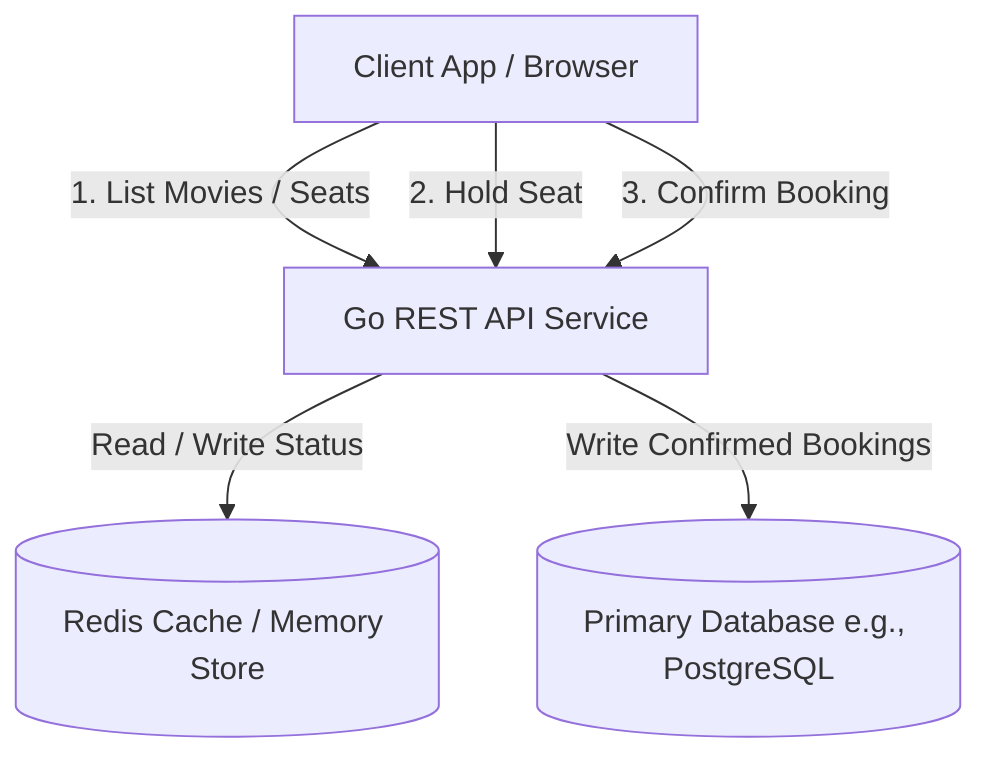
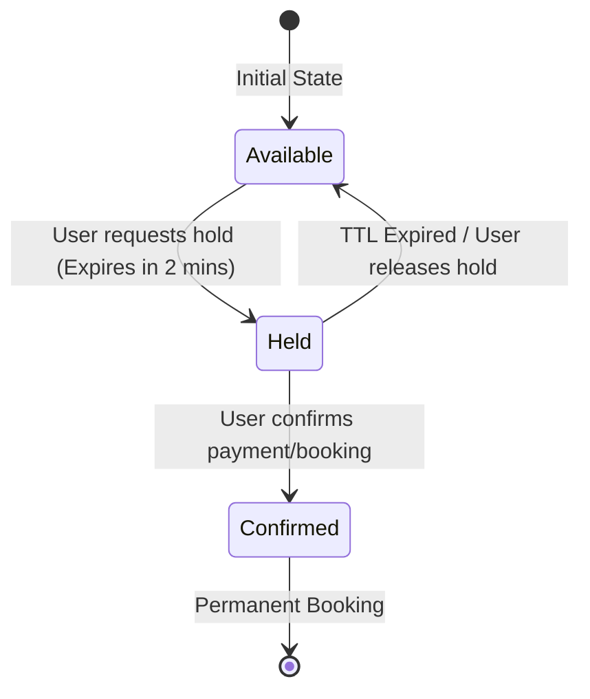
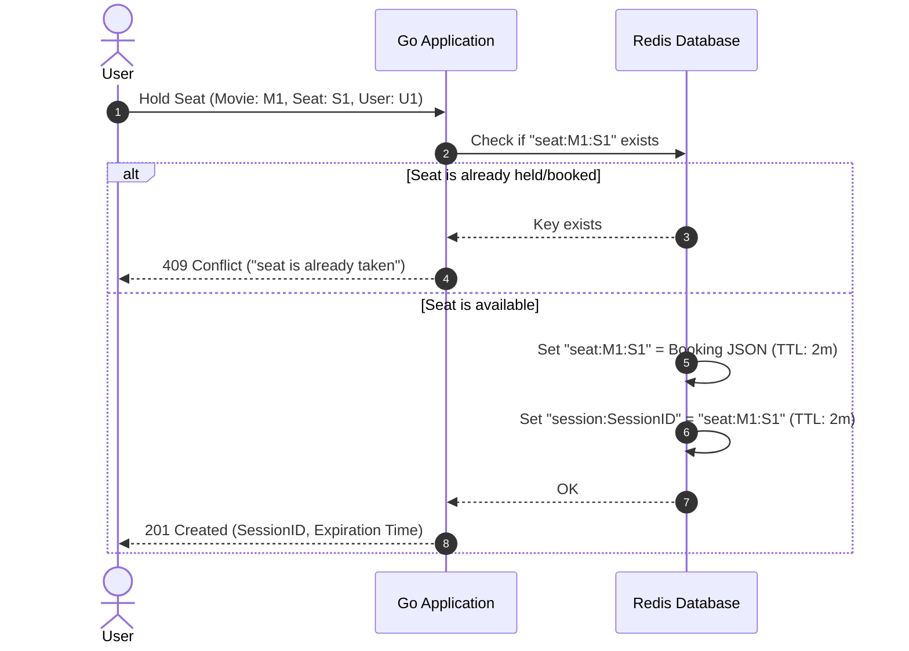

# Architecture and Technical Analysis: Concurrent Seat Booking System

This document provides a comprehensive overview of the architecture, data flows, and critical concurrency and consistency mechanisms in the Cinema Seat Booking System.

---

## 1. System Architecture

The Cinema Seat Booking System is structured as a high-concurrency, low-latency microservice. Below is the system architecture showing how components interact:



### Components
1. **Client / Frontend**: Interacts with the backend REST endpoints to fetch movies, view real-time seat status, place short-lived holds, and finalize checkout.
2. **Go REST API Service**: Handles requests, enforces business logic, manages connections, and executes transactional updates.
3. **Redis Cluster (In-Memory Datastore)**: Serves as the high-throughput coordination layer for seat availability, active checkout sessions, and short-term locks.
4. **Primary Database (Optional, for Persistence)**: Holds long-term booking records, movie inventories, and user metadata. Confirmed bookings from Redis are persisted here.

---

## 2. Seat State Machine

A seat transitions through several states to ensure that multiple users cannot book the same seat simultaneously:



* **Available**: The seat is open. No keys exist in Redis for this seat.
* **Held**: A temporary lock (TTL = 2m) is placed. Other users cannot hold or book this seat.
* **Confirmed**: The seat is locked permanently (TTL removed). It belongs to the booking user.

---

## 3. Detailed Data Flows

### A. Holding a Seat (Sequence)
When a user requests a hold, the application must atomically mark the seat as held and create a session mapping:



---

## 4. Critical Concurrency & Consistency Issues

Under concurrent production traffic, naive key-value operations exhibit severe race conditions:

### A. Non-Atomic Holds (Dangling Holds)
Setting the seat key and then the session key in separate network commands can result in **dangling holds**. If the server crashes between the two commands, the seat is locked, but no session exists to confirm it, leaving the seat unusable until the TTL expires.

### B. Double Booking / Overwrite Race
If a hold expires right as a user confirms, another user can grab the hold. The late-arriving confirmation from the first user will overwrite the new user's hold:
1. **User A** hold expires.
2. **User B** holds the same seat.
3. **User A**'s late `Confirm` removes the TTL on the seat key (which is now owned by **User B**) and overwrites the seat JSON with **User A**'s confirmed status.
4. Both users believe they own the seat.

### C. Accidental Hold Deletion
A late `Release` request from a user whose hold expired will delete the seat key, silently terminating a new, valid hold set by another user.

---

## 5. Architectural Scaling and Optimization Strategies

### A. Atomic Updates with Redis Lua Scripts
By running Lua scripts, Redis executes the entire sequence of operations in a single atomic block, preventing race conditions.

#### 1. Atomic Hold Script
```lua
-- KEYS[1]: seat key (e.g., seat:movieID:seatID)
-- KEYS[2]: session key (e.g., session:sessionID)
-- ARGV[1]: json value
-- ARGV[2]: ttl in seconds
if redis.call('EXISTS', KEYS[1]) == 1 then
    return {err = "seat is already taken"}
end
redis.call('SET', KEYS[1], ARGV[1], 'EX', ARGV[2])
redis.call('SET', KEYS[2], KEYS[1], 'EX', ARGV[2])
return "OK"
```

#### 2. Atomic Confirm Script (Compare-And-Swap)
```lua
-- KEYS[1]: session key (e.g., session:sessionID)
-- ARGV[1]: expected user id
local seat_key = redis.call('GET', KEYS[1])
if not seat_key then return {err = "session expired"} end

local seat_val = redis.call('GET', seat_key)
if not seat_val then return {err = "seat expired"} end

local booking = cjson.decode(seat_val)
if booking.UserID ~= ARGV[1] then return {err = "unauthorized"} end
if booking.Status ~= "held" then return {err = "not held"} end

booking.Status = "confirmed"
redis.call('SET', seat_key, cjson.encode(booking))
redis.call('DEL', KEYS[1]) -- Clean up session key
return "OK"
```

### B. Schema Optimization to Avoid O(N) Scan
Instead of calling `SCAN` across the global keyspace to get seats for a movie, we can perform a pipelined `MGET` on all seat keys for that movie:
```go
// For a movie with 40 seats, build seat keys and query all at once
keys := []string{"seat:M1:A1", "seat:M1:A2", ...}
vals, err := rdb.MGet(ctx, keys...).Result()
```
This is an O(1) operation on Redis that completes in a single network round-trip.
