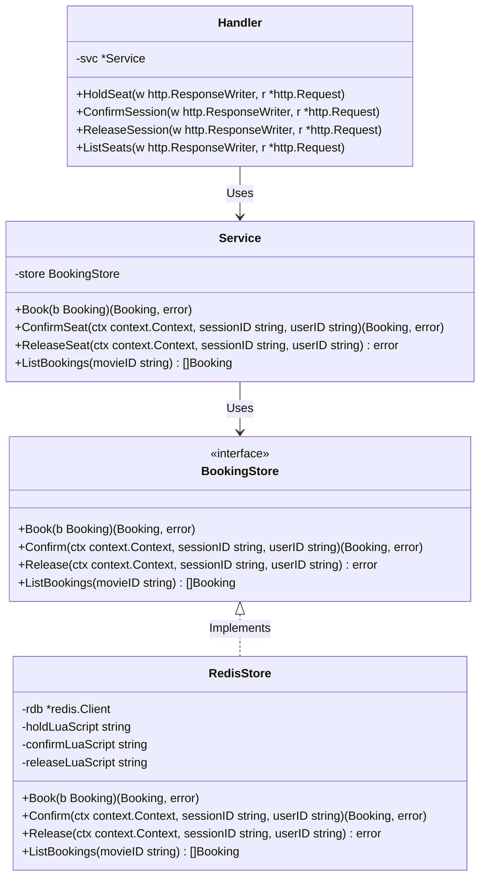
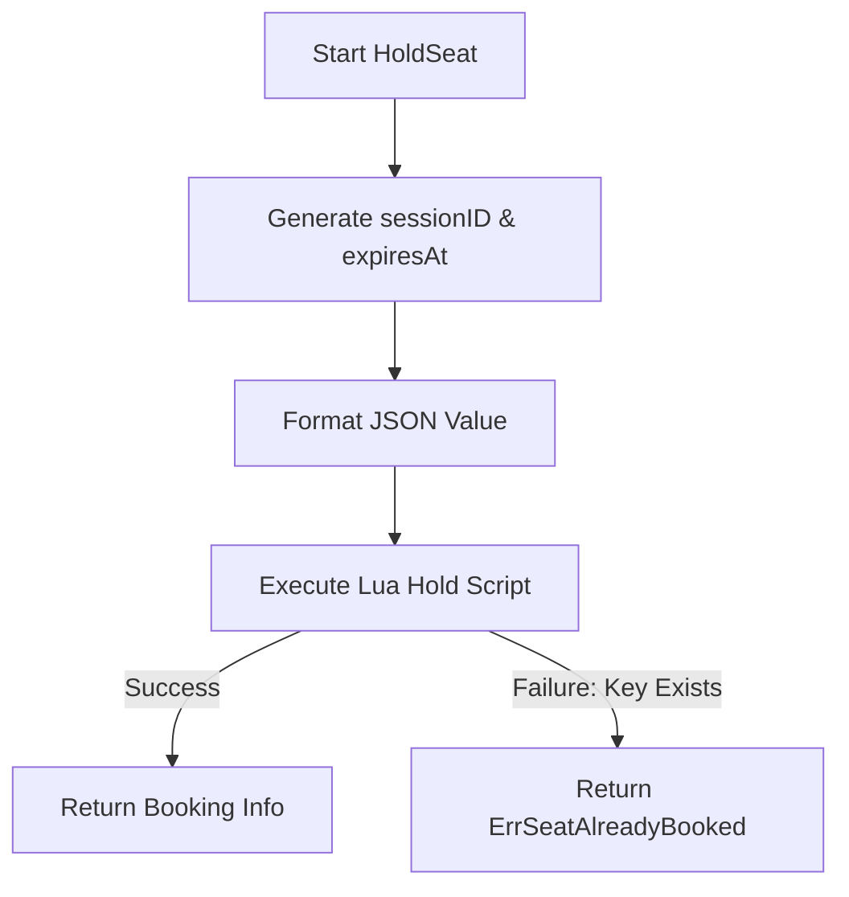
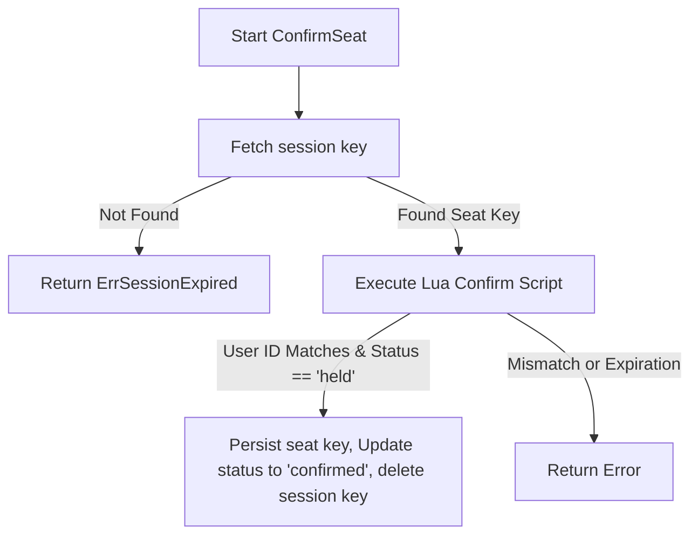

# Low-Level Design (LLD): Concurrent Seat Booking System

This Low-Level Design (LLD) document outlines the software components, object models, data schemas, and execution workflows for the Cinema Seat Booking microservice.

---

## 1. Domain Models & Data Structures

These core structures govern the data models exchanged between layers:

```go
package booking

import (
	"time"
)

// Booking represents the domain entity of a seat status (held or confirmed)
type Booking struct {
	ID        string    `json:"id"`           // Unique Session ID (UUID v4)
	MovieID   string    `json:"movie_id"`     // Identifier for the movie
	SeatID    string    `json:"seat_id"`      // Identifier for the seat (e.g., "B2")
	UserID    string    `json:"user_id"`      // Identifier for the user reserving the seat
	Status    string    `json:"status"`       // "held" | "confirmed"
	ExpiresAt time.Time `json:"expires_at"`   // Expiration timestamp for the temporary hold
}
```

### API Request/Response Payloads
```go
// holdSeatRequest is the incoming payload to initiate a seat hold
type holdSeatRequest struct {
	UserID string `json:"user_id"`
}

// holdResponse is returned upon a successful seat hold
type holdResponse struct {
	SessionID string `json:"session_id"`
	MovieID   string `json:"movie_id"`
	SeatID    string `json:"seat_id"`
	ExpiresAt string `json:"expires_at"`
}

// seatInfo represents the status of a specific seat returned in listings
type seatInfo struct {
	SeatID    string `json:"seat_id"`
	UserID    string `json:"user_id"`
	Booked    bool   `json:"booked"`
	Confirmed bool   `json:"confirmed"`
}
```

---

## 2. Component Class Diagram

Below is the relationship and method contracts for the Go modules:



---

## 3. Storage Key Schema

| Key Pattern | Data Type | Purpose | TTL |
| :--- | :--- | :--- | :--- |
| `seat:{movieID}:{seatID}` | String (JSON) | Holds the serialized `Booking` data. | `2 minutes` (during hold); `Infinite` (on confirmation) |
| `session:{sessionID}` | String (Raw) | Maps a session ID back to the seat key for reverse lookup. | `2 minutes` (during hold); `Deleted` (on confirmation) |

---

## 4. Workflows & Execution Design

### A. Hold Seat Workflow
Ensures that the seat hold is registered atomically.



### B. Confirm Seat Workflow
Checks if the hold is still valid and belongs to the calling user before committing.



---

## 5. Implementation Code Snippets (Refactored)

### Lua Script Definitions
```go
const (
	holdScript = `
		if redis.call("EXISTS", KEYS[1]) == 1 then
			return {err = "seat is already taken"}
		end
		redis.call("SET", KEYS[1], ARGV[1], "EX", ARGV[2])
		redis.call("SET", KEYS[2], KEYS[1], "EX", ARGV[2])
		return "OK"
	`

	confirmScript = `
		local seat_key = redis.call("GET", KEYS[1])
		if not seat_key then
			return {err = "session expired"}
		end
		local seat_val = redis.call("GET", seat_key)
		if not seat_val then
			return {err = "seat expired"}
		end
		local booking = cjson.decode(seat_val)
		if booking.user_id ~= ARGV[1] then
			return {err = "unauthorized session owner"}
		end
		if booking.status ~= "held" then
			return {err = "seat not held"}
		end
		booking.status = "confirmed"
		redis.call("SET", seat_key, cjson.encode(booking))
		redis.call("DEL", KEYS[1])
		return "OK"
	`
)
```

### Go Implementation inside `RedisStore`
```go
func (s *RedisStore) Book(ctx context.Context, b Booking) (Booking, error) {
	id := uuid.New().String()
	b.ID = id
	b.Status = "held"
	b.ExpiresAt = time.Now().Add(defaultHoldTTL)
	
	val, _ := json.Marshal(b)
	seatKey := fmt.Sprintf("seat:%s:%s", b.MovieID, b.SeatID)
	sessKey := fmt.Sprintf("session:%s", id)

	// Execute Hold Lua Script atomically
	err := s.rdb.Eval(ctx, holdScript, []string{seatKey, sessKey}, val, int(defaultHoldTTL.Seconds())).Err()
	if err != nil {
		return Booking{}, ErrSeatAlreadyBooked
	}

	return b, nil
}
```
