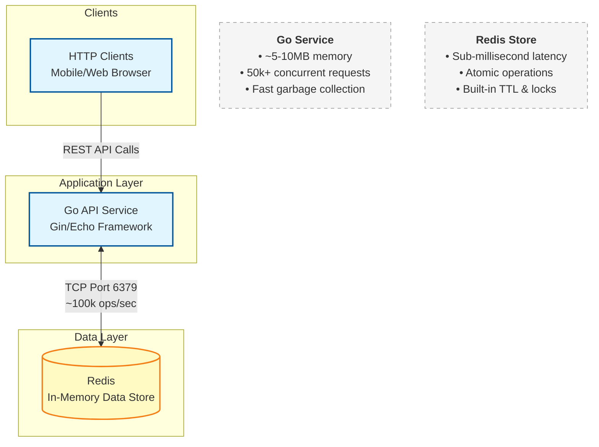

# Project Learnings, Tech Stack Rationales, and Scope

This document details the learning outcomes of the Concurrent Seat Booking system, explains why Go and Redis were selected, outlines the project scope, and discusses future architectural enhancements.

---

## 1. What Can Be Learned From This Project?

This project serves as a practical, hands-on blueprint for solving complex concurrency issues in real-time reservation systems. Key learning outcomes include:

### A. Concurrency Control in Distributed Environments
* **Understanding Race Conditions**: Learning how independent asynchronous requests (e.g., two users clicking a seat at the same time) can lead to data inconsistency.
* **Pessimistic vs. Optimistic Locking**: Understanding when to block access to resources outright (pessimistic lock) vs. letting operations proceed and validating at checkout (optimistic lock).
* **Using TTL for Temporary Reservations**: Managing resource allocation lifetimes (e.g., cart holds, seat reservations) and letting expired holds return to inventory automatically.

### B. Redis as a Synchronization Engine
* **Atomic Scripts (Lua)**: Understanding how running scripts directly on Redis ensures all checking and writing happen as a single, uninterrupted transaction.
* **Atomicity & Consistency**: Discovering the limits of multi-command client interactions and moving critical synchronization logic to the database layer.

### C. Clean Architecture & Code Structuring
* **Separation of Concerns**: Organizing logic using clear boundaries:
  * **Handlers (Adapters)**: Routing and HTTP mapping.
  * **Services (Core)**: Pure business rules.
  * **Stores (Infrastructure)**: Database and cache adapters (e.g., `RedisStore`, `MemoryStore`).
* **Interface-driven Design**: Allowing the underlying datastore to be swapped (e.g., from in-memory map to Redis) without changing the core business logic.

---

## 2. Why This Particular Tech Stack?

The stack is composed of **Go (Golang)** and **Redis**. Together, they form an extremely efficient, low-overhead system designed for raw performance.

```mermaid
graph LR
    subgraph Client["🌐 Client Requests"]
        direction TB
        C1[HTTP Request]
        C2[WebSocket]
    end
    
    subgraph GoApp["⚙️ Go Application"]
        direction TB
        G1[Handlers]
        G2[Business Logic]
        G3[Redis Client]
    end
    
    subgraph RedisDB["🗄️ Redis Instance"]
        direction TB
        R1[(Keyspace)]
        R2[Expiry Manager]
        R3[Lock Manager]
    end
    
    Client -->|JSON/HTTP| GoApp
    GoApp -->|"RESP Protocol<br/>~0.5ms RTT"| RedisDB
    RedisDB -->|"Atomic Response<br/>SET NX / GET / DEL"| GoApp
    GoApp -->|"200 OK / 409 Conflict"| Client
    
    classDef goStyle fill:#00add8,stroke:#005f7a,stroke-width:3px,color:#fff
    classDef redisStyle fill:#dc382c,stroke:#8a1a10,stroke-width:3px,color:#fff
    classDef clientStyle fill:#4caf50,stroke:#1b5e20,stroke-width:2px,color:#fff
    
    class GoApp goStyle
    class RedisDB redisStyle
    class Client clientStyle
```

### Why Redis?
* **Sub-millisecond Latency**: Because Redis is entirely in-memory, reads and writes take less than a millisecond.
* **Native TTLs**: The ability to attach an expiration time to keys natively makes it the ideal tool for temporary holds.
* **Single-Threaded Engine**: Redis processes commands sequentially. This simplifies locking mechanics because race conditions on the database layer are naturally prevented.
* **Lua Script execution**: Allows running custom operations atomically.

---

## 3. Why Was Go Used?

Go was specifically chosen for the backend due to its affinity for high-performance network services:

1. **Lightweight Concurrency (Goroutines)**:
   Unlike traditional languages that map HTTP connections to OS threads (which consumes a lot of memory), Go uses goroutines. A single server can easily handle tens of thousands of concurrent connections with a minimal memory footprint (~2KB per goroutine).
2. **Minimal Runtime overhead**:
   Go compiles directly to a single native machine code binary. There is no heavy virtual machine (like JVM) or interpreter (like Node.js/Python), ensuring instant startups and consistent performance.
3. **Strong Standard Library**:
   The `net/http` library is robust, reliable, and production-tested, making it easy to create fast, scalable HTTP services without requiring complex frameworks.
4. **Compile-time Safety**:
   Static typing prevents mapping errors and type-mismatches before the code runs, which is critical when dealing with financial transactions or booking systems.

---

## 4. Current Scope of the Project

The project currently handles the core lifecycle of a booking:
* **Inventory Querying**: Checking movie attributes and layout grids.
* **Lock Acquisition (Hold)**: Creating a temporary lease on a seat.
* **Hold Promotion (Confirm)**: Overriding the temporary lock to permanently reserve the seat.
* **Lock Release (Cancel)**: Explicitly releasing a seat lock before expiration.

---

## 5. How the Project Can Be Improved

To elevate this prototype to a production-ready enterprise service, several enhancements should be introduced:

### A. Persistent Storage Integration
* **Primary DB Integration**: Confirmed bookings should eventually flow from Redis to a relational database like PostgreSQL for permanent storage.
* **Outbox Pattern**: Implementing transactional outbox messages so that database updates and email tickets are sent reliably, even during a system crash.

### B. Real-Time Client Communication
* **WebSockets / Server-Sent Events (SSE)**: Instead of the client polling the `/seats` endpoint repeatedly, the server should push seat state changes (e.g., "Seat B2 is now held") to all connected clients immediately.

### C. Advanced Redis Optimization
* **Redis Cluster / Sentinel**: Sharding movie keys across multiple Redis nodes to scale horizontal capacity.
* **Hash-based Indexes**: Maintaining movie seat lists inside Redis Hashes instead of standalone keys to make state lookups even cleaner.
