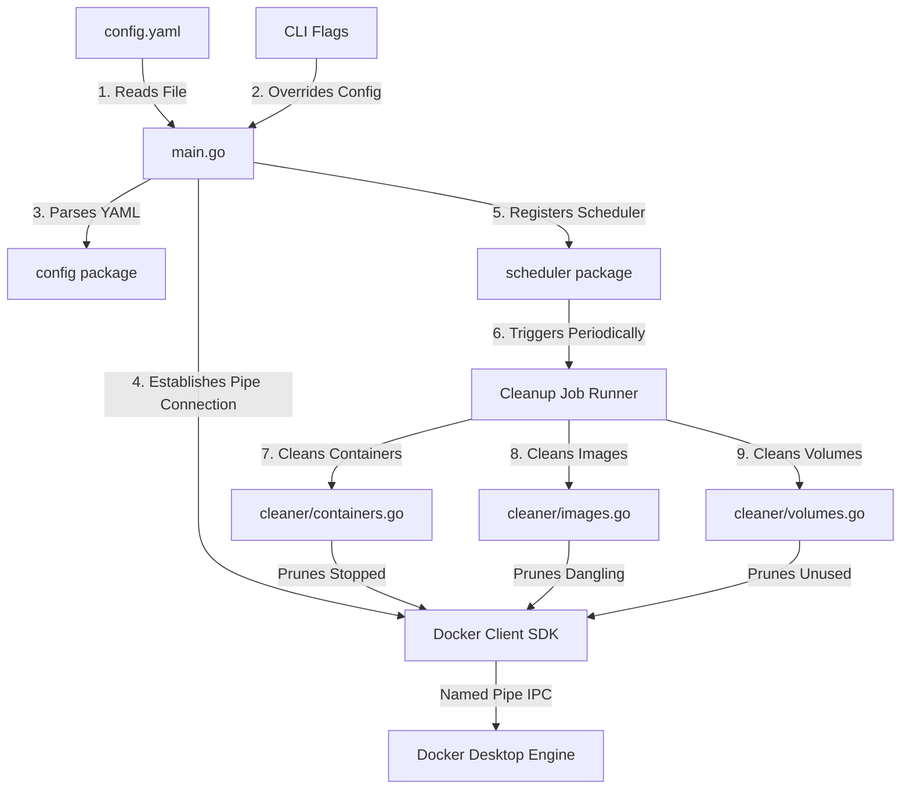

# Project Architecture & Go Learning Guide

Welcome to the **Docker Cleanup Daemon** project! This document serves as a guide to help you understand the architecture of this utility and learn the fundamentals of the Go programming language through its codebase.

---

## 🗺️ High-Level Design (HLD)

The Docker Cleanup Daemon is a lightweight background service that polls the local Docker Engine at scheduled intervals to prune unwanted resources.

### Architectural Flow




![[Pasted image 20260606132500.png|697]]

```mermaid 

```

### Key Components

1. **Configuration Loader**: Reads and maps [config.yaml](file:///c:/Users/navde/Desktop/Data%20Engineering%20Project'/Go%20Lang%20Marathon/docker-cleanup-daemon/config.yaml) values into Go-native structures, parsing human-readable safety time strings (like `"24h"`) into machine-friendly Go durations.
2. **Scheduler (Cron)**: Operates in its own background execution thread (goroutine), waking up when the cron schedule triggers.
3. **Docker Client SDK**: Communicates with your local Docker Engine. On Windows, this is done via Inter-Process Communication (IPC) using named pipes (`\\.\pipe\docker_engine`).
4. **Cleaner Engine**: The core logic containing separate sub-modules for Containers, Images, and Volumes.

---

##  Low-Level Design (LLD)

Let's look at how the code is divided, what each file is responsible for, and how the logic is implemented.

### 1. Application Entrypoint: [main.go](file:///c:/Users/navde/Desktop/Data%20Engineering%20Project'/Go%20Lang%20Marathon/docker-cleanup-daemon/main.go)
* **Purpose**: Coordinates startup, parses command-line flags, sets up the Docker connection, handles schedule triggers, and listens for OS signals to exit gracefully.
* **Control Flow**:
  1. Parses command-line flags: `--dry-run` and `--once`.
  2. Loads configuration settings from `config.yaml`.
  3. Overrides config configurations with command-line flags if provided (e.g., forcing `--dry-run`).
  4. Connects to Docker over the named pipe using `client.NewClientWithOpts(...)`.
  5. Performs an **initial cleanup pass** immediately so the user doesn't have to wait for the first scheduler interval.
  6. If `--once` was passed, exits immediately. Otherwise, starts the background scheduler.
  7. Enters a blocked state listening on an OS signal channel (`SIGINT` or `SIGTERM`).
  8. When you press `Ctrl+C`, the daemon stops the scheduler, closes the Docker client, and exits cleanly.

### 2. Config Package: [config/config.go](file:///c:/Users/navde/Desktop/Data%20Engineering%20Project'/Go%20Lang%20Marathon/docker-cleanup-daemon/config/config.go)
* **Purpose**: Deserializes YAML configuration files into structured Go objects.
* **Key Functionality**:
  * **Config Struct**: Groups variables matching the YAML keys.
  * **`GetContainersOlderThanDuration()`**: A utility method that converts strings like `"24h"` or `"30m"` into Go `time.Duration` nanoseconds. If the duration string is invalid or empty, it defaults to `0` (instant cleanup).

### 3. Container Cleaner: [cleaner/containers.go](file:///c:/Users/navde/Desktop/Data%20Engineering%20Project'/Go%20Lang%20Marathon/docker-cleanup-daemon/cleaner/containers.go)
* **Purpose**: Identifies and removes stopped containers that exceed the age threshold.
* **Algorithm**:
  1. Requests all containers from Docker: `cli.ContainerList(ctx, types.ContainerListOptions{All: true})`.
  2. Loops through each container and checks the `State`. We skip any container whose state is not `"exited"` or `"created"` (running or restarting containers are safe).
  3. If an age threshold is configured (e.g., `olderThan > 0`), the cleaner calls `cli.ContainerInspect(ctx, containerID)`.
  4. Parses the `FinishedAt` timestamp (if the container exited) or the `Created` timestamp (if it was created but never started).
  5. Calculates `time.Since(timestamp)`. If the container stopped *recently* (less than the threshold), it is skipped.
  6. If it's a dry-run, logs a simulation message. Otherwise, removes the container via `cli.ContainerRemove(...)`.

### 4. Image Cleaner: [cleaner/images.go](file:///c:/Users/navde/Desktop/Data%20Engineering%20Project'/Go%20Lang%20Marathon/docker-cleanup-daemon/cleaner/images.go)
* **Purpose**: Identifies and deletes dangling images (untagged images, usually left over from builds).
* **Algorithm**:
  1. Uses Docker SDK filters to query only dangling images: `filters.NewArgs()`, `filter.Add("dangling", "true")`.
  2. Queries the list: `cli.ImageList(ctx, types.ImageListOptions{Filters: filterArgs})`.
  3. If not in dry-run, invokes `cli.ImageRemove(ctx, imageID, options)` for each image found.

### 5. Volume Cleaner: [cleaner/volumes.go](file:///c:/Users/navde/Desktop/Data%20Engineering%20Project'/Go%20Lang%20Marathon/docker-cleanup-daemon/cleaner/volumes.go)
* **Purpose**: Identifies and deletes unused local volumes.
* **Special Dry-Run Simulation Logic**:
  * Docker's SDK does not have a "dry-run volumes prune" API. If we call the prune API, it deletes the volumes immediately.
  * To solve this, we implemented a custom simulation algorithm for dry runs:
    1. Retrieve all containers (running and stopped) via `cli.ContainerList`.
    2. Extract all volume names currently attached to those containers from their `Mounts` metadata, storing them in a hash map `usedVolumes := make(map[string]bool)`.
    3. Retrieve all volumes on the system via `cli.VolumeList`.
    4. Cross-reference the lists. Any volume not present in `usedVolumes` is unused and flagged as a candidate for deletion.
  * For live runs, we call `cli.VolumesPrune(ctx, filters.NewArgs())` directly.

### 6. Scheduler Package: [scheduler/scheduler.go](file:///c:/Users/navde/Desktop/Data%20Engineering%20Project'/Go%20Lang%20Marathon/docker-cleanup-daemon/scheduler/scheduler.go)
* **Purpose**: Wraps the third-party `robfig/cron/v3` library to isolate scheduling logic from main logic.
* **Key functions**:
  * `NewJobRunner()`: Initializer.
  * `AddSchedule(spec, cmd)`: Schedules the function `cmd` to run on a cron spec (e.g. `"0 */6 * * *"`).
  * `Start()` / `Stop()`: Controls background scheduling cycles.

---

## 🎓 Go Language Concepts for Beginners

If you are coming from Python, JavaScript, Java, or C++, Go's syntax and philosophy might feel different. Here are the core concepts used in this project explained simply:

### 1. Module Management (`go.mod` and `go.sum`)
* **In other languages**: Like `package.json` in Node.js or `requirements.txt` in Python.
* **In Go**: 
  * `go.mod` declares the module name, target Go version, and direct dependencies (e.g., Docker SDK, YAML parser, Cron).
  * `go.sum` contains cryptographic checksums of the exact package files downloaded, ensuring build integrity.
  * Running `go mod tidy` reads your import statements and automatically updates these files.

### 2. Scope & Capitalization Rules
Go does not have `public`, `private`, or `protected` keywords. Visibility is determined by capitalization:
* **Capitalized (Uppercase)**: Exported/Public (accessible outside the package). For example, `config.LoadConfig` and `cleaner.CleanContainers`.
* **Lowercase**: Unexported/Private (accessible only within the package). For example, `runCleanup` in `main.go` or `cronManager` in `scheduler.go`.

### 3. Pointers (`*` and `&`)
Pointers store the memory address of a value, rather than the value itself.
* **`&` (Address of operator)**: Generates a pointer. For example, `&cfg` creates a pointer pointing to where `cfg` resides in memory.
* **`*` (Pointer type)**: Represents a pointer. For example, `*Config` means "a pointer pointing to a `Config` struct".
* **Why do we use pointers here?**
  * **Efficiency**: Passing structs (which might contain lots of fields) by pointer avoids copying the entire struct in memory.
  * **Mutability**: Passing a pointer to functions (like parsing configurations in `decoder.Decode(&cfg)`) allows the function to directly write changes to the original memory address.

### 4. Context (`context.Context`)
You'll see `context.Background()` or `ctx` passed to every Docker SDK function.
* **What is it?** A `Context` is Go's standard way to control APIs, database queries, and HTTP calls.
* **Why use it?** It allows you to set deadlines, timeouts, or cancel long-running operations. If the daemon is shutting down, a cancelled context will signal all active Docker API calls to abort immediately instead of hanging.

### 5. Explicit Error Handling
Go does not support traditional `try-catch` exception blocks. Instead, functions return errors as regular values.
* **Example**:
  ```go
  cfg, err := config.LoadConfig(configPath)
  if err != nil {
      log.Fatalf("Error occurred: %v", err)
  }
  ```
* **Why?** Go encourages developers to handle errors immediately where they occur. This leads to more reliable, readable, and predictable code paths compared to hidden, bubbling exceptions.

### 6. Struct Tags (Metadata)
In `config/config.go`, you see tags like:
```go
type CleanupSettings struct {
	StoppedContainers bool `yaml:"stopped_containers"`
}
```
* **What are they?** These are annotations attached to fields. Go's runtime uses reflection to read them.
* **Why do we use them?** The YAML parser reads the ``yaml:"stopped_containers"`` tag to know that when parsing `stopped_containers` from `config.yaml`, it should load its value into the `StoppedContainers` Go field.

### 7. Channels & OS Signal Notification
In `main.go`, we listen for shutdown signals like this:
```go
sigChan := make(chan os.Signal, 1)
signal.Notify(sigChan, os.Interrupt, syscall.SIGTERM)
sig := <-sigChan // Blocks until a signal is received
```
* **Channels (`chan`)**: Go's native conduit to send and receive values between concurrently executing code blocks.
* **`<-sigChan`**: This operator blocks the execution of the main thread. It says "stop right here until an OS signal (like `Ctrl+C`) arrives in `sigChan`". Once received, it executes the graceful shutdown logic.

---

## 🛠️ How to Experiment and Learn

To get your hands dirty, try modifying the code in these ways:

1. **Add a new CLI Flag**:
   Open `main.go` and add a new flag in `main()` (e.g. `--version`). Log the current version of the daemon and exit.
2. **Add Configuration Output**:
   Edit `config.yaml` to add a new key, update the `Config` struct in `config/config.go` with a matching struct tag, and print it during startup in `main.go`.
3. **Change Time Format**:
   Change the logging timestamp format or log output style inside the functions in the `cleaner/` directory to format reports to your preference.
