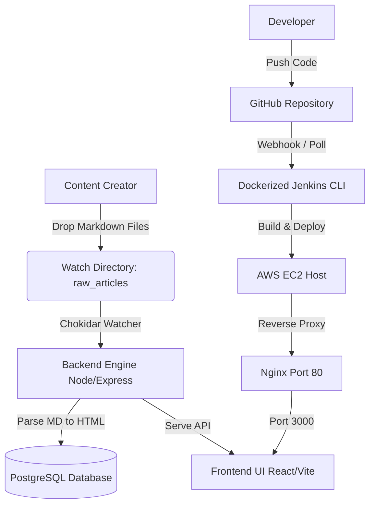

# Project Documentation: Markdown-to-HTML Publishing Platform (MD Maker)

A modern, containerized, and automated publishing system that watches for Markdown articles, compiles them into HTML, saves them into a PostgreSQL database, and serves them on a responsive web frontend—backed by a Jenkins CI/CD pipeline and deployed on AWS EC2.

---

## 1. Executive Summary
**MD Maker** is a lightweight yet powerful Markdown publishing engine designed for technical teams, bloggers, and documentarians. It automates the transition from raw text files to a database-backed, production-grade web application. By dropping files into a designated folder, writers can publish instantly without touching code or database management systems. The entire platform is containerized using Docker, integrated with a custom Jenkins pipeline, and hosted on a cost-effective, high-performance single-node AWS instance.

---

## 2. Project Objectives & Problem Statement
Traditional Content Management Systems (CMS) are often heavy, slow, and require complex visual editors. Technical writers prefer writing in **Markdown** using local editors (like VS Code or Obsidian) and managing their drafts using Git. 

### Core Objectives:
* **Frictionless Publishing**: Turn raw `.md` files into live web pages automatically.
* **Instant Delivery**: Eliminate manual rebuilds; content updates should render immediately.
* **Automated CI/CD**: Provide a robust pipeline that rebuilds and redeploys the application whenever source code changes, guaranteeing that the production version is always in sync with the repository.
* **Zero-Cost Production Setup**: Deploy the database, application server, and automation runner on a single AWS EC2 instance fitting within the AWS Free Tier.

---

## 3. Project Scope
The project scope spans four major engineering domains:



### A. The Core Application Stack
1. **Frontend**: A React single-page application (SPA) built using Vite for fast compilation. The UI offers article search, reading views, and live metadata displays.
2. **Backend**: An Express.js (Node.js) server serving API endpoints (`/api/articles`) and rendering static React bundles.
3. **File-Watcher Engine**: A background worker powered by **Chokidar** that monitors the `/app/raw_articles` folder on the filesystem.
4. **Relational Database**: A **PostgreSQL** database maintaining the schema for processed articles, including raw markdown, compiled HTML, parsed titles, tags, and creation dates.

### B. Docker Containerization
* **Multi-Stage Build**: An optimized multi-stage `Dockerfile` compiles TypeScript source files, builds Vite production bundles, and outputs a lean, production-ready runtime container.
* **Volume Mounts**: Persists PostgreSQL data in a named volume (`pgdata`) and maps the host's directory for articles (`./raw_articles`) into the container to enable direct file-watching.

### C. CI/CD Pipeline (Jenkins)
* **Custom Agent Image**: Extends the official Jenkins LTS base to install Docker CLI, Docker Compose, and Node.js v22. This enables Jenkins to safely build and deploy container images directly on the host machine.
* **Declarative Pipeline**: Codifies the build process using a `Jenkinsfile`, orchestrating SCM checkouts, code linting, image construction, and stack deployments via Docker Compose.

### D. AWS Cloud Infrastructure
* **Compute**: Single `t2.micro` EC2 instance running Ubuntu 24.04 LTS in Availability Zone `ap-south-1b` (Mumbai).
* **Storage & Swap**: A 29 GB GP3 EBS volume configured with a **3 GB swap file** to provide virtual memory, protecting the server against RAM-induced OOM crashes.
* **Reverse Proxy**: Nginx installed on the host operating system proxying inbound public HTTP traffic (Port 80) to the container (Port 3000).

---

## 4. How It Works (Step-by-Step Workflow)

### Case A: Creating & Publishing Content
1. **Writing**: A writer creates a new document, e.g., `getting-started.md`.
2. **File Transfer**: The document is placed in the `raw_articles/` directory on the EC2 server (mapped from a local folder or shared volume).
3. **Detection**: Chokidar detects the addition of the new file.
4. **Parsing**: Node parses the file:
   * Frontmatter metadata (Title, Author, Tags, Date) is extracted.
   * Markdown body is converted into standard HTML.
5. **Persistence**: The parser executes an `INSERT ... ON CONFLICT UPDATE` script to save the parsed content into the PostgreSQL database.
6. **Delivery**: When users load the website, the React frontend fetches the articles via `/api/articles` and renders the HTML.

### Case B: Updating Application Code (CI/CD)
1. **Commit**: A developer makes changes to the frontend styles or backend routes and pushes to GitHub.
2. **Trigger**: Jenkins is notified or polls the repository and starts the pipeline.
3. **Pipeline Stages**:
   * **Checkout**: Jenkins downloads the latest commit.
   * **Install & Verify**: Runs `npm ci` and `npm run lint` (TypeScript verification).
   * **Rebuild & Redeploy**: Executes `docker compose up -d --build`. This rebuilds the application image and restarts the container stack seamlessly.
   * **Status Update**: Jenkins logs the success or failure of the deployment.

---

## 5. Technical Specifications & Configuration

### A. Database Schema
```sql
CREATE TABLE IF NOT EXISTS articles (
  id SERIAL PRIMARY KEY,
  slug VARCHAR(255) UNIQUE NOT NULL,
  title VARCHAR(255) NOT NULL,
  content TEXT NOT NULL,
  summary TEXT,
  tags VARCHAR(50)[],
  published_at TIMESTAMP DEFAULT CURRENT_TIMESTAMP,
  created_at TIMESTAMP DEFAULT CURRENT_TIMESTAMP,
  updated_at TIMESTAMP DEFAULT CURRENT_TIMESTAMP
);
```

### B. Nginx Reverse Proxy Config
Nginx acts as a security barrier and performs fast static asset caching.
```nginx
server {
    listen 80;
    server_name _;

    location / {
        proxy_pass http://127.0.0.1:3000;
        proxy_http_version 1.1;
        proxy_set_header Upgrade $http_upgrade;
        proxy_set_header Connection 'upgrade';
        proxy_set_header Host $host;
        proxy_cache_bypass $http_upgrade;
    }
}
```

### C. Swap Memory Setup Script
Executed on EC2 to augment the 1GB RAM of `t2.micro`:
```bash
sudo fallocate -l 3G /swapfile
sudo chmod 600 /swapfile
sudo mkswap /swapfile
sudo swapon /swapfile
echo '/swapfile none swap sw 0 0' | sudo tee -a /etc/fstab
```

---

## 6. Implementation Milestones

### - [x] **Phase 1: Containerization**
* **Application Services**: Drafted and containerized the Node.js/Express backend (utilizing TypeScript, compiled to optimized CommonJS via esbuild) and React frontend (Vite compiled static assets served by the Express backend). The build utilizes a lightweight Node Alpine image in a multi-stage Docker build to keep images lean and runtime environments secure.
* **Database Isolation**: Provisioned a local PostgreSQL database container using the official Alpine image. Persisted all data in a named volume (`pgdata`) to protect against container restarts.
* **Jenkins Automation Service**: Built a custom Jenkins runner extending `jenkins/jenkins:lts` that installs Docker CLI, Docker Compose plugin, and Node.js v22. Mounted the host socket `/var/run/docker.sock` to enable the Jenkins container to run docker commands on the host system.
* **Compose Orchestration**: Structured a master `docker-compose.yml` defining dependencies (ensuring `app` waits for `db` to be healthy via database `pg_isready` checks) and sharing network context internally.

### - [x] **Phase 2: Local Jenkins Pipeline**
* **Declarative Pipeline**: Wrote a dynamic `Jenkinsfile` executing stages (SCM Checkout, Node dependency installations via `npm ci`, and code quality checks using `npm run lint`).
* **GitOps Gating**: Configured changeset filters so that container builds only trigger when actual source code changes, preventing redundant compiles when authors just add Markdown articles.
* **Network Resolution Fix**: Fixed network connectivity issues inside Jenkins where curl checks failed against `localhost:3000` (which refers to the Jenkins container itself). Re-routed request checks through `host.docker.internal:3000` to properly reach the application container on the host network.
* **Database Spams Resolved**: Patched `pg_isready` health check parameters in the compose stack to target the user's specific application database rather than the generic default username, preventing database connection errors in host logs.

### - [x] **Phase 3: AWS Setup & OS Tuning**
* **AZ Restrictions**: Provisioned an Ubuntu 24.04 LTS instance inside the Mumbai region (`ap-south-1`) and locked the EC2 instance strictly to Availability Zone `ap-south-1b` to comply with restricted IAM policy requirements.
* **Storage Allocation & Live FS Expansion**: Expanded the default 8 GB root volume to a **29 GB GP3 EBS volume** to accommodate heavy docker build caching and Jenkins data. Resized the live partition on-the-fly (`growpart` and `resize2fs`) without losing data or requiring a server reboot.
* **Virtual Swap Space (3 GB)**: Formatted, mounted, and registered a 3 GB swap space (`/swapfile`) in `/etc/fstab` to provide necessary virtual memory buffers, protecting the free-tier `t2.micro` (1 GB RAM) against memory exhaustion crashes.
* **Security Group Policies**: Set up restrictive ingress access rules, exposing port 80 to the public (`0.0.0.0/0`) for web app traffic, while locking down port 22 (SSH) and port 8080 (Jenkins UI) strictly to the owner's IP address (`128.185.168.206/32`).

### - [x] **Phase 4: Remote Deploy & Proxy Routing**
* **Dependencies Bootstrapping**: Connected to the server using the custom private key [mdmakerpem.pem](file:///C:/Users/navde/Downloads/mdmakerpem.pem). Wrote and executed a script to install Nginx, Git, Docker, and the Docker Compose plugin on the remote operating system.
* **Workspace Cloning**: Cloned the code repository from the `main` branch to `/home/ubuntu/MD-to-HTML-` and populated the environment `.env` secrets file with credentials.
* **Deployment Execution**: Ran `docker compose up -d --build` to compile frontend assets and start database and application containers.
* **Reverse Proxy Mapping**: Configured Nginx to act as a public-facing proxy on port 80, routing traffic to port 3000 where the Express server listens.

### - [ ] **Phase 5: Production Verification & DNS (Ongoing)**
* **Elastic IP Association**: Assign a static Elastic IP (EIP) to the EC2 instance so that stopping and starting the instance does not change its public IP.
* **Domain Name & Webhooks**: Bind a domain name (via Route 53 or DNS provider) and register automated webhooks on GitHub to notify Jenkins (`http://<domain>:8080/github-webhook/`) on code pushes to enable fully automated continuous deployment.

---

## 7. User Manual: How to Publish a New Article

This user manual describes how to prepare, upload, and publish Markdown articles onto the live web platform.

### Step 1: Prepare the Markdown File
Create a new file with a `.md` extension (e.g., `my-new-post.md`) using your preferred editor (VS Code, Obsidian, nano, etc.).

Add **YAML Frontmatter** at the very top of the file enclosed between `---` triple dashes to define metadata. Ensure you write valid YAML. Below the frontmatter, write your article body using standard Markdown:

```markdown
---
title: "Understanding Docker Volume Mounts"
summary: "A deep dive into Docker persistent storage mechanisms and bind mounts."
tags: ["Docker", "DevOps", "SysAdmin"]
---

# Introduction
This is the beginning of the article body. You can use standard Markdown tags:
* **Bold text**
* *Italicized text*
* Bullet points or tables
```

### Step 2: Upload the Article to the Server
To trigger the automated publishing mechanism, the file must be placed in the `/home/ubuntu/MD-to-HTML-/raw_articles/` directory on the EC2 server. You can do this in two ways:

#### Option A: Copy from your local machine via SCP (Recommended)
Open a terminal on your host machine and copy the file using your SSH private key:
```cmd
scp -i "C:\Users\navde\Downloads\mdmakerpem.pem" "C:\path\to\my-new-post.md" ubuntu@43.204.233.55:/home/ubuntu/MD-to-HTML-/raw_articles/
```

#### Option B: Create directly on the Server via SSH
1. SSH into the EC2 instance:
   ```cmd
   ssh -i "C:\Users\navde\Downloads\mdmakerpem.pem" ubuntu@43.204.233.55
   ```
2. Open a text editor (like `nano`) to create the file directly in the watch directory:
   ```bash
   nano /home/ubuntu/MD-to-HTML-/raw_articles/my-new-post.md
   ```
3. Paste your Markdown content, then press `Ctrl+O` and `Enter` to save, and `Ctrl+X` to exit the editor.

### Step 3: Verify the Upload
The platform's file watcher will automatically detect and parse the new article immediately. You can check the logs to verify it worked:
1. Log in to the server:
   ```bash
   ssh -i "C:\Users\navde\Downloads\mdmakerpem.pem" ubuntu@43.204.233.55
   ```
2. View the container log output:
   ```bash
   cd /home/ubuntu/MD-to-HTML-
   docker compose logs app | tail -n 20
   ```
3. Verify that the output shows the processing messages:
   ```log
   app-1  | [Processor] New article detected: my-new-post.md
   app-1  | [Processor] Successfully processed: understanding-docker-volume-mounts
   ```

### Step 4: Access online
Open your browser and navigate to **[http://43.204.233.55](http://43.204.233.55)**. Your new article will be displayed on the homepage list and searchable by its tags!
